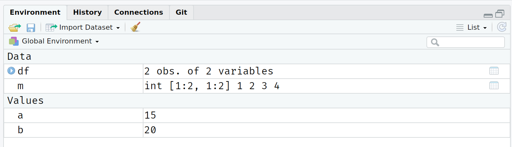
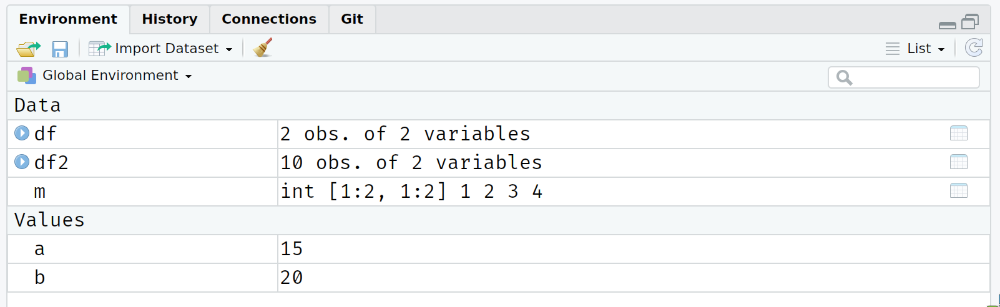

background-image: url(https://upload.wikimedia.org/wikipedia/commons/b/be/Sharingan_triple.svg)

```{r setup, include=FALSE}
options(htmltools.dir.version = FALSE)
```

# Pregled predavanja

<br>
<br>

1. [Instalacija](#instalacija)

2. [Zašto R?](#zakaj)

3. [Osnovni koncepti](#osnove)

4. [Objektno orjentirano programiranje u R](#oop)

5. ["Sve je objekt"](#eobject)

6. ["Sve ima naziv"](#ename)

7. [Indeksiranje](#indexing)

8. [Čišćenje radnog prostora](#cleaning)

---
class: inverse, center, middle
name: instalacija

# Instalacija

<html><div style='float:left'></div><hr color='#EB811B' size=1px width=796px></html>

(Početni set-up)

---

# Instalacija software-a i registracija

<br>
<br>
1. Preuzmite [R](https://www.r-project.org/).
<br>
<br>
2. Preuzmite [RStudio](https://www.rstudio.com/products/rstudio/download/preview/).
<br>
<br>
3. Preuzmite [Git](https://git-scm.com/downloads).
<br>
<br>
4. Napravite račun na [GitHub](https://github.com/) 
<br>
<br>
<br>
*[U slučaju problema sa instalacijom Git-a pogledajte http://happygitwithr.com.]

---

# Detalji
<br>
<br>
<br>
Za bolje snalaženje:
<br>
<br>
- **Windows:** Instalirajte [Rtools](https://cran.r-project.org/bin/windows/Rtools/). Također korisno [Chocolately](https://chocolatey.org/).
<br>
<br>
- **Mac:** Instalirajte [Homebrew](https://brew.sh/). Potrebno konfigurirati C++ toolchain (pogledaj [ovdje](https://github.com/stan-dev/rstan/wiki/Installing-RStan-from-source-on-a-Mac#prerequisite--c-toolchain-and-configuration).)
<br>
<br>
- **Linux:** Već znate što radite!

---

# Checklist
<br>
<br>

☑ Da li imate najnoviju verziju R?

```{r}
 version$version.string
```


☑ Da li imate najnoviju verziju RStudio-a? (Pogledaj [verziju](https://www.rstudio.com/products/rstudio/download/preview/) )

```{r eval=FALSE}
  RStudio.Version()$version
 ## Requires an interactive session but should return something like "[1] ‘1.2.5001’"
```

☑ Da li su svi R paket osvježeni? 

```{r eval=FALSE}
  update.packages(ask = FALSE, checkBuilt = TRUE)
```
  
---

# Checklist (dalje)
<br>
<br>
Otvorite [shell](http://happygitwithr.com/shell.html#shell). Ako ste već instalirali [Git for Windows](https://gitforwindows.org), sve je u redu!

☑ Koju verziju Git-a ste instalirali?
  ```
  git --version
  ```

☑ Da li ste se upoznali sa Git-om? (Upišite svoje podatke.)
  ```
  git config --global user.name 'Luka Sikic'
  git config --global user.email 'lsikic.gmail@gmail.com'
  git config --global --list
  ```

☑  Da li ste napravili račun na GitHub-u? 


---
class: inverse, center, middle
name: zakaj

# Zašto R?

<html><div style='float:left'></div><hr color='#EB811B' size=1px width=796px></html>

(Razlozi za korištenje programskog jezika R)

---

# Zašto R i RStudio? 
```{R, indeeddotcom, echo = F, fig.height = 6, fig.width = 9, dev = "svg", message= F, warning = F}
library(tidyverse)
# The popularity data
pop_df <- 
  data.frame(
  lang = c("SQL", "Python", "R", "SAS", "Matlab", "SPSS", "Stata"),
  n_jobs = c(107130, 66976, 48772, 25644, 11464, 3717, 1624),
  free = c(T, T, T, F, F, F, F)
  )
## Plot it
pop_df %>% 
  mutate(lang = lang %>% factor(ordered = T)) %>%
  ggplot(aes(x = lang, y = n_jobs, fill = free)) +
  geom_col() +
  geom_hline(yintercept = 0) +
  aes(x = reorder(lang, -n_jobs), fill = reorder(free, -free)) +
  xlab("Statistički jezik") +
  scale_y_continuous(label = scales::comma) +
  ylab("Broj poslova") +
  labs(
    title = "Usporedba statističkih jezika",
    subtitle = "Broj poslova na Indeed.com, 2019/01/06"
    ) +
  scale_fill_manual(
    "OpenSource?",
    labels = c("True", "False"),
    values = c("#f92672", "darkslategray")
    ) +
  ggthemes::theme_pander(base_size = 17) +
  # theme_ipsum() +
  theme(legend.position = "bottom")
```

---

# Zašto R i RStudio? 

### Data science pozitivizam

- Uz Python, R je postao *de facto* jezik za data science.
  - Pogledaj: [*The Impressive Growth of R*](https://stackoverflow.blog/2017/10/10/impressive-growth-r/), [*The Popularity of Data Science Software*](http://r4stats.com/articles/popularity/)
- Open-source (besplatno!) sa ogromnom bazom korisnika u akademiji i biznisu.
 

### Alat za kvantitativne društvene znanosti

- Puna podrška za statistiku i ekonometriju sa visokom primjenjivosti u drugim jezicima i API-jima.

- RStudio IDE i ekosustav omogućuju jednostavno skaliranje.

### Path dependency

- Programski jezik s kojim imam najviše iskustva.


- (Učenje više jezika je preporučljivo, nužno štoviše!)

---

# R osnove

<br>
<br>
<br>

1. Sve je objekt.

2. Sve ima naziv.

3. Stvari se rade preko funkcija.

4. Funkcije dolaze u paketima (i.e.*libraries*), a moguće je i napraviti vlastite funkcije.

--

</br>

Točke 1. and 2. se odnose na [object-orientated programming](https://en.wikipedia.org/wiki/Object-oriented_programming) (OOP) pristup.
  - Iako ovo sada možda djeluje apstraktno, stvari će postati jasnije s vremenom.

---

# R primjer (linearna regresija)

```{r fit}
fit = lm(mpg ~ wt, data = mtcars)
summary(fit)
```

---

# Osnovni R grafikon

```{r mtcars_baseplot, dev="svg", fig.height=4}
par(mar = c(4, 4, 1, .1)) ## Ljepše margine
plot(mtcars$wt, mtcars$mpg)
abline(fit, col = "red")
```

---

# ggplot2 

```{r mtcars_ggplot, dev="svg",fig.height=4, message=F, warning=F}
ggplot(data = mtcars, aes(x = wt, y = mpg)) + 
  geom_smooth(method = "lm", col = "red") + 
  geom_point() 
```

---
class: inverse, center, middle
name: osnove

# Osnovni koncepti

<html><div style='float:left'></div><hr color='#EB811B' size=1px width=796px></html>

(Neki važni koncepti u R)

---

# Osnovna aritmetika

R je moćan kalkulator i prepoznaje sve standardne aritmetičke operatore:

```{r}
1+2 ## Zbrajanje
6-7 ## Oduzimanje
5/2 ## Dijeljenje
2^3 ## Potencije
2+4*1^3 ## Redosljed operacija
```

---

# Osnovna aritmetika (dalje)
<br>
<br>
Modulo operator se koristi za dijeljenje (i ostatak). 
- Koristan za rad sa (npr.) vremenom.

```{r}
100 %/% 60 ## Koliko je cijelih sati u 100 minuta?
100 %% 60 ## Koliko je preostalo minuta?
```

---

# Logički operatori

R dolazi sa nizom logičkih operatora i boleana, koji prate standardni programerski protokol.

```{r}
1 > 2
1 > 2 & 1 > 0.5 ##  "&" znači "i"
1 > 2 | 1 > 0.5 ##  "|" znači "ili" 
isTRUE (1 < 2)
```

--

Više o logičkim operatorima pročitajte na <a href="https://stat.ethz.ch/R-manual/R-devel/library/base/html/Logic.html" target="_blank">ovdje</a> i <a href="https://stat.ethz.ch/R-manual/R-devel/library/base/html/logical.html" target="_blank">ovdje</a>. 

---

# Logički operatori (dalje)

### Hijerarhijski redosljed

Kao i u standardnoj matematici, logičke tvrdnje imaju jasan hijerarhijski redosljed. Logički operatori (`>`, `==`, etc) se izvršavaju prije boleanskih operatora (`&` i `|`).

```{r}
1 > 0.5 & 2
```

--

R vrednuje dvije odvojene "logičke" tvrdnje: 
 - `1 > 0.5`,što je TRUE.
 - `2`, što je TRUE(!) jer R evaluira `as.logical(2)`.
 
--

**Rješenje:** Potrebna je eksplicitnost oko logičkih tvrdnji.

```{r}
1 > 0.5 & 1 > 2
```


---

# Logički operatori (dalje)

### Negacija: `!`
<br>
 `!` se koristi za negaciju. Ovo je posebno korisno kod filtriranja podataka, primjerice za non-NA opservacije.

```{r}
is.na(1:10)
!is.na(1:10)
# Negate(is.na)(1:10) ## Ovo također radi. 
```

---

# Logički operatori (dalje)

### Matching vrijednosti: `%in%`

Da bismo provjerili da li je objekt sadržan unutar liste elemenata, moguće je koristiti `%in%`.
```{r}
4 %in% 1:10
4 %in% 5:10
```

--

Ne postoji ekvivalentna "not in" naredba, ali možemo ju stvoriti sami!
--

```{r}
`%ni%` <- Negate(`%in%`) ## Navodnici (`) služe za specifikaciju funkcije.
4 %ni% 5:10
```

---

# Logički operatori (dalje)

### Evaluacija
<br>
Dva znaka jednakosti se koriste za logičku evaluaciju.

```{r, error=T}
1 = 1 ## Ne radi.
1 == 1 ## radi.
1 != 2 ## Jedan znak jednakosti i negacija.
```

---

# Logički operatori (dalje)

### Oprez: "Floating-point" brojevi

Što će se dogoditi ukoliko evaluiramo `0.1 + 0.2 == 0.3`?

--

```{r floating1}
0.1 + 0.2 == 0.3
```
Zašto!?Kako!?

--

**Problem:** Kompjuteri reprezentiraju brojeve binarno (i.e. baza 2). Više [vidi ovdje](https://floating-point-gui.de/basic/).
- Brzo i memorijski efikasno ali može dosvesti do neočekivanog ponašanja. 
- Slično kao što standardni decimalni (i.e. base 10) zapis ne može precizno obuhvatiti određene decimalne brojeve (e.g. $\frac{1}{3} = 0.3333...$). 

--

**Rješenje:** Koristi `all.equal()` za evaluaciju float-ova (i.e  frakcija).

```{r floating2}
all.equal(0.1 + 0.2, 0.3)
```

---

# Pripisivanje (varijabli)

U R, moguće je koristiti `=` ili `<-` za pripisivanje.<sup>1</sup>

.footnote[
<sup>1</sup>  `<-` je zapravo `<` praćeno sa `-`, iako izgleda kao jedan znak. [Font](https://github.com/tonsky/FiraCode) koji se koristi u ovim slide-ovima.
]

--

### Pripisivanje sa `<-`

`<-` se izgovara "gets". Razmišljajte o znaku kao da kaže *pripiši u ovom smjeru*.

```{r}
a <- 10 + 5
a
```

--

Naravno, strelica može ići i u suprotnom smjeru (i.e. `->`). Naredni kod je jednak kao i prethodni, iako se znatno rijeđe susreće. 
```{r}
10 + 5 -> a
```

---

# Pripisivanje (dalje)

### Pripisivanje sa `=`

Također je moguće koristiti `=` za pripisivanje.

```{r}
b = 10 + 10 ## Pripisani objekt mora biti lijevo kada se koristi "=".
b
```

--

### Koji operator koristiti?

 R korisnici (puristi?) preferiraju `<-` za pripisivanje pošto `=` ulogu u eveluacijskim funkcijima. 
- Kasnije ćete vidjeti primjere!
- U osnovi nije niti važno. E.g. `=` je brži za tipkati i ima više smisla ako dolazite iz drugog programskog jezika. (Diskusiju pogledajte [ ovdje](https://github.com/Robinlovelace/geocompr/issues/319#issuecomment-427376764) i [ovdje](https://www.separatinghyperplanes.com/2018/02/why-you-should-use-and-never.html).)

**Bottom line:** Koristite što želite ali udite konzistentni!

---

# Pomoć
<br>
<br>
Ukoliko imate dvojbe oko funkcije ili objekta R, unesite "help" u konzolu, e.g.

```R
help(solve)
```

Još jednostavnije, koristite "?":
  
```R
# Ovo se najčeše koristi.
?solve 
```

--

</br>

**Dodatno:** Komentari u R se označavaju sa `#`. 
- `Ctrl+Shift+c` u RStudio-u koristite za komentiranje više redova odjednom.

---

# Pomoć (dalje)
<br>
<br>
Za većinu paketa možete koristiti `vignette()` funkciju, koja će prikazati uvodne detalje i funkcionalnosti paketa
- Izvršite `vignette("dplyr")` naredbu u konzoli.

--

Preporuča se čitanje vignette paketa kada postoje. 
- To je često najbolji način da se naučite služiti sa paketom.

--

Poteškoća je što treba znati točan naziv paketa (vignette).
- E.g. `dplyr` paket ima više vignette-a: "dplyr", "window-functions", "programming", etc.
- Izvršite `vignette()` (i.e. bez funkcijskih argumenta) da biste vidjeli listu svih instaliranih vignette-a za pakete na vašem sistemu. 
- Izvršite`vignette(all = FALSE)` da biste vidjeli listu vignette-a svih *učitanih* paketa.

---
class: inverse, center, middle
name: oop

# Objektno orjentirano programiranje

<html><div style='float:left'></div><hr color='#EB811B' size=1px width=796px></html>

(Karkteristike programskog jezika R)

---

# Motivacija
<br>
<br>

R pristup koristi [objektno orjentirano programiranje](https://en.wikipedia.org/wiki/Object-oriented_programming) (OOP), koje se može sažeti kao:

> **"Sve je objekt i sve ima naziv."**

--

U sljedećm djelu ćemo proučiti ovaj koncept malo dublje. Na taj način ćemo izbjeći neke frustracije ako se prije niste susreli sa OOP pristupom.

--

Izbjegavanje konfuzije je relativno jednostavno ako razumijemo pozadinu.
- Također: To je mala cijena za funkcionalnost koju R pruža.

---

# Disclaimer
<br>
<br>
Očito, postoji _više_ OOP sustava u R.
- **S3**, **S4**, **R6**...
- Hadley Wickham-ov "Advanced R" sadržava [vrlo detaljan pregled](https://adv-r.hadley.nz/oo.html) glavnih OOP sustava u R.

Vjerojatno je najskorisnije razmišljati u terminima (a) zajedničkim karakteristikama ovih sistema i (b) generalnih implikacija OOP u R.
- Pogledajte Hadley-evu knjigu ako imate prilike. Uistinu je korisna (kao i ostale njegove knjige).

---
class: inverse, center, middle
name: eobject

# "Sve je objekt"
<html><div style='float:left'></div><hr color='#EB811B' size=1px width=796px></html>

(OOP pristup)

---

# Što su objekti? 

Važno je naglasiti da postoji više različitih *tipova* (ili *klasa*) objekata. 

Proći ćemo kroz razlike između "type" vs "class" objekata. Trenutno je važno spomenuti najčešće objekte:

- vektori
- matrice
- data frame
- liste
- funkcije
- etc.

--

Vjerojatno već imate okvirnu ideju što razlikuje te objekte i za sto koristimo pojedine objekte.
- Ipak, postoje potankosti vezane uz svaki objekt koje su ponešto zbunjujuće dok se ne naviknete na R. 
- E.g. Postoje različite vrste data frame-ova; primjerice "[tibble](https://tibble.tidyverse.org/)", što je napredni obllik df-a koji omogućava *tidyverse*.

---

# Što su objekti? (dalje)

Svaka klasa objekta ima vlastiti skup pravila koja određuju kako se taj objekt koristi u R.
- Primjerice, veliki broj istih/sličnih operacija je moguć na matricama i data frame-ovima. Ipak postoji određeni broj procedura koje će funkcionirati samo na matricama vice versa.
- Valja znati da je četo moguća konverzija iz jednog oblika u drugi.

```{r df}
## Napravi mali data frame sa nazivom "df".
df <- data.frame(x = 1:2, y = 3:4) 
df
```

```{r, m}
## Pretvori ga (i.e. create) u matricu sa nazivom "m".
m <- as.matrix(df)
m
```

---

# Klasa objekta, tipovi i struktura
<br>
Korsite `class`, `typeof`, i `str` nardbe za informacije o objektu.

```{r}
# df <- data.frame(x = 1:2, y = 3:4) ## Stvori mali data frame sa nazivom "df".
class(df) ## Saznaj klasu.
typeof(df) ## Saznaj tip.
str(df) ## Pokaži strukturu.
```

--

PS — Zbunjujuće je što `typeof(df)` vaća "list"? Vidi za [objašnjenje](https://stackoverflow.com/questions/45396538/typeofdata-frame-shows-list-in-r).

---

#  Klasa objekta, tipovi i struktura (dalje)
<br>
<br>
Naravno, moguće je dati naredbu inspect/print direktno u konzoli.
- E.g. Unesite `df` i stisnite Enter.


 `View()` funkcija također pomaže.
- E.g. `View(df)`.

---

# Globalni environment (radni prostor)

Jednostavni data frame koji smo prethodno stvorili.
```{r}
df
```

--

Napravimo regresiju <sup>1</sup> na "x" i "y" varijablama:

.footnote[
<sup>1</sup> Ovo je obična regresija sa kolinearnim varijablama. 
]

```{r, error=T}
lm(y ~ x) ##  "lm" označava linearni model
```

--

Što se dogodilo?

---

# Globalni environment (dalje)

Error poruka daje odgovor:

```
*## Error in eval(predvars, data, env): object 'y' not found
```

--

R ne može naći varijable u [global-nom environment-u](https://www.datamentor.io/r-programming/environment-scope/):




--

Drgačije rečeno: Pošto varijable "x" i "y" postoje kao odvojene varijable u global environment-u, potrebno je naznačiti R-u da se odnose na objekt `df`.
- Kako biste to napravili?

---

# Globalni environment (dalje)
<br>
<br>
Nekoliko je načina za to. Najednostavniji je specifikacija argumenta `data`:

```{r}
lm(y ~ x, data = df) ## Radi kada dodamo "data = df"!
```

--

Iako zbunjujuće na prvi pogled, ova karakteristika ima određene prednosti.
- Nije moguće učitati više od dva zasebna objekta u memoriju istvremeno, pa su potrebni neki `hack`-ovi. 

---

# Rad sa više objekata

Sposobnost R da ima više objekata u radnom prostoru je korisna. 
- E.g. Moguće je stvoriti više supostojećih objekata u radnom prostoru. 

```{r df2}
df2 <- data.frame(x = rnorm(10), y = runif(10))
```



--

Potrebno je pripaziti na **nazive** objekata kako ne bi došlo do konfuzije.

---
class: inverse, center, middle
name: ename

# "Sve ima naziv"

<html><div style='float:left'></div><hr color='#EB811B' size=1px width=796px></html>

(OOP pristup)

---

# Rezervirani nazivi

Već smo vidjeli da različitim objektima možemo dati različite nazive. Postoji nekoliko rezerviranih riječi u R.
- To su fundamentalni nazivi, operatori i relacije u base R tkoje nije moguće pripisati objektu, čak niti kada bismo to htjeli.
- Slične primjere smo imali sa logičkim operatorima.

[Vidi](http://stat.ethz.ch/R-manual/R-devel/library/base/html/Reserved.html) za punu listut, uključujući:

```R
if 
else 
while 
function 
for
TRUE 
FALSE 
NULL 
Inf 
NaN 
NA 
```

---

# Kvazi-rezervirane riječi

Uz rezervirane riječi, postoji klasa riječi i stringova koje ćemo nazvati kvazi-rezervirane naredbe.
- To su funkcijski nazivi i vrijednosti (e.g. `pi`) koje je moguće pripisati...iako imaju značenje u base R.

Najvažniji kvazi-rezervirani naziv funkcije `c()`, koji koristimo za spajanje; i.e. stvaranje vektora i povezivanje objekata.

```{r}
my_vector <- c(1, 2, 5)
my_vector
```

--

Što se događa ukoliko izvršite sljedeću naredbu?

```R
c <- 4
c(1, 2 ,5)
```

--

Vektori su izrazito bitni u R. R je jezik optimiziran za rad s vektorima. Kasnije ćemo reći nešto više o "vektorizaciji" funkcija.


---

# Kvazi-rezervirane riječi (dalje)

R je dovoljno "pametan" da bi razlikovao varijable `c <- 4` koje smo stvorili od funkcije`c()` koja se koristi za spajanje objekata.

Ipak, ovo je primjer *ekstremno* lošeg kodiranja. R neće uvijek moći razlikovati ove objekte. Primjerice:
```{r}
pi
pi <- 2
pi
```
--

**Bottom line:** Nemojte koristiti kvazi-rezervirane riječi!

---

# Namespace konflikti

Slična situacija nastaje kada učitamo dva paketa koji imaju funkcije sa istim nazivima.E.g. Pogledajte što se dogodi kada učitamo `dplyr` paket.
```{r}
library(dplyr)
```

--

Pouke da su neki objekti *masked from 'package:X'* predstavljaju upozorenja koja se odnose na *namespace konflikte*.
- E.g. `dplyr` i `stats` paketi (koji se učitaju automatski kada pokrenete R) imaju funkcije pod nazivom "filter" i "lag".

---

# Namespace konflikti (dalje)

*Namespace koflikti* nastaju zbog OOP pristupa.<sup>1</sup>
- Oni također reflektiraju open-source prirodu R i korištenja eksternih paketa. Korisnicima je ostavljen izbor oko naziva funkcija, pa se poneka preklapanja uvijek mogu očekivati.

.footnote[
<sup>1</sup> Slični problemi se javljaju i u drugim programskim jezicima (Python, C, etc.)
]

--

Kada god se pojavi namespace konflikt, zadnji učitani paket ima prednost. Tako će se `filter()` funkcija odnositi na `dplyr` varijantu.

Što ako želimo `stats` varijantu? Imamo dvije opcije:
1. Privremeno koristi `stats::filter()`
2. Permanentno pripiši `filter <- stats::filter`

---

# Rješenje namespace konflikata

#### 1. Koristi `package::function()`

Moguće je eksplicitno pozvati funkciju iz paketa kroz sintaksu `package::function()`. Primjerice:
```{r}
stats::filter(1:10, rep(1, 2))
```

--

Moguće je koristiti `::` za rješavanje konfliktnih slučajeva. 
- E.g. Eksplicitnost oko funkcije (ili podataka) pridonose jasnoći koda. Probajte ove naredbe u R konzoli!

```R
dplyr::starwars ## Prikaži starwars data frame iz dplyr paketa
scales::comma(c(1000, 1000000)) ## Koristi comma funkciju, iz scales paketa
```
---

`::` sintaksa znači da možete koristiti funkciju bez učitavanja paketa.
E.g. Dokle god je `dplyr` instaliran u sustavu `dplyr::filter(iris, Species=="virginica")` će funkcionirati.
  
---

# Rješenje namespace konflikata (dalje)

#### 2. Pripiši `function <- package::function`
  
Trajnije rješenje je pripisati funkciju konfliktnog naziva objektue. To će biti validno do kraja R sesije, ili dok to ne promijenite. E.g.
```{r, eval=F}
filter <- stats::filter ## Bez zagrada.
filter <- dplyr::filter ## Promijeni nazad.
```

--

##### Općeniti savjet

Preporuča se koristiti `package::function()` sintaksu. 

Drugo rješenje je učitati najvažnije pakete na kraju. (E.g. Učitajte tidyverse nakon svih drugih paketa.)
  
Osim toga, obratite pažnju na upozorenja kod učitavanja paketa; u nedoumici je mouguće koristiti `?`. (E.g. `?filter` će dati informaciju koju varijantu funkcije koristimo.)
- Namespace konflikti nisu osobito česti ali potrebno je znati da postoje. 
  
---
class: inverse, center, middle
name: indexing

# Indeksiranje

<html><div style='float:left'></div><hr color='#EB811B' size=1px width=796px></html>
(Kako pristupiti djelovima objekta u R)  
---

# Opcija 1: []

Već smo vidjeli primjer indeksiranja u outputu konzole. Primjerice:
```{r}
1+2
```

`[1]` označava prvi (i, uovom slučaju, jedini) element našeg outputa.<sup>1</sup> U ovom slučaju vektor duljine tri, ima vrijednost "3".

--

Pokušajte izvršiti u konzoli za primjer eksplicitnog indeksiranja:
```{r, eval=F}
rnorm(n = 100, mean = 0, sd = 1)
# rnorm(100) ## Također radi. (Zašto? Hint: vidi ?rnorm)
```

.footnote[
[1] Indeksiranje u R počinje sa 1, ne sa 0 kao u nekim drugim jezicima (e.g. Python i JavaScript).
]

---

# Opcija 1: [] (dalje)


Još važnije, sintaksu `[]` je koguće koristiti za indeksiranje objekata u R.
```{r}
a <- 1:10
a[4] ## Izaberi četvrti elemet objekta "a"
a[c(4, 6)] ## Izaberi četvrti i šesti element
```

Ovo također funkcionira na većim array-ima (vektori, matrice, data frame, and liste). Primjerice:
```{r}
starwars[1, 1] ## Prikaži ćeliju koja odgvara prvom redu i prvoj koloni data frame-a.
```

--

Što naredba `starwars[1:3, 1]` vraća?

---

# Opcija 1: [] (dalje)

Nismo ih do sada puno spominjali ali **liste** su kompleksnije vrste array objekata u R.
- Mogu sadržavati objekte različite klase, različitog oblika (e.g. rank) i zajedničke strukture.
- E.g. Lista može sadržavati broj, string i data frame. Također je moguća lista data frame-ova, ili lista listi.

--

Indeksiranje lilsti zahtjeva dvostruke zagrade `[[]]` za indeksiranje "parent" elemenata list-e i jednostruke zagrade`[]` za indeksiranje unutar tog "parent" elementa. Primjerice:
```{r my_list, cache=T}
my_list <- list(a = "hello", b = c(1,2,3), c = data.frame(x = 1:5, y = 6:10))
my_list[[1]] ## Vrati prvi element
my_list[[2]][3] ## Vrati 3 element drugog objekta
```

---

# Opcija 2: $


Liste se mogu indeksirati putem operatora: `$`.
- Nastavimo sa primjerom`my_list` sa prethodnog slide-a.

```{r}
my_list
```

---
count: false

# Opcija 2: $


Liste se mogu indeksirati putem operatora: `$`.
- Nastavimo sa primjerom`my_list` sa prethodnog slide-a.

```{r, eval=F}
my_list
```

```
*## $a
## [1] "hello"
## 
*## $b
## [1] 1 2 3
## 
*## $c
##   x  y
## 1 1  6
## 2 2  7
## 3 3  8
## 4 4  9
## 5 5 10
```

.footnote[[*]Primjetite kako su "parent" liste označene: "$a" , "$b" i "$c".]

---

# Opcija 2: $ (dalje)

Moguće je indeksirati te objekte pomoću dolarskog znaka, e.g.
```{r}
my_list$a ## Vrati objekt "a"
my_list$b[3] ## Vrati treći element objekta "b" 
my_list$c$x ## Vrati kolonu "x" iz objekta "c"
```

---

# Opcija 2: $ (dalje)

`$` indeksiranje funkcionira i za druge objekte u R. 

U nekim slučajevima je moguće kombinirati obje opcije indeksiranja.
- E.g. Izvuci prvi element "name" kolone iz starwars data frame-a.
```{r}
starwars$name[1]
```
--

Primjetite neke razlike između prethodnog i `starwars[1, 1]` primjera. Koje su to?
- Hint: Osim vizualnih, probajte opciju `str()`.

---

# Opcija 2: $ (dalje)

Zadnje što je potrebno naglasiti vezano uz indeksiranje putem `$` je da ćemo tako izbjeći problem koji se javio kod neuspješnog pozivanja varijabli u primjeru regresije.

```{r, error=T}
lm(y ~ x) ## Ne radi!
lm(df$y ~ df$x) ## Radi!
```

---
class: inverse, center, middle
name: cleaning

# Čišćenje

<html><div style='float:left'></div><hr color='#EB811B' size=1px width=796px></html>

(Čistoća je pola zdravlja!)
---

# Izbacivanje objekata (i paketa)

Koristite `rm()` da biste maknuli objekt iz radnog prostora.
```{r}
a <- "hello"
b <- "world"
rm(a, b)
```

Također je moguće koristiti `rm(list = ls())` da bi se maknuli svi objekti iz radnog prostora (osim paketa). Ova funkcionalnst nije bez  [kritika](https://www.tidyverse.org/articles/2017/12/workflow-vs-script/)! 
- Vjerojatno je bolje pokrenuti novu sesiju!

--

Izbacivanje paketa iz radnog prostora je problematično jer postoji mnoštvo cross-dependency-a  (i.e. pojedinačni paketi zavise i ponekad mogu automatski učitati druge). Ipak, probajte, e.g. `detach(package:dplyr)`
- Vjerojatno je bolje pokrenuti novu sesiju!
  
---

# Izbacivanje grafika

Moguće je koristiti `dev.off()` za izbacivanje bilo koje (i.e. svih) grafikona u tekućoj sesiji. Probajte u R conzoli:
```{r, eval=F}
plot(1:10)
dev.off()
```

--

RStudio ima padajuće izbornike za čišćenje radnog prostora i izbacivanje (pojedinačnih) grafikna. Pogledajte ikone:


---

class: inverse, center, middle

# HVALA NA PAŽNJI

<html><div style='float:left'></div><hr color='#EB811B' size=1px width=796px></html>