```{r setup, include=FALSE}
options(htmltools.dir.version = FALSE)
library(knitr)
opts_chunk$set(
  fig.align="center", #fig.width=6, fig.height=4.5, 
  # out.width="748px", #out.length="520.75px",
  dpi=300, #fig.path='Figs/',
  cache=F#, echo=F, warning=F, message=F
  )
```

```{css, echo = F, eval = T}
@media print {
  .has-continuation {
    display: block !important;
  }
}
remark-slide-content {
  font-size: 22px;
  padding: 20px 80px 20px 80px;
}
.remark-code, .remark-inline-code {
  background: #f0f0f0;
}
.remark-code {
  font-size: 16px;
}
.mid. remark-code { /*Change made here*/
  font-size: 60% !important;
}
.tiny .remark-code { /*Change made here*/
  font-size: 40% !important;
}
```

```{r paketi, warning=F, echo=F, message=F}

library(FactoMineR)
library(factoextra)
library(FactoMineR)
library(tidyverse)  # data manipulation and visualization
library(gridExtra)  # plot arrangement
library(patchwork)
library(ggplot2)

```


# Pregled predavanja

<br>
<br>
<br>


1. [Opis analize glavnih komponenti (PCA)](#opis)

2. [Primjeri](#primjer)

3. [Praktična primjena](#primjena)


---
class: inverse, center, middle
name: opis

# ANALIZA GLAVNIH KOMPONENTI

<html><div style='float:left'></div><hr color='#EB811B' size=1px width=796px></html>

(Definicija)

---

# Osnovne karakteristike PCA
<br>
<br>

- PCA uvodi K. Pearson (1901), a metode izračuna u praksi Hotelling (1933)
<br>
- Jedna od jednostavnijih metoda multivarijatne analize
<br>
- Polazište za PCA je skup (visoko) koreliranih varijabli
<br>
- Cilj PCA je redukcija mnoštva *koreliranih* varijabli na mali broj (2-3) međusobno nekoreliranih varijabli, odnosno smanjenje
dimenzionalnosti podataka
<br>
- Redukcija se provodi linearnom projekcijom početnog skupa varijabli na nove, sintetičke varijable (glavne komponente:GK) koje su poredane prema veličini varijance
<br>
- Nove varijable (GK) od interesa su one sa najvećom varijancom
<br>
- U praktičnom smislu je najčešće riječ o dvije ili tri komponente
<br>
- Nove varijable (GK) se najčešće koriste za dvodimenzionalnu
vizualizaciju, odnosno pojednostavljenje velikog skupa podataka
<br>
- Nove varijable (GK) se također mogu koristiti kao imputi za daljnju analizu (primjerice regresijski model) 


---

# Proceura provedbe PCA

<br>
<br>


1. Provedi skaliranje originalnih varijabli tako da imaju prosjek 0 i standardnu devijaciju 1.
<br>
2. Izračunaj kovarijančnu matricu. U slučaju da je prvi korak proveden, dovoljno je izračunati korelacijsku matricu!
<br>
3. Izračunaj svojstvene vrijednosti i pripadajuće svojstvene vektore matrice iz prethodnog koraka. Koeficijenti glavnih komponenti su svojstveni vektori, a svojstvene vrijednosti su varijanca glavnih kmponenti.
<br>
4. Zadrži onaj dio glavnih komponenti koji sadržava najveći stupanj varijabilnosti (2-3 komponente).


---
class: inverse, center, middle
name: primjer

# PRIMJERI PCA

<html><div style='float:left'></div><hr color='#EB811B' size=1px width=796px></html>

(Gdje se koristi PCA!?)

---

# Ptice i vremenska nepogoda

##### Pregled podataka

```{r, include=TRUE, fig.align="center", echo=FALSE, out.width="300px"}

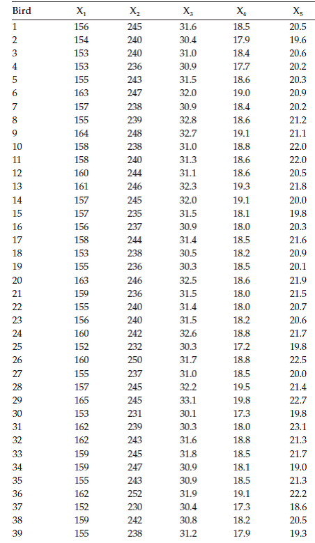
```

---
# Ptice i vremenska nepogoda

##### ...nastavak


```{r, include=TRUE, fig.align="center",  echo=FALSE, out.width="400px"}


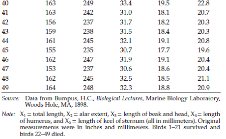
```


---

# Ptice i vremenska nepogoda

##### Korelacija između pet mjera veličine ptica
<br>
<br>
<br>
```{r, out.width="500px", include=TRUE, fig.align="center", echo=FALSE}


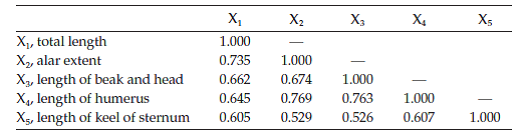
```


---

# Ptice i vremenska nepogoda

##### Svojstvene vrijednosti i vektori 
<br>
<br>
<br>

```{r, out.width="500px", include=TRUE, fig.align="center",  echo=FALSE}


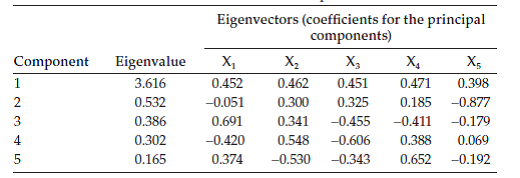
```

---

# Ptice i vremenska nepogoda

##### Provedena PCA 
<br>
<br>
<br>


```{r, out.width="500px", include=TRUE, fig.align="center",  echo=FALSE}


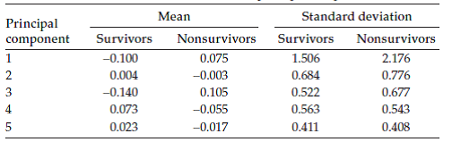


```
---

# Ptice i vremenska nepogoda

##### PCA vizualizacija (Crne točkice označavaju umrle ptice)

```{r, include=TRUE,out.width="500px", fig.align="center",  echo=FALSE}


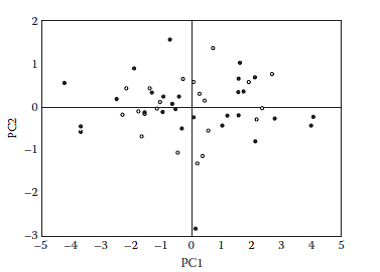
```

---

# Struktura zaposlenosti u europskim zemljama

##### Pregled podataka


```{r, include=TRUE,out.width="300px", fig.align="center",  echo=FALSE}

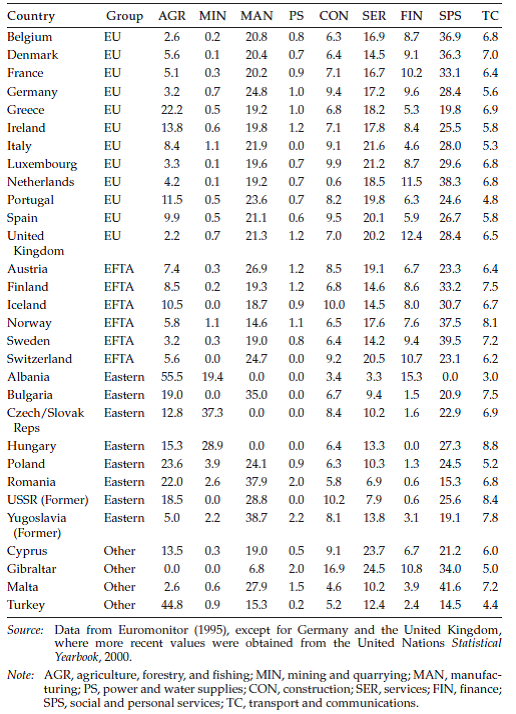
```


---

# Struktura zaposlenosti u europskim zemljama

##### Korelacijska matrica
<br>
<br>


```{r, include=TRUE,out.width="500px", fig.align="center",  echo=FALSE}


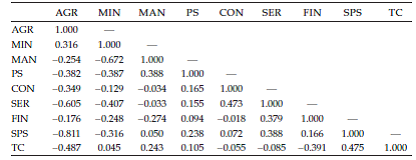
```

---

# Struktura zaposlenosti u europskim zemljama

##### PCA vizualizacija


```{r, include=TRUE,out.width="500px", fig.align="center", echo=FALSE}


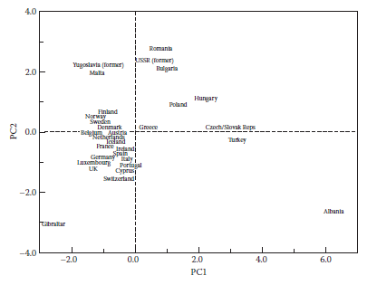
```

---

# Elementi razvoja osobnosti kod djece

##### PCA opterećenja

<br>
<br>

```{r, include=TRUE,out.width="450px", fig.align="center",  echo=FALSE}


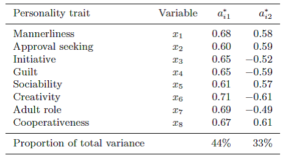
```

---

# Uspjeh u srednjoj školi

##### Korelacija između postignuća na različitim predmetima 
<br>
<br>
```{r, include=TRUE,out.width="500px", fig.align="center",  echo=FALSE}

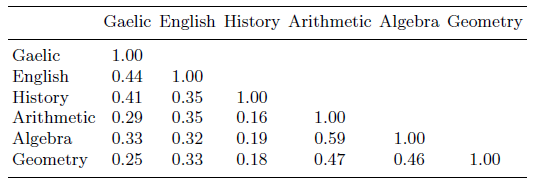
```

---

# Uspjeh u srednjoj školi

##### Provedena PCA
<br>
<br>

```{r, include=TRUE,out.width="500px", fig.align="center",  echo=FALSE}

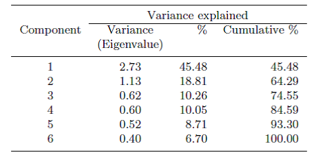
```

---

# Uspjeh u srednjoj školi

##### Vizualizacija dvije dominantne PCA komponente

```{r, include=TRUE,out.width="500px", fig.align="center",  echo=FALSE}

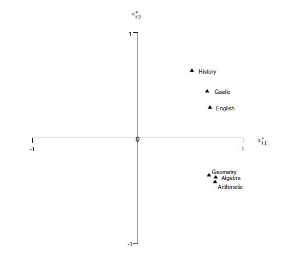
```

---

# Uspjeh u srednjoj školi

##### Opterećenja za prve dvije PCA komponente

```{r, include=TRUE,out.width="400px", fig.align="center",  echo=FALSE}


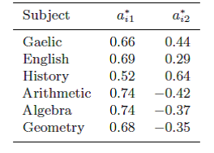
```

---

# Zaposlenost u EU

##### Opis varijabli 
<br>
<br>


```{r, include=TRUE,out.width="500px", fig.align="center",  echo=FALSE}

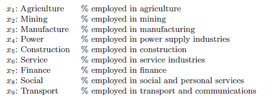
```

---

# Zaposlenost u EU

##### Korelacijska matrica

```{r, include=TRUE,out.width="450px", fig.align="center",  echo=FALSE}

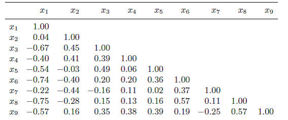
```

---

# Zaposlenost u EU

##### Varijanca pripadajućih PCA komponenti

```{r, include=TRUE,out.width="500px", fig.align="center",  echo=FALSE}

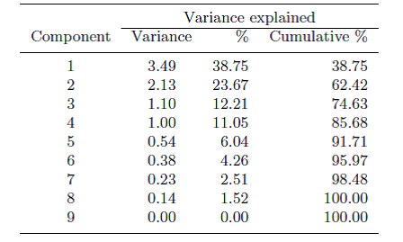
```

---

# Zaposlenost u EU

##### PCA opterećenja komponenti


```{r, include=TRUE,out.width="500px", fig.align="center",  echo=FALSE}

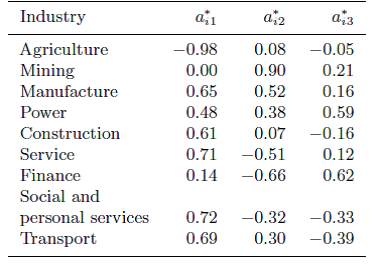
```

---

#Zaposlenost u EU

##### Scree grafikon za PCA analizu

```{r, include=TRUE,out.width="450px", fig.align="center",  echo=FALSE}

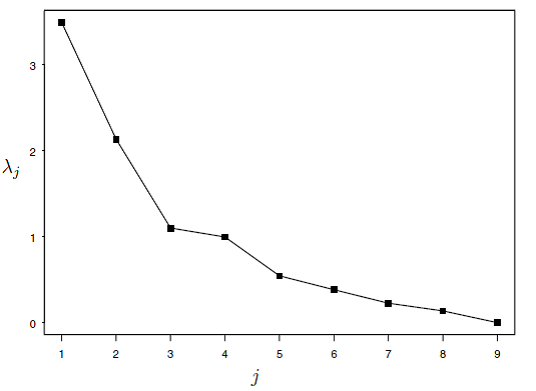
```

---

# Zaposlenost u EU

##### Vizualizacija dvije glavne PCA komponente po sektorima


```{r, include=TRUE, out.width="450px",fig.align="center",  echo=FALSE}

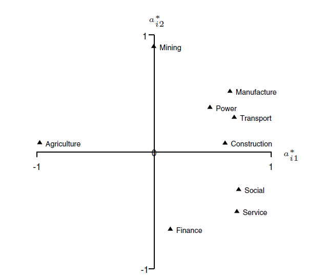
```

---

# Zaposlenost u EU

##### Vizualizacija dvije glavne PCA komponente po zemljama

```{r, include=TRUE,out.width="450px",fig.align="center",  echo=FALSE}


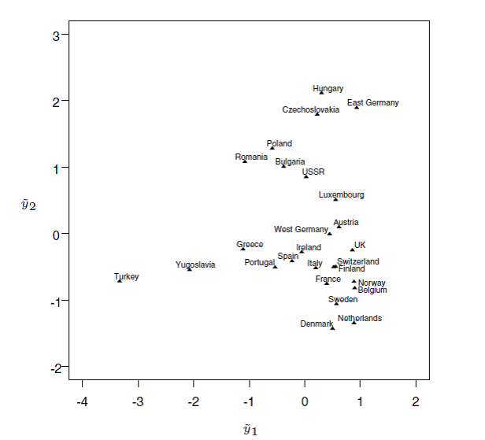
```

---

# Socijalna mobilnost u UK

##### Pregled varijabli


```{r, include=TRUE,out.width="500px", fig.align="center", echo=FALSE}


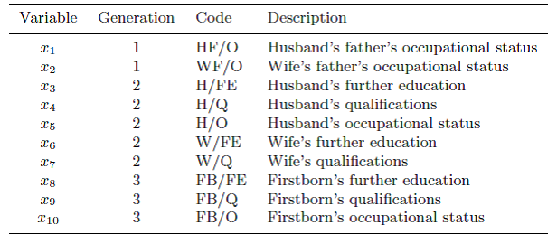
```

---

# Socijalna mobilnost u UK

##### Korelacijska matrica 

```{r, include=TRUE,out.width="500px", fig.align="center", echo=FALSE}


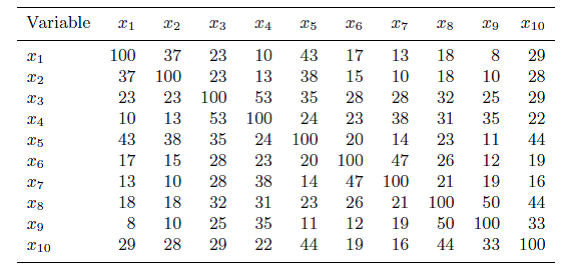
```

---

# Socijalna mobilnost u UK

##### PCA opterećenja

```{r, include=TRUE,out.width="500px", fig.align="center", echo=FALSE}

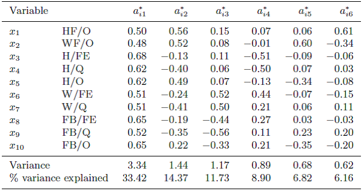
```

---

# Gledanje televizije u UK

##### Korelacijska matrica


```{r, include=TRUE,out.width="500px", fig.align="center", echo=FALSE}


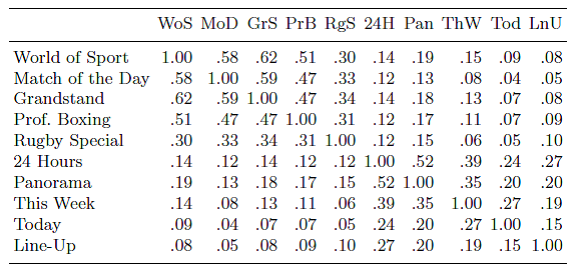
```

---

# Gledanje televizije u UK

##### Scree grafikon

```{r, include=TRUE,out.width="500px", fig.align="center", echo=FALSE}


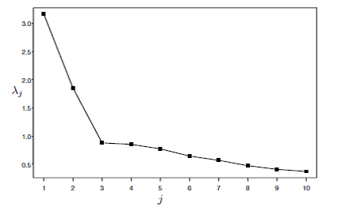
```

---

# Gledanje televizije u UK

##### PCA vizualizacija


```{r, include=TRUE,out.width="500px", fig.align="center", echo=FALSE}


knitr::include_graphics("../Foto/tv_pca_gg.png")
```

---
class: inverse, center, middle
name: primjena

# PRAKTIČNA PRIMJENA

<html><div style='float:left'></div><hr color='#EB811B' size=1px width=796px></html>

(PCA u praksi)

---

# Primjer 1 (Kriminal u SAD)

##### Podatci

```{r}

data("USArrests")  # Učitaj podatke
head(USArrests,10) # Pregledaj podatke
```

---

# Primjer 1 (Kriminal u SAD)

##### Skaliranje varijabli

```{r}

apply(USArrests, 2, var) # Pogledaj varijance verijabli
skalirano_dta <- apply(USArrests,2, scale) # Standardiziraj varijable
str(skalirano_dta) # Pogledaj novi objekt
head(skalirano_dta,4) # pogledaj podatke

```

---

# Primjer 1 (Kriminal u SAD)

##### Prilagodba podataka

```{r}

# Za izračun glavnih komponenti:
## 1. izračunaj kovarijančnu matricu
kov_dta <- cov(skalirano_dta)
## 2. Izračunaj svojstvene vrijednosti km
eig_kov_dta <- eigen(kov_dta)
str(eig_kov_dta) # Pogledaj objekt
## 3. Spremi opterećenja u novi objekt
opt <- eig_kov_dta$vectors[,1:2]
## 4. Okreni smjer svojstvenih vektora
opt <- -opt
## 5. Pripiši nazive
row.names(opt) <- c("Murder", "Assault", "UrbanPop", "Rape")
colnames(opt) <- c("PC1", "PC2")
```

---

# Primjer 1 (Kriminal u SAD)

##### Prilagodba podataka

```{r}
head(opt) # Pogledaj objekt
```

---


# Primjer 1 (Kriminal u SAD)

##### Prilagodba podataka (nastavak)


```{r}

## 6. Izračunaj koeficijente glavnih komponenti
PC1 <- as.matrix(skalirano_dta) %*% opt[,1]
PC2 <- as.matrix(skalirano_dta) %*% opt[,2]
## 7. Poveži u podatkovni okvir
PC <- data.frame(GEO = row.names(USArrests), PC1, PC2)
head(PC)

```

---

# Primjer 1 (Kriminal u SAD)

##### Prikaži grafički 

```{r, fig.height=4}
# Prikaži prve dvije PC komponente grafički
ggplot2:: ggplot(PC, aes(PC1,PC2)) + 
  modelr:: geom_ref_line(h=0) + 
  modelr:: geom_ref_line(v= 0) +
  geom_text(aes(label = GEO), size = 1.5) +
  xlab("PC1") + 
  ylab("PC2") + 
  ggtitle("Prve dvije glavne komponente za USArrests podatkovni okvir") +
theme_grey(base_size = 10)  -> USArViz
```

---

# Primjer 1 (Kriminal u SAD)

##### Prikaži grafički 

```{r, fig.height=3}
USArViz
```

---

# Primjer 1 (Kriminal u SAD)

##### Scree plot 

```{r, fig.height=6}

# Izračunaj varijabilnost vezanu uz glavne komponente

PCvar <- eig_kov_dta$values / sum(eig_kov_dta$values)
print(round(PCvar,2)) # Prikaži podatke

# Prikaži grafički

## Scree

PVEplot <- qplot(c(1:4), PCvar) + 
  geom_line() + 
  xlab("PC") + 
  ylab("PVE") +
  ggtitle("Scree") +
  ylim(0, 1)

```

---

# Primjer 1 (Kriminal u SAD)

##### Scree plot 

```{r, fig.height=3}
PVEplot
```
---

# Primjer 1 (Kriminal u SAD)

##### Kumulativni zbroj 

```{r, fig.height=6}

## CumSum scree

cumPVE <- qplot(c(1:4), cumsum(PCvar)) + 
  geom_line() + 
  xlab("PC") + 
  ylab(NULL) + 
  ggtitle("Cumulative Sum Scree") +
  ylim(0,1)

```
---

# Primjer 1 (Kriminal u SAD)

##### Kumulativni zbroj 

```{r, fig.height=3}
cumPVE
```

---

# Primjer 1 (Kriminal u SAD)

##### PCA pomoću funkcija 

.tiny[
```{r}
## PROVEDI PROCEDURU PUTEM FORMULA ##
PCA_fun <- prcomp(USArrests, scale = T)
names(PCA_fun) # Pregledaj objekt
# Pogledaj prosjek komponenti po varijablama
PCA_fun$center
# Pogledaj stdev komponenti po varijablama
PCA_fun$scale
# Pogledaj opterećenja
PCA_fun$rotation
```
]
---

# Primjer 1 (Kriminal u SAD)

##### PCA pomoću funkcija 

```{r}
# Promjeni predznak
PCA_fun$rotation <- -PCA_fun$rotation
PCA_fun$rotation 
# Izračunaj koeficijente
PCA_fun$x <- -PCA_fun$x
head(PCA_fun$x)
```

---

# Primjer 1 (Kriminal u SAD)

##### PCA pomoću funkcija 

```{r, echo = FALSE, message = F, warning = FALSE}
# funkcija za ljepši biplot
PCbiplot <- function(PC, x="PC1", y="PC2") {
    # PC being a prcomp object
    data <- data.frame(obsnames=row.names(PC$x), PC$x)
    plot <- ggplot(data, aes_string(x=x, y=y)) + geom_text(alpha=.99, size=0.8, aes(label=obsnames))
    datapc <- data.frame(varnames=rownames(PC$rotation), PC$rotation)
    mult <- min(
        (max(data[,y]) - min(data[,y])/(max(datapc[,y])-min(datapc[,y]))),
        (max(data[,x]) - min(data[,x])/(max(datapc[,x])-min(datapc[,x])))
        )
    datapc <- transform(datapc,
            v1 = .7 * mult * (get(x)),
            v2 = .7 * mult * (get(y))
            )
    plot <- plot + coord_equal() + geom_text(data=datapc, aes(x=v1, y=v2, label=varnames), size = 5, vjust=1, color="red")
    plot <- plot + geom_segment(data=datapc, aes(x=0, y=0, xend=v1, yend=v2), arrow=arrow(length=unit(0.2,"cm")), alpha=0.75, color="red")
    plot
}
```

```{r, fig.height=3}
# Vizualiziraj 
# biplot(PCA_fun, scale = 0) bi se koristio uobičajeno
PCbiplot(PCA_fun) # custom made funkcija; vidi .Rmd
```

---

# Primjer 1 (Kriminal u SAD)

##### PCA pomoću funkcija 

```{r, fig.height=5}
VE <- PCA_fun$sdev^2
PCv <- VE / sum(VE)
print(round(PCv, 2))
```

---

# Primjer 2 (Sportski rezultati)

##### Pregled podataka

```{r}
# Podatci
data(decathlon2)
head(decathlon2, 7)
```

---

# Primjer 2 (Sportski rezultati)

##### Pregled podataka (nastavak)

```{r}
str(decathlon2)
```

---

# Primjer 2 (Sportski rezultati)

##### Prilagodba podataka 

```{r}
# Definiraj podatke za analizu
decathlon2.active <- decathlon2[1:23, 1:10]
head(decathlon2.active[, 1:6], 10)
```

---

# Primjer 2 (Sportski rezultati)

##### Provedi PCA

.tiny[
```{r}
# Provedi PCA
procjena_PCA <- FactoMineR::PCA(decathlon2.active, graph = F)
print(procjena_PCA)
```
]

---

# Primjer 2 (Sportski rezultati)

##### Svojstvene vrijednosti

```{r}
# Izvuci svojstvene vrijednosti
svojstvene_vrijednosti <- get_eigenvalue(procjena_PCA)
print(svojstvene_vrijednosti)
```

---

# Primjer 2 (Sportski rezultati)

##### Svojstvene vrijednosti

```{r, fig.height=3}
# Prikaži grafički
fviz_eig(procjena_PCA, addlabels = T, ylim = c(0,45))
```

---

# Primjer 2 (Sportski rezultati)

##### Analiza varijabli

```{r}
## VARIJABLE ##
vars <- get_pca_var(procjena_PCA)
print(vars)
```

---

# Primjer 2 (Sportski rezultati)

##### Analiza varijabli

```{r}

head(vars$coord)   # Pogledaj koordinate za varijable 

```

---

# Primjer 2 (Sportski rezultati)

##### Analiza varijabli

```{r}
head(vars$cos2)    # Reprezentativnost varijabli
```

---

# Primjer 2 (Sportski rezultati)

##### Analiza varijabli

```{r}

head(vars$contrib) # Doprinos varijabli komponentama

```

---

# Primjer 2 (Sportski rezultati)

##### Analiza varijabli

```{r, fig.height=3}
# Prikaži varijable u prostoru glavnih komponenti
fviz_pca_var(procjena_PCA, col.var = "contrib")
```

---

# Primjer 2 (Sportski rezultati)

##### Analiza varijabli

.tiny[
```{r, fig.height=4}
# Prikaži kvalitetu reprezentacije varijabli u faktorskom prostoru
corrplot::corrplot(vars$cos2, is.corr = F)
```
]
---

# Primjer 2 (Sportski rezultati)

##### Analiza varijabli

```{r, fig.height=3}
# Prikaži doprinos na stupčastom grafikonu
fviz_cos2(procjena_PCA, choice = "var", axes = 1:2)
```

---

# Primjer 2 (Sportski rezultati)

##### Analiza varijabli

```{r, fig.height=3}
# Prikaži kvalitetu reprezentacije varijabli u PC prostoru
corrplot::corrplot(vars$contrib, is.corr = F)
```

---

# Primjer 2 (Sportski rezultati)

##### Analiza varijabli

```{r, fig.height=3}
# Prikaži na stupčastom grafikonu
fviz_contrib(procjena_PCA, choice = "var", axses = 1, top = 10)
```

---

# Primjer 2 (Sportski rezultati)

##### Proširena analiza
```{r, fig.height=3}
set.seed(123) # Grupiranje na osnovi Kmeans algoritma #
group_km <- kmeans(vars$coord, centers = 3, nstart = 25)
group <- as.factor(group_km$cluster)
fviz_pca_var(procjena_PCA, col.var = group,
             palette = c("#0073C2FF", "#EFC000FF", "#868686FF"),
             legend.title = "cluster")
```

---

# Primjer 2 (Sportski rezultati)

##### Analiza PCA dimenzija
.tiny[
```{r}
## OPIS DIMENZIJA ##
opis_PCA <- dimdesc(procjena_PCA, axes = c(1,2), proba = 0.05)
head(opis_PCA,10)
```
]

---
# Primjer 2 (Sportski rezultati)

##### Analiza PCA dimenzija

```{r}
# Prva dimenzija
opis_PCA$Dim.1
```

---

# Primjer 2 (Sportski rezultati)

##### Analiza PCA dimenzija

```{r}
# Druga dimenzija
opis_PCA$Dim.2
```

---

# Primjer 2 (Sportski rezultati)

##### Analiza PCA dimenzija

```{r}

## INDIVIDUALNI ELEMENTI ##

inds <- get_pca_ind(procjena_PCA) # Stvori IE objekt
print(inds) # Pregledaj

```

---

# Primjer 2 (Sportski rezultati)

##### Analiza PCA dimenzija

```{r}

head(inds$coord)     # Kordinate za IE
```

---
# Primjer 2 (Sportski rezultati)

##### Analiza PCA dimenzija

```{r}
head(inds$cos2)      # Reprezentativnost IE
```

---
# Primjer 2 (Sportski rezultati)

##### Analiza PCA dimenzija

```{r}
head(inds$contrib)   # Doprinos IE
```

---

# Primjer 2 (Sportski rezultati)

##### Analiza PCA dimenzija

```{r, fig.height=3}
# Prikaži doprinos IE
fviz_pca_ind(procjena_PCA, col.ind = "cos2",gradient.cols = c("#00AFBB", "#E7B800","#FC4E07"),repel = TRUE)
```

---

# Primjer 2 (Sportski rezultati)

##### Analiza PCA dimenzija

```{r, fig.height=3}
# Prikaži doprinos IE na stupčastom grafikonu
fviz_cos2(procjena_PCA, choice = "ind")
```

---

# Primjer 2 (Sportski rezultati)

##### Analiza PCA dimenzija

```{r, fig.height=3}
fviz_cos2(procjena_PCA, choice = "ind",
          axses = 1:2) # Prve dvije dimenzije
```

---

# Primjer 3 (Sportski rezultati)

##### Analiza PCA dimenzija

```{r, fig.height=3}
fviz_cos2(procjena_PCA, choice = "ind",
          axses = 1:2) # Prve dvije dimenzije

```

---


# Primjer 3 (Cvijeće)

##### Podatci

```{r}
head(iris,10) # Pogledaj podatke
```

---

# Primjer 3 (Cvijeće)

##### Provedi PCA

.tiny[
```{r}
# Provedi PCA
iris_PCA <- PCA(iris[,-5], graph = F)
iris_PCA
```
]

---

# Primjer 3 (Cvijeće)

##### Grafički prikaz

```{r, fig.height=2}
# Vizualizacija 1
fviz_pca_ind(iris_PCA,
             geom.ind = "point",
             col.ind = iris$Species, 
             addEllipses = T,
             legend.title = "Grupa",
             palette = c("#00AFBB", "#E7B800", "#FC4E07"))
```

---

# Primjer 3 (Cvijeće)

##### Grafički prikaz

```{r, fig.height=2}
# Vizualizacija 2
fviz_pca_biplot(iris_PCA,
             geom.ind = "point",
             col.ind = iris$Species, 
             addEllipses = T,
             legend.title = "Grupa",
             palette = "jco",
             col.var = "black",
             label = "var",
             repel = T)
```


---

class: inverse, center, middle

# Hvala na pažnji

<html><div style='float:left'></div><hr color='#EB811B' size=1px width=796px></html>

(Nastavak: Faktorska analiza)


