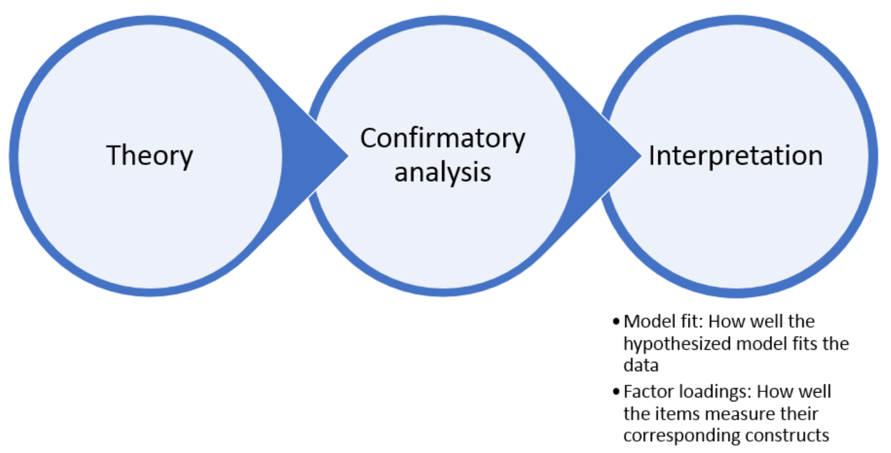

```{r setup, include=FALSE}
options(htmltools.dir.version = FALSE)
library(knitr)
opts_chunk$set(
  fig.align="center", #fig.width=6, fig.height=4.5, 
  # out.width="748px", #out.length="520.75px",
  dpi=300, #fig.path='Figs/',
  cache=F#, echo=F, warning=F, message=F
  )
```

```{css, echo = F, eval = T}
@media print {
  .has-continuation {
    display: block !important;
  }
}
remark-slide-content {
  font-size: 22px;
  padding: 20px 80px 20px 80px;
}
.remark-code, .remark-inline-code {
  background: #f0f0f0;
}
.remark-code {
  font-size: 16px;
}
.mid. remark-code { /*Change made here*/
  font-size: 60% !important;
}
.tiny .remark-code { /*Change made here*/
  font-size: 40% !important;
}
```

```{r paketi, warning=F, echo=F, message=F, eval=FALSE}

library(FactoMineR)
library(factoextra)
library(FactoMineR)
library(tidyverse)  # data manipulation and visualization
library(gridExtra)  # plot arrangement
library(patchwork)
library(ggplot2)
library(lavaan)
library(sem)

```

# Pregled predavanja

<br>
<br>
<br>


1. [Jednodimenzionalna faktorska analiza (FA)](#uni)

2. [Multidimenzionalna FA](#multi)

3. [Konfirmatorna FA](#conf)


---
class: inverse, center, middle
name: uni

# FAKTORSKA ANALIZA

<html><div style='float:left'></div><hr color='#EB811B' size=1px width=796px></html>

(Općenito)

---


- Charles Spearman (1904) je zaslužan za uvođenje FA
- FA ima mnogo sičnosti sa PCA
- Cilj FA je reducirati veliki broj (koreliranih) varijabli na mali broj indeksa (faktora)
- FA je statistički model (za razliku od PCA koja je statistička metoda)
<br>
<br>
##### **Procedura provođenja FA**:
1. Izračunaj faktorska opterećenja (~PCA)
2. Faktorska rotacija (ortogonalna/zaobljena)
3. Izračunaj faktorske koeficijente (za pripadajuće individualne elemente)


---

# Odnos FA i drugih analiza
<br>
<br>

- Klasična analiza: opterećenja su neponderirana suma varijabli
- FA: opterećenja su empirisjki ponderirana suma varijabli pri čemu su ponderi određeni na osnovi korelacije varijabli
- SEM: proširenje faktorske analize na način da uključuje odnose između latentnih varijabli

---

# Vrste FA
<br>
<br>

.pull-left[
##### EKSPLORATIVNA

- koristi se u fazi razvoja modela
- pregled faktorske strukture
- opća slika o varijablama
]

.pull-right[
##### KONFIRMATORNA

- procijeni kosntrukt
- koristi se nakon razvoja mjere

]


---
class: inverse, center, middle

# PODATCI I PODRŠKA

<html><div style='float:left'></div><hr color='#EB811B' size=1px width=796px></html>

(Pretpostavke za analizu)

---

# Paket

- koristimo `psych` paket

- za detalje o paketu pogledajte [Personality project](http://personality-project.org/r/psych/)

```{r}
library(psych)
```

---

# Podatci

- koristimo `gcbs` podatkovni skup (Generic Conspiracist Beliefs Survey)
- provjerite da li i vas prisluškuju na [Open psychometrics](https://openpsychometrics.org/tests/GCBS/) 


```{r}
gcbs <- readRDS("../Podatci/GCBS_data.rds")
str(gcbs)
```


---

# Konstrukti

- Zavjera vlade (GM)
- Prikrivanje vanzemaljaca (ET)
- Zle i zavjereničke globalne organizacije (MG)
- osobna dobrobit (PW)
- kontrola informacija (CI)

Za detalje o varijablama pogledajte [Measuring belief in conspiracy theories](https://www.frontiersin.org/articles/10.3389/fpsyg.2013.00279/full)

---

# Varijable i konstrukti

```{r, include=TRUE, fig.align="center", echo=FALSE, out.width="300px"}

knitr::include_graphics("../Foto/konstrukti_FA.png")
```

---

# Jednodimenzionalni konstrukt

```{r, include=TRUE, fig.align="center", echo=FALSE, out.width="300px"}

knitr::include_graphics("../Foto/unidim_FA.png")
```

---

# Jednodimenzionalni konstrukt

.tiny[
.pull-left[
```{r}
EFA_model <- fa(gcbs)
EFA_model$loadings
```
]
]
.pull-right[
```{r}
fa.diagram(EFA_model)
```

]


---
class: inverse, center, middle

# RAZVOJ KONSTRUKTA

<html><div style='float:left'></div><hr color='#EB811B' size=1px width=796px></html>

(Prije analize...)

---

# Procedura razvoja konstrukta

- Odredi elemente konstrukta
- Prikupi podatke 
- Upoznaj se sa podatcima
- Odluka što koristiti EFA, CFA ili obje analize
- Podijeli uzorak u dva (slučajna; *random*) dijela (za obje)
- Usporedi uzorke


---

# Upoznaj se sa podatcima

```{r}
describe(gcbs)
```


---

# Podijeli podatke

```{r}
N <- nrow(gcbs)
indices <- seq(1,N)
indices_EFA <- sample(indices,floor((0.5 * N)))
indices_CFA <- indices[!(indices %in% indices_EFA)]
gcbs_EFA <- gcbs[indices_EFA, ]
gcbs_CFA <- gcbs[indices_CFA, ]
```

---

# Usporedi polovice

```{r}
group_var <- vector("numeric", nrow(gcbs))
group_var[indices_EFA] <- 1
group_var[indices_CFA] <- 2
head(group_var,15)
```

---

# Usporedi polovice


```{r}
gcbs_grouped <- cbind(gcbs, group_var)
describeBy(gcbs_grouped, group = group_var)
```

---

# Usporedi polovice

```{r}
statsBy(gcbs_grouped, group = "group_var")
```

---

# Korelacije varijabli

```{r}
lowerCor(gcbs)
```

---

# Signifikantnost korelacija

```{r}
corr.test(gcbs, use = "pairwise.complete.obs")$p
```


---

# Intervali pouzdanosti

```{r}
corr.test(gcbs, use = "pairwise.complete.obs")$ci
```

---

# Alfa koeficijent

```{r}
alpha(gcbs)
```

---

# Pouzdanost podjele

```{r}
splitHalf(gcbs)
```

---
class: inverse, center, middle
name: uni

# MULTIDIMENZIONALNA FA

<html><div style='float:left'></div><hr color='#EB811B' size=1px width=796px></html>

(U praksi uvijek ima više od jedne dimenzije)

---

# Podatci

- koristimo podatke Synthetic Aperture Personality Assessment(SAPA)
- 2.800 osoba
- 25 pitanja
.tiny[
```{r}
data(bfi)
str(bfi)
```
]

---

# Podatci

```{r}
head(bfi)
```

---

# Podatci

```{r}
names(bfi)
```

---

# Konstrukt


```{r, include=TRUE, fig.align="center", echo=FALSE, out.width="300px"}
knitr::include_graphics("../Foto/bfi_FA.png")
```

---

# Konstrukt

- konstrukt se ne može direktno mjeriti
- primjeri: samoodređenost, sposobnost razmišlljanja, politička pripadnost, ekstrovertiranost 

```{r, include=TRUE, fig.align="center", echo=FALSE, out.width="200px"}

```

---

# Podijeli podatke

```{r}
N <- nrow(bfi)
indices <- seq(1, N)
indices_EFA <- sample(indices, floor((.5*N)))
indices_CFA <- indices[!(indices %in% indices_EFA)]
bfi_EFA <- bfi[indices_EFA, ]
bfi_CFA <- bfi[indices_CFA, ]
```

---

# Podijeli podatke

```{r}
head(bfi_EFA, 2)
head(bfi_CFA, 2)
```

---

# ...bez teorije


```{r, include=TRUE, fig.align="center", echo=FALSE, out.width="300px"}
knitr::include_graphics("../Foto/noTheory_FA.png")
```

---

# Korelacijska matrica


```{r}
bfi_EFA_cor <- cor(bfi_EFA, use = "pairwise.complete.obs")
head(bfi_EFA_cor,4) 
```


---

# Svojsvene vrijednosti


```{r}
scree(bfi_EFA_cor, factors = FALSE)
```


---

# Eksplorativna vs. konfirmatorna FA


```{r, include=TRUE, fig.align="center", echo=FALSE, out.width="150px"}

```


```{r, include=TRUE, fig.align="center", echo=FALSE, out.width="150px"}

```


---

# Provedi FA

```{r}
EFA_model <- fa(bfi_EFA, nfactors = 6)
EFA_model
```

---

# Faktorska opterećenja

.tiny[
```{r}
EFA_model$loadings
```
]


---

# Faktorski koeficijenti

```{r}
head(EFA_model$scores)
```

---

# Procjena kvalitete modela (fit)

##### Apsolutne mjere

- Chi-square test: nesignifikanstnost
- Tucker-Lewis Index (TLI) : > 0.90
- Root Mean Square Error of Approximation (RMSEA): < 0.05

##### Relativne mjere

- Bayesian Information Criterion (BIC)

---

# Procjena kvalitete modela

.tiny[
```{r, eval = FALSE}
EFA_model <- fa(bfi_EFA, nfactors = 6)
EFA_model
```
]

---

# Procjena kvalitete modela (relativna)

```{r}
bfi_theory <- fa(bfi_EFA, nfactors = 5)
bfi_eigen <- fa(bfi_EFA, nfactors = 6)

bfi_theory$BIC
bfi_eigen$BIC
bfi_theory$BIC
bfi_eigen$BIC
```


---
class: inverse, center, middle
name: conf

# KONFIRMATORNA FA (CFA)

<html><div style='float:left'></div><hr color='#EB811B' size=1px width=796px></html>

(Kada postoji teorija!)

---

# Razlozi za korištenje
<br>
<br>
<br>
- Eksplicitno specificiran odnos među varijablama
<br>
- Testiranje teorije koja je unaprijed poznata
<br>
- Pristup koji se koristi kod razvoja nove mjere


---

# Skica

```{r, include=TRUE, fig.align="center", echo=FALSE, out.width="300px"}

```

---

# Provedi CFA


```{r}
EFA_syn <- structure.sem(EFA_model)
head(EFA_syn,15)
```

---

# CFA na osnovi teorije

```{r}
# Uredi sintaksu
theory_syn_eq <- "
AGE: A1, A2, A3, A4, A5 #Agreeableness
CON: C1, C2, C3, C4, C5 #Conscientiousness
EXT: E1, E2, E3, E4, E5 #Extraversion
NEU: N1, N2, N3, N4, N5 #Neuroticism
OPE: O1, O2, O3, O4, O  #Openness
"

```

- Kraki nazivi
- Naziv faktora pa dvotočka
- Elementi kao comma-separated lista

```{r}
theory_syn <- sem::cfa(text = theory_syn_eq, reference.indicators = FALSE)
```

---

# Odnos između varijabli i faktora
.tiny[
```{r}
head(theory_syn,25)
```
]


---

# Provedi CFA


```{r, eval = FALSE}
theory_CFA <- sem::sem(theory_syn, data = bfi_CFA)
summary(theory_CFA)
```


`Model Chisquare =  2212.032   Df =  265 Pr(>Chisq) = 9.662018e-304 AIC =  2332.032 BIC =  326.618 Normalized Residuals   Min. 1st Qu.  Median    Mean 3rd Qu.    Max. -5.5800 -0.3732  1.0350  1.1220  2.4710  8.9000  R-square for Endogenous Variables    A1     A2     A3     A4     A5     C1     C2     C3     C4 0.1178 0.4475 0.5731 0.2994 0.4713 0.3006 0.3667 0.2947 0.4886 ... Parameter Estimates            Estimate   Std Error  z value    Pr(>|z|)                  lam[A1:AGE] -0.5011716 0.04487184 -11.168956  5.785714e-29 A1 <--- AGE lam[A2:AGE]  0.8230960 0.03447831  23.872862 5.863008e-126 A2 <--- AGE`


