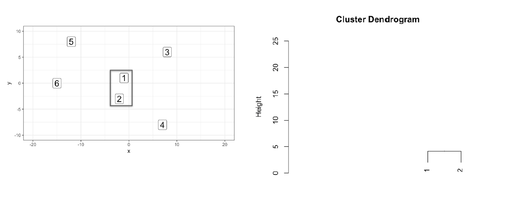

```{r setup, include=FALSE}
options(htmltools.dir.version = FALSE)
library(knitr)
opts_chunk$set(
  fig.align="center", #fig.width=6, fig.height=4.5, 
  # out.width="748px", #out.length="520.75px",
  dpi=300, #fig.path='Figs/',
  cache=F#, echo=F, warning=F, message=F
  )
```

```{css, echo = F, eval = T}
@media print {
  .has-continuation {
    display: block !important;
  }
}
remark-slide-content {
  font-size: 22px;
  padding: 20px 80px 20px 80px;
}
.remark-code, .remark-inline-code {
  background: #f0f0f0;
}
.remark-code {
  font-size: 16px;
}
.mid. remark-code { /*Change made here*/
  font-size: 60% !important;
}
.tiny .remark-code { /*Change made here*/
  font-size: 40% !important;
}
```

```{r paketi, warning=F, echo=F, message=F, eval=TRUE}

library(tidyverse)  # data manipulation and visualization
library(gridExtra)  # plot arrangement
library(ggplot2)
library(tidyverse)
library(dplyr)
```

# Pregled predavanja

<br>
<br>
<br>


1. [Karakteristike klaster analize](#kars)

2. [Udaljenost između opservacija](#slic)

2. [Hijerarhijski klastering](#hier)

3. [K-means klastering](#kmen)


---

class: inverse, center, middle
name: kars

# KLASTER ANALIZA

<html><div style='float:left'></div><hr color='#EB811B' size=1px width=796px></html>

(Općenito)

---

# Što je klaster analiza?


```{r, include=TRUE, fig.align="center", echo=FALSE, out.width="500px"}


```

---

# Što je klaster analiza?

```{r, include=TRUE, fig.align="center", echo=FALSE, out.width="500px"}

knitr::include_graphics("../Foto/klast3.png")
```
<br>
---

# Što je klaster analiza?

```{r, include=TRUE, fig.align="center", echo=FALSE, out.width="500px"}

knitr::include_graphics("../Foto/klast4.png")
```
<br>
---

# Što je klaster analiza?

```{r, include=TRUE, fig.align="center", echo=FALSE, out.width="500px"}

knitr::include_graphics("../Foto/klast5.png")
```
<br>
---

# Tijek klaster analize
<br>
<br>
<br>
<br>
```{r, include=TRUE, fig.align="center", echo=FALSE, out.width="650px"}


```

---

class: inverse, center, middle
name: slic

# UDALJENOST IZMEĐU OPSEVACIJA

<html><div style='float:left'></div><hr color='#EB811B' size=1px width=796px></html>

(Podloga za klastering)

---

# Udaljenost vs. sličnost
<br>
<br>
<br>
```{r, include=TRUE, fig.align="center", echo=FALSE, out.width="500px"}

knitr::include_graphics("../Foto/klastDist1.png")
```

---

# Udaljenost vs. sličnost
<br>
<br>
<br>
```{r, include=TRUE, fig.align="center", echo=FALSE, out.width="500px"}

knitr::include_graphics("../Foto/klastDist2.png")
```

---

# Udaljenost vs. sličnost
<br>
<br>
<br>
```{r, include=TRUE, fig.align="center", echo=FALSE, out.width="500px"}

knitr::include_graphics("../Foto/klastDist3.png")
```

---

# Udaljenost vs. sličnost
<br>
<br>
<br>
```{r, include=TRUE, fig.align="center", echo=FALSE, out.width="500px"}


```

---

# Udaljenost vs. sličnost
<br>
<br>
<br>
```{r, include=TRUE, fig.align="center", echo=FALSE, out.width="500px"}

knitr::include_graphics("../Foto/klastDist5.png")
```

---

# Udaljenost vs. sličnost
<br>
<br>
<br>
```{r, include=TRUE, fig.align="center", echo=FALSE, out.width="500px"}

knitr::include_graphics("../Foto/klastDist6.png")
```

---

# Udaljenost vs. sličnost
<br>
<br>
<br>
```{r, include=TRUE, fig.align="center", echo=FALSE, out.width="500px"}

knitr::include_graphics("../Foto/klastDist7.png")
```

---

# Udaljenost vs. sličnost
<br>
<br>
<br>
```{r, include=TRUE, fig.align="center", echo=FALSE, out.width="500px"}

knitr::include_graphics("../Foto/klastDist8.png")
```

---

# Udaljenost vs. sličnost
<br>
<br>
<br>
```{r, include=TRUE, fig.align="center", echo=FALSE, out.width="500px"}

knitr::include_graphics("../Foto/klastDist9.png")
```

---

# Više od dvije opservacije

```{r}
# Napravi podatke
triIgraca <- data.frame(X = c(0,9,-2),
                            Y = c(0,12,19),
                            row.names = c("BLUE", "RED", "GREEN"))

print(triIgraca) # Prikaži 

dist(triIgraca)  # Izračunaj udaljenosti
```


---

# Udaljenost između opservacija


```{r}
# Napravi podatke
visinaTezina <- data.frame(Visina = c(6,6,8),
                           Tezina = c(200,202,200),
                           row.names = c(1,2,3))

# Prikazi podatke 
print(visinaTezina)
```

---

# Udaljenost između opservacija

```{r, include=TRUE, fig.align="center", echo=FALSE, out.width="500px"}
knitr::include_graphics("../Foto/klastVisina.png")
```

---

# Udaljenost između opservacija

```{r, include=TRUE, fig.align="center", echo=FALSE, out.width="500px"}
knitr::include_graphics("../Foto/klastVisina1.png")
```

---

# Udaljenost između opservacija

```{r, include=TRUE, fig.align="center", echo=FALSE, out.width="500px"}

```

---

# Udaljenost između opservacija

```{r, include=TRUE, fig.align="center", echo=FALSE, out.width="500px"}

```

---

# Udaljenost između opservacija

```{r, include=TRUE, fig.align="center", echo=FALSE, out.width="500px"}

```

---

# Udaljenost između opservacija
<br>
<br>
<br>
<br>
$$
visina(skalirano) = \frac{visina - (prosječna)visina}{std(visina)}
$$

---

# Udaljenost između opservacija
<br>
<br>
```{r, include=TRUE, fig.align="center", echo=FALSE, out.width="500px"}
knitr::include_graphics("../Foto/klastDist10.png")
```

---

# Udaljenost između opservacija
<br>
<br>
```{r, include=TRUE, fig.align="center", echo=FALSE, out.width="500px"}
knitr::include_graphics("../Foto/klastDist11.png")
```

---

# Skaliranje 
<br>
<br>

.pull-left[
```{r, message= F, warning=F, fig.height=6}
# Prikaži podatke
print(visinaTezina)
```
]

.pull-right[
```{r}
# Skalirani podatci
scale(visinaTezina)
```
]
---

# Kategorički podatci

```{r, message= F, warning=F, fig.height=6}
# Napravi podatke
zadovoljstvo <- data.frame(
                      zadovoljstvo = c("Nisko","Nisko","Visoko","Nisko","Srednje"),
                      sreća = c("Ne","Ne","Da","Ne","Ne"))
# Prikaži podatke u tablici
kable(zadovoljstvo)
```

---

# Jaccardova udaljenost u R

```{r, message= F, warning=F, fig.height=6}
# Prikaži podatke
print(zadovoljstvo)
# Udaljenost za kategoričke podatke (NA)
dist(zadovoljstvo, method = "binary") 
```

---

# Jaccardova udaljenost u R


```{r, message= F, warning=F, fig.height=6}
library(dummies)
dummieZadovoljstvo <- dummy.data.frame(zadovoljstvo) # Pretvori u dummie
print(dummieZadovoljstvo)
```

---

# Jaccardova udaljenost u R

```{r, message= F, warning=F, fig.height=6}
# Prikaži podatke
print(zadovoljstvo)
```


```{r, message= F, warning=F, fig.height=6}
 # Udaljenost za kategorije
dist(dummieZadovoljstvo, method = "binary") 
```

---

class: inverse, center, middle
name: kars

# HIJERARHIJSKI KLASTERING

<html><div style='float:left'></div><hr color='#EB811B' size=1px width=796px></html>

---

# Grupiranje

<br>
<br>
```{r, include=TRUE, fig.align="center", echo=FALSE, out.width="500px"}

```

---

# Grupiranje

<br>
<br>
```{r, include=TRUE, fig.align="center", echo=FALSE, out.width="500px"}
knitr::include_graphics("../Foto/klastH2.png")
```


---

# Grupiranje

<br>
<br>
```{r, include=TRUE, fig.align="center", echo=FALSE, out.width="500px"}

```

---

# Grupiranje

<br>
<br>
```{r, include=TRUE, fig.align="center", echo=FALSE, out.width="500px"}
knitr::include_graphics("../Foto/klastH4.png")
```

---

# Grupiranje

<br>
<br>
```{r, include=TRUE, fig.align="center", echo=FALSE, out.width="500px"}
knitr::include_graphics("../Foto/klastH5.png")
```

---

# Grupiranje

<br>
<br>
```{r, include=TRUE, fig.align="center", echo=FALSE, out.width="500px"}

```

---

# Grupiranje

<br>
<br>
```{r, include=TRUE, fig.align="center", echo=FALSE, out.width="500px"}
knitr::include_graphics("../Foto/klastH7.png")
```

---

# Grupiranje

<br>
<br>
```{r, include=TRUE, fig.align="center", echo=FALSE, out.width="500px"}
knitr::include_graphics("../Foto/klastH8.png")
```

---

# Grupiranje

<br>
<br>
```{r, include=TRUE, fig.align="center", echo=FALSE, out.width="500px"}

```

---

# Grupiranje

<br>
<br>
```{r, include=TRUE, fig.align="center", echo=FALSE, out.width="500px"}
knitr::include_graphics("../Foto/klastH10.png")
```

---

# Izgled klastera

<br>
<br>
```{r, include=TRUE, fig.align="center", echo=FALSE, out.width="500px"}
knitr::include_graphics("../Foto/klastIZ1.png")
```

---

# Izgled klastera

<br>
<br>
```{r, include=TRUE, fig.align="center", echo=FALSE, out.width="500px"}
knitr::include_graphics("../Foto/klastIZ1.png")
```

---

# Izgled klastera

<br>
<br>
```{r, include=TRUE, fig.align="center", echo=FALSE, out.width="500px"}

```
---

# Izgled klastera

<br>
<br>
```{r, include=TRUE, fig.align="center", echo=FALSE, out.width="500px"}

```
---

# Izgled klastera

<br>
<br>
```{r, include=TRUE, fig.align="center", echo=FALSE, out.width="500px"}
knitr::include_graphics("../Foto/klastIZ4.png")
```
---

# Izgled klastera

<br>
<br>
```{r, include=TRUE, fig.align="center", echo=FALSE, out.width="500px"}

```
---

# Izgled klastera

<br>
<br>
```{r, include=TRUE, fig.align="center", echo=FALSE, out.width="500px"}
knitr::include_graphics("../Foto/klastIZ6.png")
```
---

# Izgled klastera

<br>
<br>
```{r, include=TRUE, fig.align="center", echo=FALSE, out.width="500px"}

```
---

# Izgled klastera

<br>
<br>
```{r, include=TRUE, fig.align="center", echo=FALSE, out.width="500px"}

```
---

# Izgled klastera

<br>
<br>
```{r, include=TRUE, fig.align="center", echo=FALSE, out.width="500px"}

```
---

# Izgled klastera

<br>
<br>
```{r, include=TRUE, fig.align="center", echo=FALSE, out.width="500px"}
knitr::include_graphics("../Foto/klastIZ10.png")
```

---

# Klastering procedura

```{r, message= F, warning=F, fig.height=6}
# Napravi podatke
igraci <-  data.frame(X = c(-1,-2,8,7,-12,-15),
                      Y = c(1,-3,6,-8,8,0))
# Prikaži podatke
print(igraci) 
# Izračunaj udaljenost
distIgraci <- dist(igraci, method = "euclidean") 
# Provedi klastering
hcIgraci <- hclust(distIgraci, method = 'complete') 
```

---

# Klastering procedura

```{r, message= F, warning=F, fig.height=6}
klasteri <- cutree(hcIgraci, k = 2) # Odredi broj klastera
print(klasteri) # Prikaži podatke
igraciKlasteri<- mutate(igraci, cluster = klasteri) # Prilagodba podataka
# Podatci + klasteri
print(igraciKlasteri) 
```
---

# Klastering procedura

```{r, message= F, warning=F, fig.height=3}
# Prikaži podatke grafički
ggplot(igraciKlasteri, aes(x = X, y = Y, color = factor(klasteri))) +
  geom_point() +
  ggtitle("Prikaz igrača i klastera u koordinatnom sustavu")
  
```

---

# Napravi dendogram

<br>
<br>
```{r, include=TRUE, fig.align="center", echo=FALSE, out.width="600px"}

```

---

# Napravi dendogram

<br>
<br>
```{r, include=TRUE, fig.align="center", echo=FALSE, out.width="600px"}
knitr::include_graphics("../Foto/klastDend2.png")
```

---

# Napravi dendogram

<br>
<br>
```{r, include=TRUE, fig.align="center", echo=FALSE, out.width="600px"}

```

---

# Napravi dendogram

<br>
<br>
```{r, include=TRUE, fig.align="center", echo=FALSE, out.width="600px"}
knitr::include_graphics("../Foto/klastDend4.png")
```
---

# Napravi dendogram

<br>
<br>
```{r, include=TRUE, fig.align="center", echo=FALSE, out.width="600px"}
knitr::include_graphics("../Foto/klastDend5.png")
```
---

# Napravi dendogram

<br>
<br>
```{r, include=TRUE, fig.align="center", echo=FALSE, out.width="600px"}
knitr::include_graphics("../Foto/klastDend6.png")
```

---

# Napravi dendogram

<br>
<br>
```{r, include=TRUE, fig.align="center", echo=FALSE, out.width="600px"}

```
---

# Napravi dendogram

<br>
<br>
```{r, include=TRUE, fig.align="center", echo=FALSE, out.width="600px"}
knitr::include_graphics("../Foto/klastDend8.png")
```

---

# Napravi dendogram

```{r, message= F, warning=F, fig.height=4}
plot(hcIgraci)
```

---

# Odredi broj klastera

<br>
<br>
```{r, include=TRUE, fig.align="center", echo=FALSE, out.width="500px"}

```
---

# Odredi broj klastera

<br>
<br>
```{r, include=TRUE, fig.align="center", echo=FALSE, out.width="500px"}

```
---

# Odredi broj klastera

```{r, message= F, warning=F, fig.height=3}
library(dendextend) # Učitaj paket
dendIgraci <- as.dendrogram(hcIgraci) # Napravi dendogram
dendBoje <- color_branches(dendIgraci, h = 2) # Prilagodi dendogram
plot(dendBoje) # Prikaži dendogram
```

---

# Broj klastera

```{r , message= F, warning=F, fig.height=5}
dendIgraci <- as.dendrogram(hcIgraci) # Napravi dendogram
dendBoje <- color_branches(dendIgraci, k = 5) # Prilagodi dendogram
plot(dendBoje) # Prikaži dendogram
```

---

# Broj klastera

```{r, message= F, warning=F, fig.height=5}
clusterPripisano <- cutree(hcIgraci, h = 15) # "Odreži"
print(clusterPripisano) # Prikaz podataka
igraciKlaster <- mutate(igraci, cluster = clusterPripisano) # Prilagodba podataka
print(igraciKlaster) # Podatci + klasteri
```


---

class: inverse, center, middle
name: kars

# K MEANS KLASTERING

<html><div style='float:left'></div><hr color='#EB811B' size=1px width=796px></html>

(Najćešća klastering metoda)

---

# Intuicija

<br>
<br>
```{r, include=TRUE, fig.align="center", echo=FALSE, out.width="500px"}
knitr::include_graphics("../Foto/klastK.png")
```
---

# Intuicija

<br>
<br>
```{r, include=TRUE, fig.align="center", echo=FALSE, out.width="500px"}

```
---

# Intuicija

<br>
<br>
```{r, include=TRUE, fig.align="center", echo=FALSE, out.width="500px"}

```
---

# Intuicija

<br>
<br>
```{r, include=TRUE, fig.align="center", echo=FALSE, out.width="500px"}
knitr::include_graphics("../Foto/klastK3.png")
```
---

# Intuicija

<br>
<br>
```{r, include=TRUE, fig.align="center", echo=FALSE, out.width="500px"}
knitr::include_graphics("../Foto/klastK4.png")
```
---

# Intuicija

<br>
<br>
```{r, include=TRUE, fig.align="center", echo=FALSE, out.width="500px"}

```
---

# Intuicija

<br>
<br>
```{r, include=TRUE, fig.align="center", echo=FALSE, out.width="500px"}

```
---

# Intuicija

<br>
<br>
```{r, include=TRUE, fig.align="center", echo=FALSE, out.width="500px"}
knitr::include_graphics("../Foto/klastK7.png")
```
---

# Intuicija

<br>
<br>
```{r, include=TRUE, fig.align="center", echo=FALSE, out.width="500px"}
knitr::include_graphics("../Foto/klastK8.png")
```
---

# Intuicija

<br>
<br>
```{r, include=TRUE, fig.align="center", echo=FALSE, out.width="500px"}

```

---

# Provedi kmeans()

```{r, message= F, warning=F, fig.height=6}
# Napravi podatke
lineup <- data.frame(X =c(-1,-2,8,7,-12,-15,-13,15,21,12,-25,26),
           Y = c(1,-3,6,-8,8,0,-10,16,2,-15,1,0))
# Pregledaj podatke
head(print(lineup),6) 
# Provedi K-means
model <- kmeans(lineup, centers = 2)
```

---

# Provedi kmeans()

```{r, message= F, warning=F, fig.height=6}
print(model$cluster) # Prikaži klastere
```

```{r, message= F, warning=F, fig.height=6}
lineupKlasteri <- mutate(lineup, cluster = model$cluster) # Prilagodi podatke
head(print(lineupKlasteri),6) # Prikaži klastere i podatke
```

--- 

# Odredi broj klastera
<br>
<br>
```{r, include=TRUE, fig.align="center", echo=FALSE, out.width="500px"}

```
--- 

# Odredi broj klastera
<br>
<br>
```{r, include=TRUE, fig.align="center", echo=FALSE, out.width="500px"}
knitr::include_graphics("../Foto/klastK11.png")
```
--- 

# Odredi broj klastera
<br>
<br>
```{r, include=TRUE, fig.align="center", echo=FALSE, out.width="500px"}

```
--- 

# Odredi broj klastera
<br>
<br>
```{r, include=TRUE, fig.align="center", echo=FALSE, out.width="500px"}

```
--- 

# Odredi broj klastera
<br>
<br>
```{r, include=TRUE, fig.align="center", echo=FALSE, out.width="500px"}

```
--- 

# Odredi broj klastera
<br>
<br>
```{r, include=TRUE, fig.align="center", echo=FALSE, out.width="500px"}
knitr::include_graphics("../Foto/klastK15.png")
```
--- 

# Odredi broj klastera
<br>
<br>
```{r, message= F, warning=F, fig.height=6}
model <- kmeans(x = lineup, centers = 2) # Provedi model sa dva klastera
model$tot.withinss # Kvaliteta modela
```
--- 

# Odredi broj klastera
<br>
<br>
```{r, message= F, warning=F, fig.height=6}
library(purrr)
tot_withinss <- map_dbl(1:10, function(k){
model <- kmeans(x = lineup, centers = k)
model$tot.withinss
})
elbow_df <- data.frame(
k = 1:10,
tot_withinss = tot_withinss
)
head(print(elbow_df),5)
```
--- 

# Odredi broj klastera
<br>
<br>
```{r, message= F, warning=F, fig.height=4}
ggplot(elbow_df, aes(x = k, y = tot_withinss)) +
geom_line() +
scale_x_continuous(breaks = 1:10)
```
--- 

# Silhouette analiza
<br>
<br>
<br>
<br>
```{r, include=TRUE, fig.align="center", echo=FALSE, out.width="500px"}
knitr::include_graphics("../Foto/klastS1.png")
```

--- 

# Silhouette analiza
<br>
<br>
<br>
<br>
```{r, include=TRUE, fig.align="center", echo=FALSE, out.width="500px"}
knitr::include_graphics("../Foto/klastS2.png")
```

--- 

# Silhouette analiza
<br>
<br>
<br>
<br>
```{r, include=TRUE, fig.align="center", echo=FALSE, out.width="500px"}
knitr::include_graphics("../Foto/klastS3.png")
```
--- 

# Silhouette analiza
<br>
<br>
<br>
<br>
```{r, include=TRUE, fig.align="center", echo=FALSE, out.width="500px"}

```
--- 

# Silhouette analiza
<br>
<br>
<br>
<br>
```{r, include=TRUE, fig.align="center", echo=FALSE, out.width="500px"}

```

--- 

# Silhouette analiza
<br>
<br>
<br>
<br>
```{r, include=TRUE, fig.align="center", echo=FALSE, out.width="500px"}
knitr::include_graphics("../Foto/klastS6.png")
```

--- 

# Silhouette analiza
<br>
<br>
<br>
<br>
```{r, include=TRUE, fig.align="center", echo=FALSE, out.width="500px"}
knitr::include_graphics("../Foto/klastS7.png")
```
--- 

# Silhouette analiza

```{r, message= F, warning=F, fig.height=5}
library(cluster)
pam_k3 <- pam(lineup, k = 3)
pam_k3$silinfo$widths
```
--- 

# Silhouette analiza

```{r, message= F, warning=F, fig.height=4}
sil_plot <- silhouette(pam_k3)
plot(sil_plot)
```
--- 

# Silhouette analiza

```{r, message= F, warning=F, fig.height=5}
pam_k3$silinfo$avg.width

#  1: Dobro klastersko poklapanje
#  0: Granično poklapanje između klastera
# -1: Loše poklapanje
```
--- 

# Silhouette analiza

```{r, message= F, warning=F, fig.height=5}
sil_width <- map_dbl(2:10, function(k){
model <- pam(x = lineup, k = k)
model$silinfo$avg.width
})
sil_df <- data.frame(
k = 2:10,
sil_width = sil_width
)
head(print(sil_df),5)
```

--- 

# Silhouette analiza

```{r, message= F, warning=F, fig.height=5}
ggplot(sil_df, aes(x = k, y = sil_width)) +
geom_line() +
scale_x_continuous(breaks = 2:10)
```


---

class: inverse, center, middle

# Hvala na pažnji

<html><div style='float:left'></div><hr color='#EB811B' size=1px width=796px></html>

(Nastavak: Višestruka linearna regresija)


