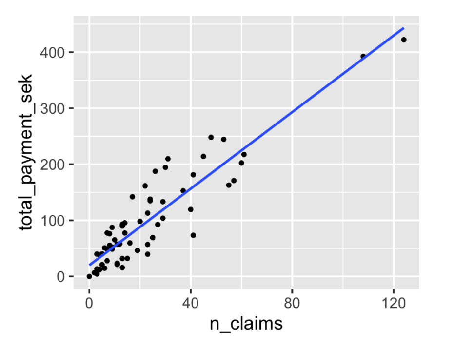
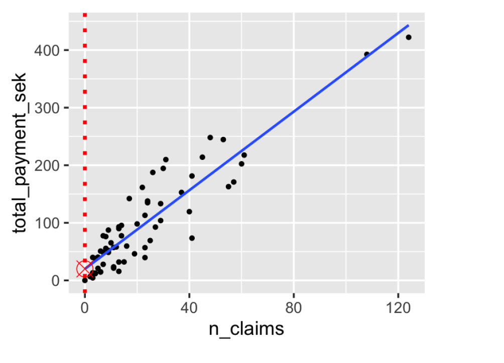
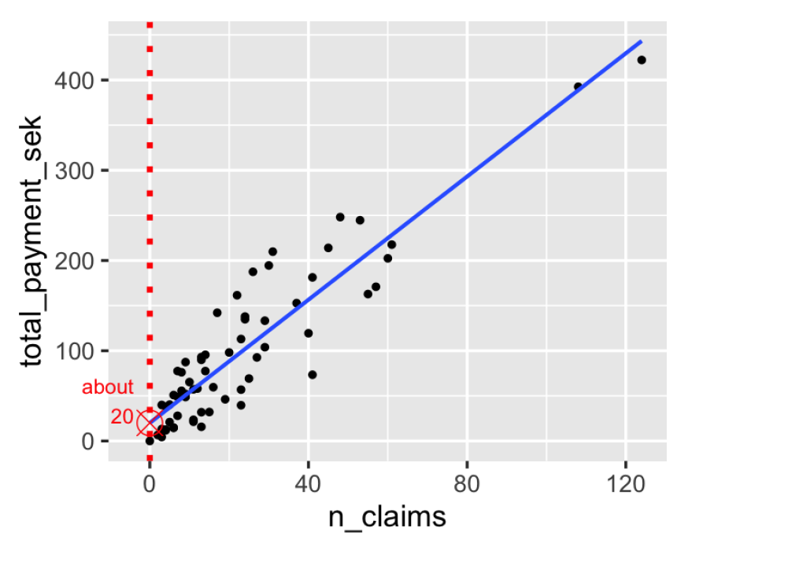
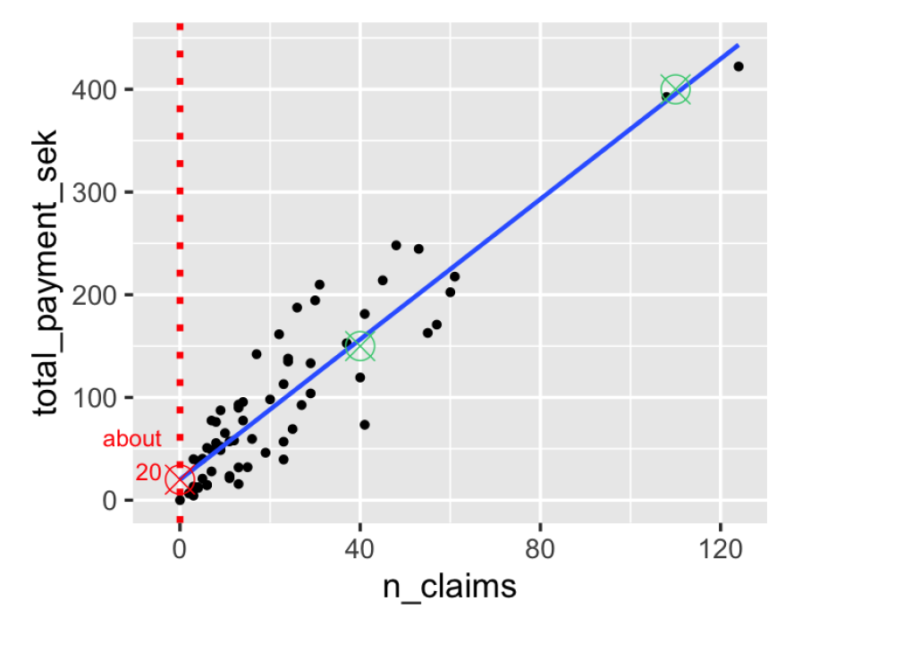
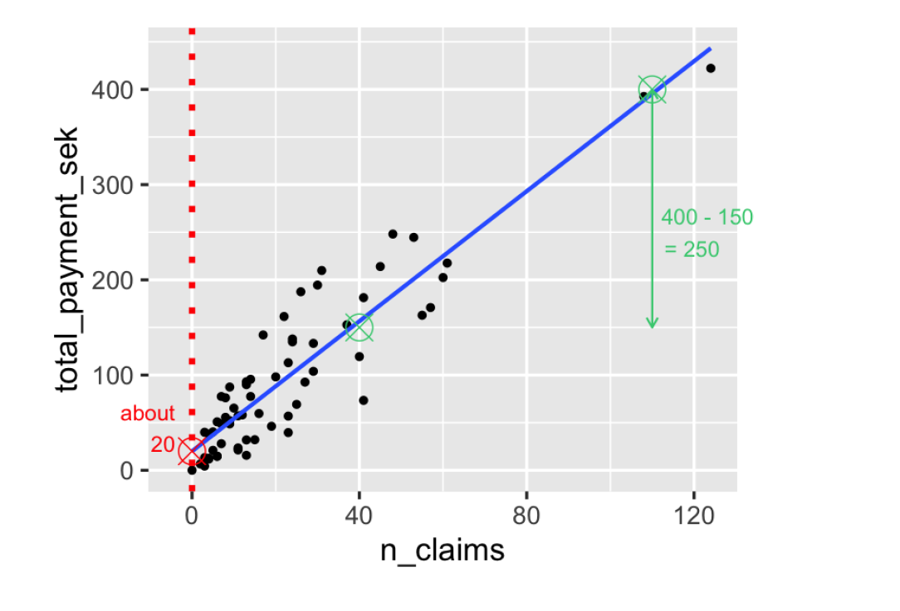
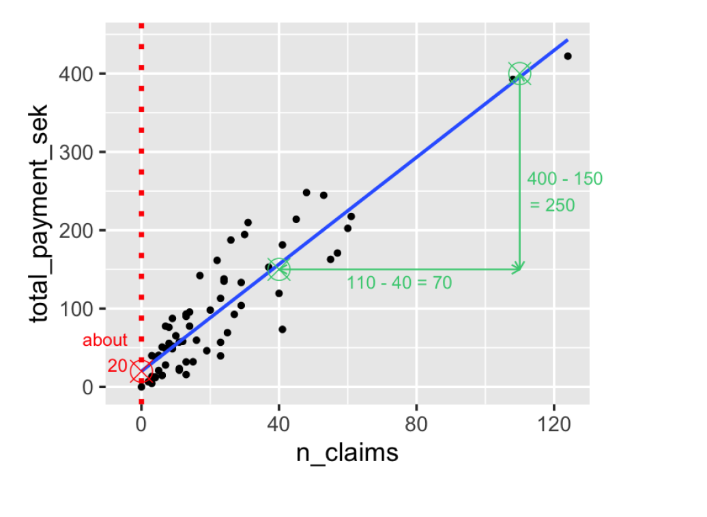

```{r setup, include=FALSE}
options(htmltools.dir.version = FALSE)
library(knitr)
opts_chunk$set(
  fig.align="center", #fig.width=6, fig.height=4.5, 
  # out.width="748px", #out.length="520.75px",
  dpi=300, #fig.path='Figs/',
  cache=T, echo=T, warning=F, message=F
  )
knitr::opts_hooks$set(fig.callout = function(options) {
  if (options$fig.callout) {
    options$echo <- FALSE
    options$out.height <- "99%"
    options$fig.width <- 16
    options$fig.height <- 8
  }
  options
})
```

```{css, echo = F, eval = T}
@media print {
  .has-continuation {
    display: block !important;
  }
}
remark-slide-content {
  font-size: 22px;
  padding: 20px 80px 20px 80px;
}
.remark-code, .remark-inline-code {
  background: #f0f0f0;
}
.remark-code {
  font-size: 16px;
}
.mid. remark-code { /*Change made here*/
  font-size: 60% !important;
}
.tiny .remark-code { /*Change made here*/
  font-size: 40% !important;
}

/* custom.css */
.left-code {
  color: #777;
  width: 38%;
  height: 92%;
  float: left;
}
.right-plot {
  width: 60%;
  float: right;
  padding-left: 1%;
}
.plot-callout {
  height: 225px;
  width: 450px;
  bottom: 5%;
  right: 5%;
  position: absolute;
  padding: 0px;
  z-index: 100;
}
.plot-callout img {
  width: 100%;
  border: 4px solid #23373B;
}
```

```{r paketi, warning=F, echo=F, message=F, eval=TRUE}

library(tidyverse)  # data manipulation and visualization
library(gridExtra)  # plot arrangement
library(ggplot2)
library(tidyverse)
library(dplyr)
```

# Pregled predavanja

<br>
<br>
<br>


1. [Praktični primjer](#exemplar)

2. [Univarijatna regresijska analiza](#uni)

2. [Predikcija i elementi modela](#pred)

3. [Kvaliteta procjene](#qual)

3. [Višestruka regresija](#multi)


---

class: inverse, center, middle
name: exemplar

# PRAKTIČNI PRIMJER

<html><div style='float:left'></div><hr color='#EB811B' size=1px width=796px></html>

(Motivacija)

---


# Podatci

```{r}
# Koristimo "marketing" podatkovni skup iz "datarium" paketa
library(datarium) # učitaj paket
data("marketing") # učitaj podatke
# Podatci se odnose na prodajni efekt ulaganja u promidžbu na youtube, facebook i novinske oglase
head(marketing,10) # pogledaj podatke 
```

---

# Model
<br>
<br>
- cilj je procijeniti utjecaj oglašavanja na youtube, fb i novinskih oglasa na prodaju
<br>
- procjenjujemo model `sales = b0 + b1*youtube + b2*facebook + b3*newspaper`
<br>
```{r}
# Procijeni model u R
model <- lm(sales ~ youtube + facebook + newspaper, data = marketing)
```
---

# Model

```{r}
# Rezultati modela
summary(model)
```

---

# Interpretacija

```{r}
model$coefficent
```

---

# Poboljšanje modela

```{r}
# izbaci nesignifikantnu varijablu
model  <- lm(sales ~ youtube + facebook, data = marketing)
summary(model)
```

---

# Kvaliteta modela

```{r}
confint(model)
```

##### R-sq
```{r}

```

##### RSE

```{r}
sigma(model)/mean(marketing$sales)
```

---

# Alternativna specifikacija
<br>
<br>
```{r}
# Svi prediktori u jednom funkcijskom pozivu
model <- lm(sales ~., data = marketing)
# Selekcija prediktora; bez varijable newspaper
model <- lm(sales ~. -newspaper, data = marketing)
# Također moguće i korištenje sintakse
model1 <- update(model,  ~. -newspaper)
```

---

class: inverse, center, middle
name: uni

# UVIVARIJATNA REGRESIJA

<html><div style='float:left'></div><hr color='#EB811B' size=1px width=796px></html>

(Osnovni model)


---

# Podatci

```{r}
library(dplyr)
# Učitaj podatke
SMID <- read.csv2("../Podatci/SLR.csv", header = TRUE) %>% # podatci na GHubu
  rename(n_claims = X, total_payment_sek = Y) # preimenuj varijable
str(SMID) # struktura
head(SMID, 5) # pogledaj podatke
```

---

# Deskriptivna statistika

.pull-left[
```{r}
library(dplyr)
SMID %>%
summarize_all(mean)
```
]

.pull-right[
```{r}
SMID %>%
summarize(correlation = cor(n_claims, total_payment_sek))
```
]


---

# Što je regresija?

- statistički model koji objašnjava odnos između zavisne i nezavisne varijable
- uz danu vrijednost nezavisne varijable, kolika je vrijednsot zavisne?

```{r,echo=FALSE}
tribble(~n_claims, ~total_payment_sel,
  "108","392.5",
  "19","46.2",
  "13","15.7",
  "124","422.2",
  "40","119.4",
  "200","???")
```

---

# Osnovna terminologija

###### ŽARGON
<br>
<br>
- *response* varijabla ili zavisna varijable je ona koju želimo predvidjeti
- *eksplanatorna* varijabla ili nazavisna je ona koja objašnjava promjenu u zavisnoj

###### DEFINICIJE
<br>
<br>
- Linearna regresija: zavisna varijabla je numenrička
- Logistička regresija: zavisna varijabla je logička (0,1)
- Univarijatna regresija: samo jedna nezavisna varijabla
- MUltivarijatna regresija: više zavisnih varijabli

<br>
<br>
---

# Vizualizacija
<br>
<br>
.left-code[
```{r plot-label, eval=FALSE}
library(ggplot2)
ggplot(SMID,
aes(n_claims, total_payment_sek)) +
geom_point()
```
]

.right-plot[
```{r plot-label-out, ref.label="plot-label", echo=FALSE, fig.height=4}

```
]


---

# Dodaj regresijski pravac
<br>
<br>
.left-code[
```{r plot-label2, eval=FALSE}
library(ggplot2)
ggplot(SMID,
aes(n_claims, total_payment_sek)) +
geom_point() +
geom_smooth(method = "lm", se = FALSE)  
```
]

.right-plot[
```{r plot-label2-out, ref.label="plot-label2", echo=FALSE, fig.height=4}

```
]

---

# Regresijski pravac

- odječak na osi y (*intercept*)

- nagib pravca (*slope*) je iznos za koji se poveća y ako se x poveća za jednu jedinicu

- jednadžba pravca: `y = odsječak + nagib*x`

---

# Procjena nagiba

```{r, include=TRUE, fig.align="center", echo=FALSE, out.width="500px"}


```
<br>

---

# Procjena nagiba

```{r, include=TRUE, fig.align="center", echo=FALSE, out.width="500px"}


```
<br>

---

# Procjena nagiba

```{r, include=TRUE, fig.align="center", echo=FALSE, out.width="500px"}


```
<br>


---

# Procjena nagiba

```{r, include=TRUE, fig.align="center", echo=FALSE, out.width="500px"}


```
<br>
---

# Procjena nagiba

```{r, include=TRUE, fig.align="center", echo=FALSE, out.width="500px"}


```
<br>

---

# Procjena nagiba

```{r, include=TRUE, fig.align="center", echo=FALSE, out.width="500px"}


```
<br>

---

# Procijeni model

```{r}
lm(total_payment_sek ~ n_claims, data = SMID)
```

---

# Interpretacija koeficijenata

```{r}
lm(total_payment_sek ~ n_claims, data = SMID)
```

##### Jednadžba

`total_payment_sek = 19.994 + 3.414*n_claims`

---

class: inverse, center, middle
name: uni

# Kategorijska zavisna varijabla

<html><div style='float:left'></div><hr color='#EB811B' size=1px width=796px></html>

(Predviđanje kategorija)


---

# Podatci

```{r, echo=FALSE}
fish <- read.table("http://www.amstat.org/publications/jse/datasets/fishcatch.dat.txt ")
colnames(fish) <- c("obs","species","mass_g","length_cm","len2","len3"
                    ,"height.pct","width.pct","sex")
fish$species <- factor(fish$species, levels = c(1:7), 
                       labels = c("Common Bream","Whitefish","Roach","Silver Bream"
                                  ,"Smelt","Pike","Perch"))
# Do not modify the following code:
fish <- filter(fish, sex != "NA") %>% select(species,mass_g,length_cm) %>% slice(-1)
```

```{r}
head(sample_n(fish,10),10) # pogledaj podatke (detaljan opis podataka u GH repo)
```

- svaki red se odnosi na jednu ribu
- uzorak se sastoji od 71 ribe
- u uzorak ulazi devet vrsta riba

---

# Vizualiziraj podatke

.left-code[
```{r plot-label3, eval=FALSE}
ggplot(fish, aes(mass_g)) +
geom_histogram(bins = 9) +
facet_wrap(vars(species))  
```
]

.right-plot[
```{r plot-label3-out, ref.label="plot-label3", echo=FALSE, fig.height=4}

```
]

---

# Deskriptivna statistika

```{r}
fish %>%
group_by(species) %>%
summarize(mean_mass_g = round(mean(mass_g),2))
```

---

# Regresijski model

```{r}
lm(mass_g ~ species, data = fish)
```

---

# Regresijski model bez odsječka

```{r}
lm(mass_g ~ species + 0, data = fish)
```


---

class: inverse, center, middle
name: pred

# PREDIKCIJA I ELEMENTI MODELA

<html><div style='float:left'></div><hr color='#EB811B' size=1px width=796px></html>

(Nakon procjene...)

---

# Podatkovni skup o ribama


```{r, eval=TRUE}
# Izaberi samo "Bream" vrstu
bream <- fish %>%
filter(str_detect(species,"Bream"))
head(bream,10)
```

---

# Vizualiziraj težinu vs. duljinu

.left-code[
```{r plot-label4, eval=FALSE}
ggplot(bream, aes(length_cm, mass_g)) +
geom_point() +
geom_smooth(method = "lm", se = FALSE) 
```
]

.right-plot[
```{r plot-label4-out, ref.label="plot-label4", echo=FALSE, fig.height=4}

```
]

---

# Provedi regresijski model

```{r}
tezina_vs_visina <- lm(mass_g ~ length_cm, data = bream)
tezina_vs_visina
```

---

# Predviđanje 

> Ako postavimo nezavisne varijable na vrijednost xy, koja će biti vrijednost zavisne varijable?

```{r}
nezavisne_vars <- tibble(length_cm = 20:40)
```

```{r}
predict(tezina_vs_visina, nezavisne_vars)
```

---

# Predviđanje u data.frame objektu

```{r}
prediction_data <- nezavisne_vars %>%
mutate(mass_g = predict(tezina_vs_visina, nezavisne_vars))
prediction_data
```


---

# Vizualiziraj predikcije

.left-code[
```{r plot-label5, eval=FALSE}
ggplot(bream, aes(length_cm, mass_g)) +
  geom_point() +
  geom_smooth(method = "lm", se = FALSE) + 
  geom_point( data = prediction_data, color = "blue")
```
]

.right-plot[
```{r plot-label5-out, ref.label="plot-label5", echo=FALSE, fig.height=4}

```
]

---

# Ekstrapolacija
<br>
<br>
- *Ekstrapolacija* označava predikciju izvan postojećih podataka

```{r}
mali_bream <- tibble(length_cm = 10)
mali_bream %>%
mutate(mass_g = predict(tezina_vs_visina, mali_bream))
```

---

class: inverse, center, middle


# Elementi modela

<html><div style='float:left'></div><hr color='#EB811B' size=1px width=796px></html>

(Što se sve nalazi u regresijskom objektu!?)

---

# Regresijski koeficijenti


