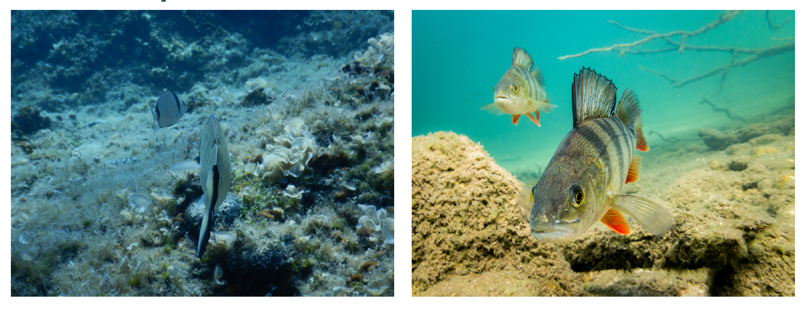

```{r setup, include=FALSE}
options(htmltools.dir.version = FALSE)
library(knitr)
opts_chunk$set(
  fig.align="center", #fig.width=6, fig.height=4.5, 
  # out.width="748px", #out.length="520.75px",
  dpi=300, #fig.path='Figs/',
  cache=T, echo=T, warning=F, message=F
  )
knitr::opts_hooks$set(fig.callout = function(options) {
  if (options$fig.callout) {
    options$echo <- FALSE
    options$out.height <- "99%"
    options$fig.width <- 16
    options$fig.height <- 8
  }
  options
})
```

```{css, echo = F, eval = T}
@media print {
  .has-continuation {
    display: block !important;
  }
}
remark-slide-content {
  font-size: 22px;
  padding: 20px 80px 20px 80px;
}
.remark-code, .remark-inline-code {
  background: #f0f0f0;
}
.remark-code {
  font-size: 16px;
}
.mid. remark-code { /*Change made here*/
  font-size: 60% !important;
}
.tiny .remark-code { /*Change made here*/
  font-size: 40% !important;
}

/* custom.css */
.left-code {
  color: #777;
  width: 38%;
  height: 92%;
  float: left;
}
.right-plot {
  width: 60%;
  float: right;
  padding-left: 1%;
}
.plot-callout {
  height: 225px;
  width: 450px;
  bottom: 5%;
  right: 5%;
  position: absolute;
  padding: 0px;
  z-index: 100;
}
.plot-callout img {
  width: 100%;
  border: 4px solid #23373B;
}
```

```{r paketi, warning=F, echo=F, message=F, eval=TRUE}

library(tidyverse)  # data manipulation and visualization
library(gridExtra)  # plot arrangement
library(ggplot2)
library(tidyverse)
library(dplyr)
```

# Pregled predavanja

<br>
<br>
<br>


1. [Praktični primjer](#exemplar)

2. [Univarijatna regresijska analiza](#uni)

2. [Predikcija i elementi modela](#pred)

3. [Kvaliteta procjene](#qual)

3. [Višestruka regresija](#multi)


---

class: inverse, center, middle
name: exemplar

# PRAKTIČNI PRIMJER

<html><div style='float:left'></div><hr color='#EB811B' size=1px width=796px></html>

(Motivacija)

---


# Podatci

```{r}
# Koristimo "marketing" podatkovni skup iz "datarium" paketa
library(datarium) # učitaj paket
data("marketing") # učitaj podatke
# Podatci se odnose na prodajni efekt ulaganja u promidžbu na youtube, facebook i novinske oglase
head(marketing,10) # pogledaj podatke 
```

---

# Model
<br>
<br>
- cilj je procijeniti utjecaj oglašavanja na youtube, fb i novinskih oglasa na prodaju
<br>
- procjenjujemo model: `sales = b0 + b1*youtube + b2*facebook + b3*newspaper`
<br>
<br>
```{r}
# Procijeni model u R
model <- lm(sales ~ youtube + facebook + newspaper, data = marketing)
```
---

# Interpretacija

```{r}
summary(model)$coefficients
```

---

# Model

```{r}
# Rezultati modela
summary(model)
```

---

# Poboljšanje modela

```{r}
# izbaci nesignifikantnu varijablu
model  <- lm(sales ~ youtube + facebook, data = marketing)
summary(model)
```

---

# Kvaliteta modela

##### Intervali pouzdanosti

```{r}
confint(model)
```

##### R-sq

```{r}
summary(model)$r.squared
```

##### RSE

```{r}
sigma(model)/mean(marketing$sales)
```

---

# Alternativna specifikacija
<br>
<br>
```{r}
# Svi prediktori u jednom funkcijskom pozivu
model <- lm(sales ~., data = marketing)
```
<br>
```{r}
# Selekcija prediktora; bez varijable newspaper
model <- lm(sales ~. -newspaper, data = marketing)
```
<br>
```{r}
# Također moguće i korištenje sintakse
model1 <- update(model,  ~. -newspaper)
```

---

class: inverse, center, middle
name: uni

# UVIVARIJATNA REGRESIJA

<html><div style='float:left'></div><hr color='#EB811B' size=1px width=796px></html>

(Osnovni model)

---

# Podatci

```{r}
library(dplyr)
# Učitaj podatke
SMID <- read.csv2("../Podatci/SLR.csv", header = TRUE) %>% # podatci na GHubu
  rename(n_claims = X, total_payment_sek = Y) # preimenuj varijable
str(SMID) # struktura
head(SMID, 5) # pogledaj podatke
```

---

# Deskriptivna statistika
<br>
<br>
.pull-left[
```{r}
library(dplyr)
SMID %>%
summarize_all(mean)
```
]

.pull-right[
```{r}
SMID %>%
summarize(correlation = cor(n_claims, total_payment_sek))
```
]

---

# Što je regresija?
<br>
<br>
> statistički model koji objašnjava odnos između zavisne i nezavisne varijable
> uz danu vrijednost nezavisne varijable, kolika je vrijednsot zavisne?

<br>
<br>
```{r,echo=FALSE}
tribble(~n_claims, ~total_payment_sel,
  "108","392.5",
  "19","46.2",
  "13","15.7",
  "124","422.2",
  "40","119.4",
  "200","???")
```

---

# Osnovna terminologija

###### ŽARGON

- **response** varijabla ili zavisna varijable je ona koju želimo predvidjeti
- **eksplanatorna** varijabla ili nazavisna je ona koja objašnjava promjenu u zavisnoj
<br>
<br>
###### DEFINICIJE

- Linearna regresija: zavisna varijabla je numenrička
- Logistička regresija: zavisna varijabla je logička (0,1)
- Univarijatna regresija: samo jedna nezavisna varijabla
- MUltivarijatna regresija: više zavisnih varijabli

<br>
<br>
---

# Vizualizacija odnosa
<br>
<br>
.left-code[
```{r plot-label, eval=FALSE}
library(ggplot2)
ggplot(SMID,
aes(n_claims, total_payment_sek)) +
geom_point() +
ggtitle("Odnos isplata i zahtijeva")
```
]

.right-plot[
```{r plot-label-out, ref.label="plot-label", echo=FALSE, fig.height=4}
```
]


---

# Dodaj regresijski pravac
<br>
<br>
.left-code[
```{r plot-label2, eval=FALSE}
library(ggplot2)
ggplot(SMID,
aes(n_claims, total_payment_sek)) +
geom_point() +
geom_smooth(method = "lm", se = FALSE) +
ggtitle("Odnos isplata i zahtijeva")  
```
]

.right-plot[
```{r plot-label2-out, ref.label="plot-label2", echo=FALSE, fig.height=4}
```
]

---

# Regresijski pravac
<br>
<br>
<br>
- odječak na osi y (*intercept*)

- nagib pravca (*slope*) je iznos za koji se poveća y ako se x poveća za jednu jedinicu

- jednadžba pravca: `y = odsječak + nagib*x`

---

# Procjena nagiba
<br>
<br>
```{r, include=TRUE, fig.align="center", echo=FALSE, out.width="500px"}
knitr::include_graphics("../Foto/reg1.png")
```
<br>

---

# Procjena nagiba
<br>
<br>
```{r, include=TRUE, fig.align="center", echo=FALSE, out.width="500px"}

knitr::include_graphics("../Foto/reg2.png")
```
<br>

---

# Procjena nagiba
<br>
<br>
```{r, include=TRUE, fig.align="center", echo=FALSE, out.width="500px"}

knitr::include_graphics("../Foto/reg3.png")
```
<br>


---

# Procjena nagiba
<br>
<br>
```{r, include=TRUE, fig.align="center", echo=FALSE, out.width="500px"}

knitr::include_graphics("../Foto/reg4.png")
```
<br>
---

# Procjena nagiba
<br>
<br>
```{r, include=TRUE, fig.align="center", echo=FALSE, out.width="500px"}

knitr::include_graphics("../Foto/reg5.png")
```
<br>

---

# Procjena nagiba
<br>
<br>
```{r, include=TRUE, fig.align="center", echo=FALSE, out.width="500px"}

knitr::include_graphics("../Foto/reg6.png")
```
<br>

---

# Procijeni model
<br>
<br>
```{r}
lm(total_payment_sek ~ n_claims, data = SMID)
```

---

# Interpretacija koeficijenata
<br>
<br>
##### Model
```{r}
lm(total_payment_sek ~ n_claims, data = SMID)
```

##### Jednadžba

`total_payment_sek = 19.994 + 3.414*n_claims`

---

class: inverse, center, middle

# Kategorijska zavisna varijabla

<html><div style='float:left'></div><hr color='#EB811B' size=1px width=796px></html>

(Predviđanje kategorija)


---

# Podatci

```{r, echo=FALSE}
fish <- read.table("http://www.amstat.org/publications/jse/datasets/fishcatch.dat.txt ")
colnames(fish) <- c("obs","species","mass_g","length_cm","len2","len3"
                    ,"height_cm","width.pct","sex")
fish$species <- factor(fish$species, levels = c(1:7), 
                       labels = c("Common Bream","Whitefish","Roach","Silver Bream"
                                  ,"Smelt","Pike","Perch"))
# Do not modify the following code:
fish <- filter(fish, sex != "NA") %>% select(species,mass_g,length_cm,height_cm) %>% slice(-1)
```

```{r}
head(sample_n(fish,10),10) # pogledaj podatke (detaljan opis podataka u GH repo-u)
```
<br>
<br>
- svaki red se odnosi na jednu ribu
- uzorak se sastoji od 71 ribe
- u uzorak ulazi devet vrsta riba

---

# Vizualiziraj podatke

.left-code[
```{r plot-label3, eval=FALSE}
ggplot(fish, aes(mass_g)) +
geom_histogram(bins = 9) +
facet_wrap(vars(species)) +
ggtitle("Histogram prema vrstama riba")
```
]

.right-plot[
```{r plot-label3-out, ref.label="plot-label3", echo=FALSE, fig.height=4}
```
]

---

# Deskriptivna statistika
<br>
<br>
```{r}
fish %>%
group_by(species) %>%
summarize(mean_mass_g = round(mean(mass_g),2))
```

---

# Regresijski model
<br>
```{r}
lm(mass_g ~ species, data = fish)
```

---

# Regresijski model bez odsječka
<br>
```{r}
lm(mass_g ~ species + 0, data = fish)
```

---

class: inverse, center, middle
name: pred

# PREDIKCIJA I ELEMENTI MODELA

<html><div style='float:left'></div><hr color='#EB811B' size=1px width=796px></html>

(Nakon procjene...)

---

# Podatkovni skup o ribama
<br>
```{r, eval=TRUE}
# Izaberi samo "Bream" vrstu
bream <- fish %>%
filter(str_detect(species,"Bream"))
head(bream,12)
```

---

# Vizualiziraj težinu vs. duljinu
<br>
<br>
.left-code[
```{r plot-label4, eval=FALSE}
ggplot(bream, aes(length_cm, mass_g)) +
geom_point() +
geom_smooth(method = "lm", se = FALSE) +
ggtitle("Odnos duljine i težine")
```
]

.right-plot[
```{r plot-label4-out, ref.label="plot-label4", echo=FALSE, fig.height=4}
```
]

---

# Provedi regresijski model
<br>
<br>
```{r}
tezina_vs_visina <- lm(mass_g ~ length_cm, data = bream)
tezina_vs_visina
```

---

# Predviđanje 
<br>
> Ako postavimo nezavisne varijable na vrijednost xy, koja će biti vrijednost zavisne varijable?

```{r}
nezavisne_vars <- tibble(length_cm = 20:40)
```

```{r}
predict(tezina_vs_visina, nezavisne_vars)
```

---

# Predviđanje u `data.frame` objektu
<br>
```{r}
prediction_data <- nezavisne_vars %>%
mutate(mass_g = predict(tezina_vs_visina, nezavisne_vars))
prediction_data
```

---

# Vizualiziraj predikcije
<br>
<br>
.left-code[
```{r plot-label5, eval=FALSE}
ggplot(bream, aes(length_cm, mass_g)) +
  geom_point() +
  geom_smooth(method = "lm", se = FALSE) + 
  geom_point( data = prediction_data, color = "blue") +
  ggtitle(" Odnos duljine i težine")
```
]

.right-plot[
```{r plot-label5-out, ref.label="plot-label5", echo=FALSE, fig.height=4}

```
]

---

# Ekstrapolacija
<br>
- *Ekstrapolacija* označava predikciju izvan postojećih podataka
<br>
```{r}
mali_bream <- tibble(length_cm = 10)
mali_bream %>%
mutate(mass_g = predict(tezina_vs_visina, mali_bream))
```

---

class: inverse, center, middle

# Elementi modela

<html><div style='float:left'></div><hr color='#EB811B' size=1px width=796px></html>

(Što se sve nalazi u regresijskom objektu?)

---

# Regresijski koeficijenti
<br>
<br>
```{r}
tezina_vs_visina <- lm(mass_g ~ length_cm, data = bream)
tezina_vs_visina
```

```{r}
coefficients(tezina_vs_visina)
```

---

# *fitted* vrijednosti

- predstavljaju predviđanja na originalnim podatcima

```{r}
fitted(tezina_vs_visina)
```

```{r}
# jednako kao:
explanatory_data <- bream %>% select(length_cm)
predict(tezina_vs_visina, explanatory_data)
```

---

# Rrezidualne vrijednosti

- predstavljaju razliku između nezavisne varijable i predviđenih vrijednosti


```{r}
residuals(tezina_vs_visina)
# ekvivalentno:
bream$mass_g - fitted(tezina_vs_visina)
```

---

# Puni pregled modela

```{r}
summary(tezina_vs_visina)
```


---

# Dodatne vještine u R
<br>
<br>
```{r}
library(broom) # podgledaj dokumentaciju na https://opr.princeton.edu/workshops/Downloads/2016Jan_BroomRobinson.pdf
tidy(tezina_vs_visina) # napravi tibble (dframe) procjene 
```

---

# Dodatne vještine u R

```{r}
augment(tezina_vs_visina)
```

---

# Dodatne vještine u R
<br>
<br>
```{r}
glance(tezina_vs_visina)
```
---

class: inverse, center, middle

# Nelinearnosti

<html><div style='float:left'></div><hr color='#EB811B' size=1px width=796px></html>

(Svijet nije linearan!)

---

# *Perch* vrsta ribe 

```{r}
perch <- fish %>%
filter(species == "Perch")
head(perch,12)
```

---

# Nelinearnost

```{r, fig.height=3}
ggplot(perch, aes(length_cm, mass_g)) +
geom_point() +
geom_smooth(method = "lm", se = FALSE) +
ggtitle("Odnos duljine i težine")
```

---

# Bream vs. perch vrsta
<br>
<br>
```{r, include=TRUE, fig.align="center", echo=FALSE, out.width="600px"}

```
---

# Težina vs. duljina **na treću(^3)** 
<br>
<br>
.left-code[
```{r plot-label6, eval=FALSE}
ggplot(perch, aes(length_cm ^ 3, mass_g)) +
geom_point() +
geom_smooth(method = "lm", se = FALSE) +
ggtitle("Odnos duljine i težine")  
```
]

.right-plot[
```{r plot-label6-out, ref.label="plot-label6", echo=FALSE, fig.height=4}
```
]

---

# Regresijski model
<br>
<br>
```{r}
mdl_perch <- lm(mass_g ~ I(length_cm ^ 3), data = perch)
mdl_perch
```

---

# Predikcija
<br>
<br>
```{r}
explanatory_data <- tibble(length_cm = seq(10, 40, 5))
prediction_data <- explanatory_data %>%
mutate(mass_g = predict(mdl_perch, explanatory_data))
head(prediction_data)
```

---

# Vizualiziraj (^3)

.left-code[
```{r plot-label7, eval=FALSE}
ggplot(perch, aes(length_cm ^ 3, mass_g)) +
geom_point() +
geom_smooth(method = "lm", se = FALSE) +
geom_point(data = prediction_data, color = "blue") +
ggtitle("Odnos duljine i težine")
```
]

.right-plot[
```{r plot-label7-out, ref.label="plot-label7", echo=FALSE, fig.height=4}
```
]

---

# Vizualiziraj 

.left-code[
```{r plot-label8, eval=FALSE}
ggplot(perch, aes(length_cm, mass_g)) +
geom_point() +
geom_smooth(method = "lm", se = FALSE) +
geom_point(data = prediction_data, color = "blue") +
ggtitle("Odnos duljine i težine")
```
]

.right-plot[
```{r plot-label8-out, ref.label="plot-label8", echo=FALSE, fig.height=4}
```
]

---

class: inverse, center, middle
name: exemplar

# KVALITETA PROCJENE

<html><div style='float:left'></div><hr color='#EB811B' size=1px width=796px></html>

(Koliko je dobar model?)

---

# Bream vs perch model 

```{r, echo=FALSE, fig.height=4}
gg1 <- ggplot(perch, aes(length_cm ^ 3, mass_g)) +
geom_point() +
geom_smooth(method = "lm", se = FALSE) +
geom_point(data = prediction_data, color = "blue") +
ggtitle("Perch")

gg2 <- ggplot(perch, aes(length_cm, mass_g)) +
geom_point() +
geom_smooth(method = "lm", se = FALSE) +
geom_point(data = prediction_data, color = "blue")+
ggtitle("Bream")

library(gridExtra)
grid.arrange(gg1, gg2, ncol = 2)   

```

---

# Koeficijent determinacije
<br>
> Označava proporciju varijance u zavisnoj varijabli koja se može objasniti sa nezavisnom varijablom.

- `1` označava savršeni fit
- `0` označava najgori mogući fit

.tiny[
```{r}
mdl_bream <- lm(mass_g ~ length_cm, data = bream)
summary(mdl_bream) # Vidi R-squared
```
]

---

# Alternativni način 

```{r}
# Pregledaj rezultate modela
mdl_bream %>% glance()
```

```{r}
# Izvuci koeficijent determinacije
mdl_bream %>% glance() %>% pull(r.squared)
```

```{r}
# Zapravo se radi o običnom kvadratu korelacijskog koeficijenta :-)
bream %>% summarize(coeff_determination = cor(length_cm, mass_g) ^ 2)
```

---

# Rezidualna standardna pogreška (RSE)

> Tipična razlika između predikcije i zavisne varijable.

```{r}
# Vidi residual standard error
summary(mdl_bream)
```

---

# Rezidualna standardna pogreška (RSE)
<br>
<br>
```{r}
mdl_bream %>%
glance()
```

```{r}
# Izvuci RSE
mdl_bream %>%
glance() %>%
pull(sigma)
```

---

# Izračunaj RSE: reziduali ^2

```{r}
bream %>%
mutate(residuals_sq = residuals(mdl_bream) ^ 2)
```

---

# Izračunaj RSE: zbroji
<br>
<br>
```{r}
bream %>%
mutate(residuals_sq = residuals(mdl_bream) ^ 2) %>%
summarize(resid_sum_of_sq = sum(residuals_sq))
```

---

# Izračunaj RSE: stupnjevi slobode
<br>
<br>
> Stupnjevi slobode su broj opservacija minus broj modelskih koeficijenata.

```{r}
bream %>%
mutate(residuals_sq = residuals(mdl_bream) ^ 2) %>%
summarize(
resid_sum_of_sq = sum(residuals_sq),
deg_freedom = n() - 2)
```

---

# Izračunaj RSE: korijen omjera

```{r}
bream %>%
mutate(residuals_sq = residuals(mdl_bream) ^ 2) %>%
summarize(resid_sum_of_sq = sum(residuals_sq),
deg_freedom = n() - 2,
rse = sqrt(resid_sum_of_sq / deg_freedom))
```

---

# Interpretacija RSE

<br>
<br>
<br>
- `mdl_bream` ima RSE `74`
<br>
> Taj pokazatelj se može interpretirati na način da je razlika predviđene mase bream vrste i prave (podatci) mase te vrste otprilike 74g.


---

# RMSE
<br>

###### Rezidualna stde

.pull-left[
```{r}
bream %>%
mutate(residuals_sq = residuals(mdl_bream) ^ 2) %>%
summarize(resid_sum_of_sq = sum(residuals_sq),
deg_freedom = n() - 2,
rse = sqrt(resid_sum_of_sq / deg_freedom))
```
]

###### Korijen prosjecne stde (RMSE)

.pull-right[
```{r}
bream %>%
mutate(residuals_sq = residuals(mdl_bream) ^ 2) %>%
summarize(
resid_sum_of_sq = sum(residuals_sq),
n_obs = n(),
rmse = sqrt(resid_sum_of_sq / n_obs))
```
]

---

# Poželjna stvojstva reziduala

<br>
<br>
- Normalna disribucija
<br>
<br>
- Prosjek reziduala je 0

---

# Dobar model: Bream

```{r, echo=T,eval=TRUE}
mdl_bream <- lm(mass_g ~ length_cm, data = bream)
```

```{r, echo=F, eval=TRUE, fig.height=3}
ggplot(bream, aes(length_cm, mass_g)) +
  geom_point() +
  geom_smooth(method = "lm", se = FALSE) + 
  geom_point( data = prediction_data, color = "blue") +
  ggtitle("Odnos duljine i težine")
```

---

# Loš model: Perch

```{r, echo=T,eval=TRUE}
mdl_perch <- lm(mass_g ~ length_cm, data = perch)
```

```{r, echo=F, eval=TRUE, fig.height=3}
ggplot(perch, aes(length_cm, mass_g)) +
geom_point() +
geom_smooth(method = "lm", se = FALSE) +
geom_point(data = prediction_data, color = "blue") + 
ggtitle("Odnos duljine i težine")
```

---

# Reziduali vs. fitted vrijednosti

###### Bream
<br>
.pull-left[ 
```{r, echo=FALSE, fig.height=4}
library(ggfortify)
autoplot(mdl_bream, which=1)
```
]

###### Perch

.pull-right[ 
```{r, echo=FALSE, fig.height=4}
autoplot(mdl_perch, which=1)
```
]

---

# QQ

###### Bream

.pull-left[ 
```{r, echo=FALSE, fig.height=4}
autoplot(mdl_bream, which=2)
```
]

###### Perch

.pull-right[ 
```{r, echo=FALSE, fig.height=4}
autoplot(mdl_perch, which=2)
```
]

---

# Scale-location

###### Bream

.pull-left[ 
```{r, echo=FALSE, fig.height=4}
autoplot(mdl_bream, which=3)
```
]

###### Perch

.pull-right[ 
```{r, echo=FALSE, fig.height=4}
autoplot(mdl_perch, which=3)
```
]

---

# autoplot() funkcija

.left-code[
```{r plot-label9, eval=FALSE}
autoplot(
mdl_perch,
which = 1:3,
nrow = 3,
ncol = 1
)
```
]

.right-plot[
```{r plot-label9-out, ref.label="plot-label9", echo=FALSE, fig.height=4}
```
]

---

class: inverse, center, middle

# Ekstremne vrijednosti

<html><div style='float:left'></div><hr color='#EB811B' size=1px width=796px></html>

(*Outlieri*)

---

# Roach vrsta
<br>
<br>
```{r}
roach <- fish %>%
filter(species == "Roach") 
roach %>% head(8)  
```

---

# Ekstremne vrijednosti
<br>
<br>
.left-code[
```{r plot-label10, eval=FALSE}
ggplot(roach, aes(length_cm, mass_g)) +
geom_point() +
geom_smooth(method = "lm", se = FALSE) + 
ggtitle("Odnos duljine i težine")
```
]

.right-plot[
```{r plot-label10-out, ref.label="plot-label10", echo=FALSE, fig.height=3}
```
]

---

# Ekstremne vrijednosti 
<br>
<br>
.left-code[
```{r plot-label11, eval=FALSE}
roach %>%
mutate(has_extreme_length = length_cm < 15 | length_cm > 26) %>%
ggplot(aes(length_cm, mass_g)) +
geom_point(aes(color = has_extreme_length)) +
geom_smooth(method = "lm", se = FALSE) + 
ggtitle("Odnos duljine i težine")
```
]

.right-plot[
```{r plot-label11-out, ref.label="plot-label11", echo=FALSE, fig.height=3}
```
]

---

# Ekstremne vrijednosti
<br>
<br>
.left-code[
```{r plot-label12, eval=FALSE}
roach %>%
mutate(has_extreme_length = length_cm < 15 | length_cm > 26,has_extreme_mass = mass_g < 1) %>%
ggplot(aes(length_cm, mass_g)) +
geom_point(aes(color = has_extreme_length,shape = has_extreme_mass)) +
geom_smooth(method = "lm", se = FALSE) + 
ggtitle("Odnos duljine i težine")
```
]

.right-plot[
```{r plot-label12-out, ref.label="plot-label12", echo=FALSE, fig.height=3}
```
]

---

# Poluga (*leverge*)
<br>
<br>
> "Poluga" pokazuje koliko su ekstremne nezavisne varijable.

```{r}
mdl_roach <- lm(mass_g ~ length_cm, data = roach)
hatvalues(mdl_roach)
```

---

# .hat kolona
<br>
```{r}
augment(mdl_roach)
```

---

# Visoka poluga (*Roach vrsta*) 
<br>
```{r}
mdl_roach %>%
augment() %>%
select(mass_g, length_cm, leverage = .hat) %>%
arrange(desc(leverage)) %>%
head()
```

---

# Utjecaj (*Influence*)
<br>
<br>
> "Utjecaj" pokazuje koliko će se model promijeniti ako se opservacija isključi iz uzorka.

```{r}
cooks.distance(mdl_roach)
```

---

# .cooksd kolona
<br>
<br>
```{r}
augment(mdl_roach)
```

---

# Opservacije sa najvećim *utjecajem*

```{r}
mdl_roach %>%
augment() %>%
select(mass_g, length_cm, cooks_dist = .cooksd) %>%
arrange(desc(cooks_dist)) %>%
head()
```

---

# Izbacivanje opservacija
```{r}
# Makni opservacije sa visokom "polugom"
roach_not_short <- roach %>%
filter(length_cm != 12.9)
```

.left-code[
```{r plot-label13, eval=FALSE}
ggplot(roach, aes(length_cm, mass_g)) +
geom_point() +
geom_smooth(method = "lm", se = FALSE) +
geom_smooth(method = "lm", se = FALSE,data = roach_not_short, color = "red") + 
ggtitle("Odnos duljine i težine")
```
]

.right-plot[
```{r plot-label13-out, ref.label="plot-label13", echo=FALSE, fig.height=3}
```
]

---

# Pregledaj reziduale

.left-code[
```{r plot-label14, eval=FALSE}
autoplot(
mdl_roach,
which = 4:6,
nrow = 3,
ncol = 1)
```
]

.right-plot[
```{r plot-label14-out, ref.label="plot-label14", echo=FALSE, fig.height=5}
```
]

---

class: inverse, center, middle
name: exemplar

# VIŠESTRUKA LINEARNA REGRESIJA

<html><div style='float:left'></div><hr color='#EB811B' size=1px width=796px></html>

(Više od jedne nezavisne )

---

# Pregledaj podatke

```{r}
head(sample_n(fish,10),12)
```

---

# 3D vizualizacija 

.left-code[
```{r plot-label15, eval=FALSE}
library(plot3D)
scatter3D(fish$length_cm, fish$height_cm, fish$mass_g)
```
]

.right-plot[
```{r plot-label15-out, ref.label="plot-label15", echo=FALSE, fig.height=5}
```
]

---

# 2D vizualizacija 

.left-code[
```{r plot-label16, eval=FALSE}
ggplot(fish,
aes(length_cm, height_cm, color = mass_g)) +
geom_point() + 
ggtitle("Odnos duljine i težine")
```
]

.right-plot[
```{r plot-label16-out, ref.label="plot-label16", echo=FALSE, fig.height=5}
```
]

---

# 2D vizualizacija (*poboljšano*)

.left-code[
```{r plot-label17, eval=FALSE}
ggplot(fish,
aes(length_cm, height_cm, color = mass_g)) +
geom_point() + 
scale_color_viridis_c(option = "inferno") +
ggtitle("Odnos duljine i težine")
```
]

.right-plot[
```{r plot-label17-out, ref.label="plot-label17", echo=FALSE, fig.height=5}
```
]

---

# Regresijski model (*2 varijable*)

```{r}
mdl_mass_vs_both <- lm(mass_g ~ length_cm + height_cm, data = fish)
mdl_mass_vs_both
```

---

# Predviđanje

.pull-left[
```{r}
explanatory_data <- expand_grid(
length_cm = seq(5, 60, 5),
height_cm = seq(2, 20, 2))

head(explanatory_data,4)
```
]

.pull-right[
```{r}
prediction_data <- explanatory_data %>%
mutate(mass_g = predict(mdl_mass_vs_both, explanatory_data))

head(prediction_data,4)
```
]

---

# Vizaliziraj predikciju

.left-code[
```{r plot-label18, eval=FALSE}
ggplot(fish,aes(length_cm, height_cm, color = mass_g)) +
geom_point() +
scale_color_viridis_c(option = "inferno") +
geom_point(data = prediction_data, shape = 15, size = 3) +
ggtitle("Odnos duljine i težine")
```
]

.right-plot[
```{r plot-label18-out, ref.label="plot-label18", echo=FALSE, fig.height=5}
```
]

---

# Uključi interakciju varijabli

```{r}
mdl_mass_vs_both_inter <- lm(mass_g ~ length_cm * height_cm, data = fish)
mdl_mass_vs_both_inter
```

---

# Predviđanje 


.pull-left[
```{r}
explanatory_data <- expand_grid(
length_cm = seq(5, 60, 5),
height_cm = seq(2, 20, 2))

head(explanatory_data,4)
```
]

.pull-right[
```{r}
prediction_data <- explanatory_data %>%
mutate(mass_g = predict(mdl_mass_vs_both_inter, explanatory_data))

head(prediction_data,4)
```
]

---

# Vizaliziraj predikciju

.left-code[
```{r plot-label19, eval=FALSE}
ggplot(fish,aes(length_cm, height_cm, color = mass_g)) +
geom_point() +
scale_color_viridis_c(option = "inferno") +
geom_point(data = prediction_data, shape = 15, size = 3) +
ggtitle("Odnos duljine i težine")
```
]

.right-plot[
```{r plot-label19-out, ref.label="plot-label19", echo=FALSE, fig.height=5}
```
]

---

class: inverse, center, middle

# Hvala na pažnji

<html><div style='float:left'></div><hr color='#EB811B' size=1px width=796px></html>

(Sljedeće predavanje: Survival analiza)


