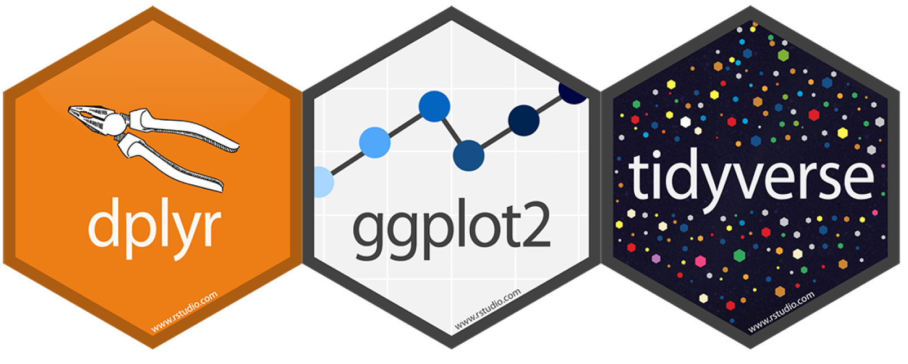
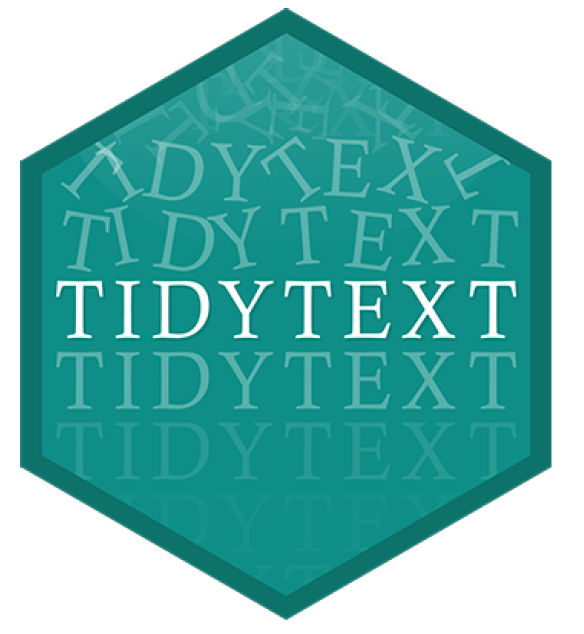
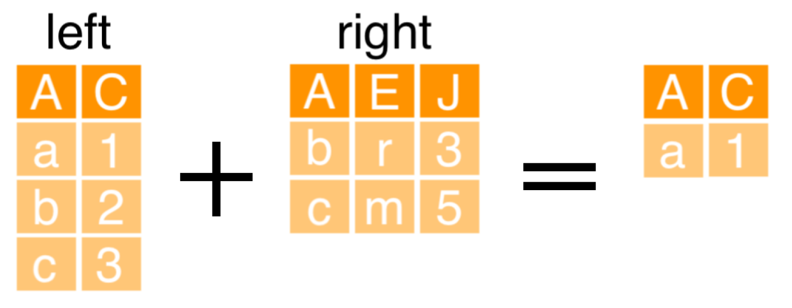

```{r setup, include=FALSE}
options(htmltools.dir.version = FALSE)
library(knitr)
opts_chunk$set(
  fig.align="center", #fig.width=6, fig.height=4.5, 
  # out.width="748px", #out.length="520.75px",
  dpi=300, #fig.path='Figs/',
  cache=T, echo=T, warning=F, message=F
  )
knitr::opts_hooks$set(fig.callout = function(options) {
  if (options$fig.callout) {
    options$echo <- FALSE
    options$out.height <- "99%"
    options$fig.width <- 16
    options$fig.height <- 8
  }
  options
})
```

```{css, echo = F, eval = T}
@media print {
  .has-continuation {
    display: block !important;
  }
}
remark-slide-content {
  font-size: 22px;
  padding: 20px 80px 20px 80px;
}
.remark-code, .remark-inline-code {
  background: #f0f0f0;
}
.remark-code {
  font-size: 16px;
}
.mid. remark-code { /*Change made here*/
  font-size: 60% !important;
}
.tiny .remark-code { /*Change made here*/
  font-size: 40% !important;
}

/* custom.css */
.left-code {
  color: #777;
  width: 38%;
  height: 92%;
  float: left;
}
.right-plot {
  width: 60%;
  float: right;
  padding-left: 1%;
}
.plot-callout {
  height: 225px;
  width: 450px;
  bottom: 5%;
  right: 5%;
  position: absolute;
  padding: 0px;
  z-index: 100;
}
.plot-callout img {
  width: 100%;
  border: 4px solid #23373B;
}
```

```{r paketi, warning=F, echo=F, message=F, eval=TRUE}

library(tidyverse)  # data manipulation and visualization
library(gridExtra)  # plot arrangement
library(ggplot2)
library(tidyverse)
library(dplyr)
library(tidyr)
library(readr)
```

# Pregled predavanja

<br>
<br>
<br>


1. [Manipulacija tekstualnih podataka](#mani)

2. [Vizualizacija teksta](#viz)

3. [Analiza sentimenta](#sent)

4. [Tematska analiza](#topi)


---

class: inverse, center, middle
name: mani

# MANIPULACIJA TEKSTUALNIH PODATAKA

<html><div style='float:left'></div><hr color='#EB811B' size=1px width=796px></html>

(*Podrška* za analizu sadržaja)

---


# Software podrška (paketi)
<br>
<br>
```{r, include=TRUE, fig.align="center", echo=FALSE, out.width="500px"}

```


---

# Podatci

```{r, eval=FALSE, echo=FALSE}
library(rvest)
link <-paste0("https://github.com/marcdotson/tidy-text-analysis/blob/master/Roomba%20650%20Amazon%20Reviews.csv")
webpage <- read_html(link)
data <- html_nodes(webpage,".js-csv-data")
recenzije_Dta<- html_table(data[[1]],header = TRUE)[,-1]
head(recenzije_Dta,8)
```

```{r}
recenzije_Dta <- read_csv("../Podatci/Roomba Reviews.csv")
head(recenzije_Dta,10)
```

---

# Pregled podataka

```{r}
# filter() + summarize()
recenzije_Dta %>%
filter(Product == "iRobot Roomba 650 for Pets") %>%
summarize(stars_mean = mean(Stars))
```

```{r}
# group_by() + summarize()
recenzije_Dta %>%
group_by(Product) %>%
summarize(stars_mean = mean(Stars))
```

```{r}
# nestrukturirani podatci
recenzije_Dta %>%
group_by(Product) %>%
summarize(review_mean = mean(Review))
```

---

# Pregled podataka

```{r}
glimpse(recenzije_Dta)
```

```{r}
recenzije_Dta %>%
summarize(number_rows = n())
```

---

# Pregled podataka 

```{r}
# summarize() + n()
recenzije_Dta %>%
  group_by(Product) %>%
  summarize(number_rows = n())
```
```{r}
# count()
recenzije_Dta %>%
count(Product)
```

```{r}
recenzije_Dta %>%
  count(Product) %>%
  arrange(desc(n))
```

---

# tidytext paket
<br>
<br>
```{r, include=TRUE, fig.align="center", echo=FALSE, out.width="500px"}

```

---

# Tokenizacija teksta
<br>
<br>
- Bag of words: riječi u dokumentu su nezavisne
<br>
- svaki element tesksta je dokument
<br>
- svaka jedinstvena riječ je element (*term*)
<br>
- svaka pojava elementa je token
<br>
- stvaranje *bag of words* je tokenizacija

---

# Tokenizacija teksta

```{r, message=FALSE}
# unnest_tokens() funkcija
library(tidytext)
tidy_review <- recenzije_Dta %>%
unnest_tokens(word, Review)
head(tidy_review,8)
```
---

# Pobroji riječi

```{r}
tidy_review %>%
count(word) %>%
arrange(desc(n))
```

---

# anti_join()
<br>
<br>
```{r, include=TRUE, fig.align="center", echo=FALSE, out.width="500px"}

```

---

# anti_join()
<br>
<br>

```{r}
tidy_review2 <- recenzije_Dta %>%
  unnest_tokens(word, Review) %>%
  anti_join(stop_words)
tidy_review2
```

---

# Stop riječi

```{r}
head(stop_words,12)
```


---

# Pobroji riječi (drugi put)

```{r}
tidy_review2 %>%
count(word) %>%
arrange(desc(n))
```


---

class: inverse, center, middle
name: mani

# VIZALIZACIJA TEKSTA

<html><div style='float:left'></div><hr color='#EB811B' size=1px width=796px></html>

(Pregled tekstualnih podataka)

---

# Uredi podatke za prikaz

```{r}
tidy_review <- recenzije_Dta %>%
mutate(id = row_number()) %>%
unnest_tokens(word, Review) %>%
anti_join(stop_words)
head(tidy_review,8)
```

---

# Histogram

```{r, fig.height=4}
word_counts <- tidy_review %>%
count(word) %>%
arrange(desc(n)) %>%
filter(n<2000)
ggplot(word_counts, aes(x = word, y = n)) +
geom_col()
```

---

# Filtriraj

```{r, fig.height=4}
word_counts2 <- tidy_review %>%
count(word) %>%
filter(n > 300) %>%
arrange(desc(n)) 
head(word_counts2,8)
```

---

# Vizualizacija

```{r, fig.height=4}
# zakreni osi pomoću coord_flip()
ggplot(word_counts2, aes(x = word, y = n)) +
geom_col() +
coord_flip() +
ggtitle("Review Word Counts")
```

---

# Stop riječi

.pull_left[
```{r}
# default stop riječi
head(stop_words,8)
```
]

.pull-right[
```{r}
# dodaj custom stop riječi
tribble(
~word, ~lexicon,
"roomba", "CUSTOM",
"2", "CUSTOM"
)
```
]

---

# Stop riječi

```{r}
custom_stop_words <- tribble(
~word, ~lexicon,
"roomba", "CUSTOM",
"2", "CUSTOM"
)
stop_words2 <- stop_words %>%
bind_rows(custom_stop_words)
```

```{r}
# Ukloni sve stop riječi
tidy_review <- recenzije_Dta %>%
mutate(id = row_number()) %>%
select(id, Date, Product, Stars, Review) %>%
unnest_tokens(word, Review) %>%
anti_join(stop_words2)
tidy_review %>%
filter(word == "roomba")
```

---

# Poboljšaj grafikon

```{r}
# prvo koristi fct_reorder funkcija
word_counts <- tidy_review %>%
count(word) %>%
filter(n > 300) %>%
mutate(word2 = fct_reorder(word, n))
head(word_counts,8)
```

---

# Poboljšaj grafikon

```{r, geom}
ggplot(word_counts, aes(x = word2, y = n)) +
geom_col() +
coord_flip() +
ggtitle("Review Word Counts")
```

---

# Facet grafikoni

```{r}
tidy_review %>%
count(word, Product) %>%
arrange(desc(n))
```

---

# Priprema za facet grafikon

```{r}
tidy_review %>%
count(word, Product) %>%
group_by(Product) %>%
top_n(10, n)
```

---

# Priprema za facet grafikon

```{r}
word_counts <- tidy_review %>%
count(word, Product) %>%
group_by(Product) %>%
top_n(10, n) %>%
ungroup() %>%
mutate(word2 = fct_reorder(word, n))
```

```{r}
gg <- ggplot(word_counts, aes(x = word2, y = n, fill = Product)) +
geom_col(show.legend = FALSE) +
facet_wrap(~Product, scales = "free_y") +
coord_flip() +
ggtitle("Review Word Counts")
```

---

# Facet grafikon

```{r, fig.height=5}
gg
```


---

# Oblak riječi (*WordCloud*)

.left-code[
```{r plot-label, eval=FALSE}
library(wordcloud)
word_counts <- tidy_review %>% count(word)
wordcloud(
words = word_counts$word,
freq = word_counts$n,
max.words = 30)
```
]

.right-plot[
```{r plot-label-out, ref.label="plot-label", echo=FALSE, fig.height=4}
```
]

---

# Oblak riječi (*WordCloud*)

.left-code[
```{r plot-label1, eval=FALSE}
# Više riječi
wordcloud(
words = word_counts$word,
freq = word_counts$n,
max.words = 70
)
```
]

.right-plot[
```{r plot-label1-out, ref.label="plot-label1", echo=FALSE, fig.height=4}
```
]

---

# Oblak riječi (*WordCloud*)

.left-code[
```{r plot-label2, eval=FALSE}
# Boja
wordcloud(
words = word_counts$word,
freq = word_counts$n,
max.words = 30,
colors = "blue"
)
```
]

.right-plot[
```{r plot-label2-out, ref.label="plot-label2", echo=FALSE, fig.height=4}
```
]

---

class: inverse, center, middle
name: mani

# ANALIZA SENTIMENTA

<html><div style='float:left'></div><hr color='#EB811B' size=1px width=796px></html>

(Sve ovisi o riječnicima)

---

# Dohvati riječnike sentimenta

```{r}
get_sentiments("bing")
```

---

# Pregledaj riječnik
<br>
<br>
```{r}
get_sentiments("bing") %>%
  count(sentiment)
```
---

# Dohvati drugi riječnik

```{r, message=FALSE, warning=FALSE}
library(textdata)
get_sentiments("afinn")
```

---

# Pregledaj riječnik


```{r}
get_sentiments("afinn") %>%
  summarize( min = min(value), max = max(value) )
```

---

# Dohvati treći riječnik

```{r}
sentiment_counts <- get_sentiments("loughran") %>%
count(sentiment) %>%
mutate(sentiment2 = fct_reorder(sentiment, n))
gg2 <- ggplot(sentiment_counts, aes(x = sentiment2, y = n)) +
geom_col() +
coord_flip() +
labs(title = "Sentiment Counts in Loughran",
         x = "Counts",
         y = "Sentiment")
```
---

# Vizualni pregled riječnika

```{r}
gg2 
```

---

# Spoji riječnik i podatke


```{r}
tidy_review %>%
inner_join(get_sentiments("loughran"))
```


---

# Pregled spojenih podataka

```{r}
sentiment_review <- tidy_review %>%
inner_join(get_sentiments("loughran"))
sentiment_review %>%
count(sentiment)
```

---

# Pregled spojenih podataka

```{r}
sentiment_review %>% 
  count(word, sentiment) %>%
  arrange(desc(n))
```


---

# Vizualizacija sentimenta

```{r}
sentiment_review2 <- sentiment_review %>%
filter(sentiment %in% c("positive", "negative"))
word_counts <- sentiment_review2 %>%
count(word, sentiment) %>%
group_by(sentiment) %>%
top_n(10, n) %>%
ungroup() %>%
mutate(word2 = fct_reorder(word, n))
```

```{r}
gg3 <- ggplot(word_counts, aes(x = word2, y = n, fill = sentiment)) +
geom_col(show.legend = FALSE) +
facet_wrap(~ sentiment, scales = "free") +
coord_flip() +
labs(title = "Sentiment Word Counts",
         x = "Words")
```

---

# Vizualizacija sentimenta

```{r}
gg3
```

---

Izračunaj sentiment prema rangu


---

class: inverse, center, middle

# Hvala na pažnji

<html><div style='float:left'></div><hr color='#EB811B' size=1px width=796px></html>

(Sljedeće predavanje: Survival analiza)


