```{r setup, include=FALSE}
options(htmltools.dir.version = FALSE)
library(knitr)
opts_chunk$set(
  fig.align="center", #fig.width=6, fig.height=4.5, 
  # out.width="748px", #out.length="520.75px",
  dpi=300, #fig.path='Figs/',
  cache=T, echo=T, warning=F, message=F
  )
knitr::opts_hooks$set(fig.callout = function(options) {
  if (options$fig.callout) {
    options$echo <- FALSE
    options$out.height <- "99%"
    options$fig.width <- 16
    options$fig.height <- 8
  }
  options
})
```

```{css, echo = F, eval = T}
@media print {
  .has-continuation {
    display: block !important;
  }
}
remark-slide-content {
  font-size: 22px;
  padding: 20px 80px 20px 80px;
}
.remark-code, .remark-inline-code {
  background: #f0f0f0;
}
.remark-code {
  font-size: 16px;
}
.mid. remark-code { /*Change made here*/
  font-size: 60% !important;
}
.tiny .remark-code { /*Change made here*/
  font-size: 40% !important;
}

/* custom.css */
.left-code {
  color: #777;
  width: 38%;
  height: 92%;
  float: left;
}
.right-plot {
  width: 60%;
  float: right;
  padding-left: 1%;
}
.plot-callout {
  height: 225px;
  width: 450px;
  bottom: 5%;
  right: 5%;
  position: absolute;
  padding: 0px;
  z-index: 100;
}
.plot-callout img {
  width: 100%;
  border: 4px solid #23373B;
}
```

```{r paketi, warning=F, echo=F, message=F, eval=TRUE}

library(tidyverse)  # data manipulation and visualization
library(gridExtra)  # plot arrangement
library(ggplot2)
library(tidyverse)
library(dplyr)
library(TH.data)
library(Ecdat)
library(survminer)
```

# Pregled predavanja

<br>
<br>
<br>


1. [Karakteristike survival analize](#kar)

2. [Procjena survival krivulja](#proc)

3. [Weibull model](#wei)

4. [Cox model](#cox)


---

class: inverse, center, middle
name: kar

# KARAKTERISTIKE SURVIVAL ANALIZE

<html><div style='float:left'></div><hr color='#EB811B' size=1px width=796px></html>

(O čemu se tu radi!?)

---


# Koncept

```{r, include=TRUE, fig.align="center", echo=FALSE, out.width="500px"}
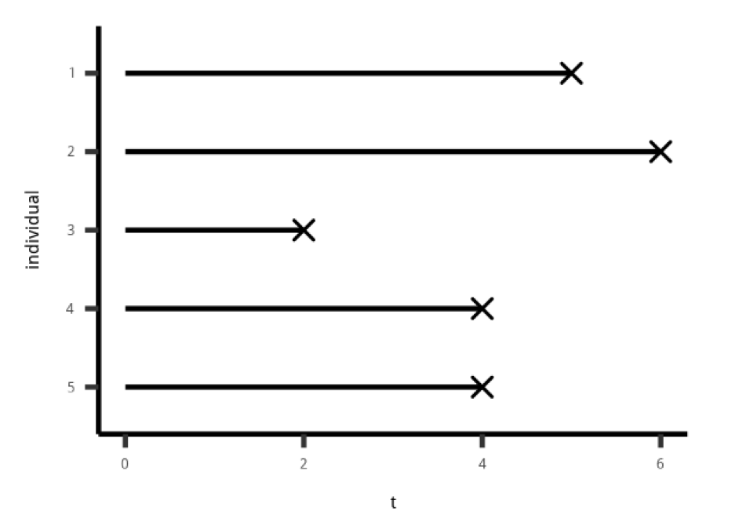
```


---

# Primjer 1

```{r, include=TRUE, fig.align="center", echo=FALSE, out.width="500px"}
knitr::include_graphics("../Foto/surv2.png")
```

---

# Primjer 2

```{r, include=TRUE, fig.align="center", echo=FALSE, out.width="500px"}
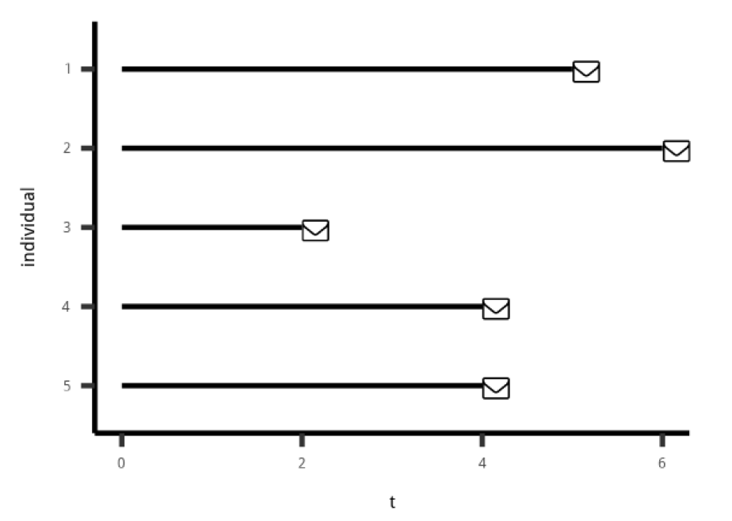
```


---

# Primjer 3

```{r, include=TRUE, fig.align="center", echo=FALSE, out.width="500px"}
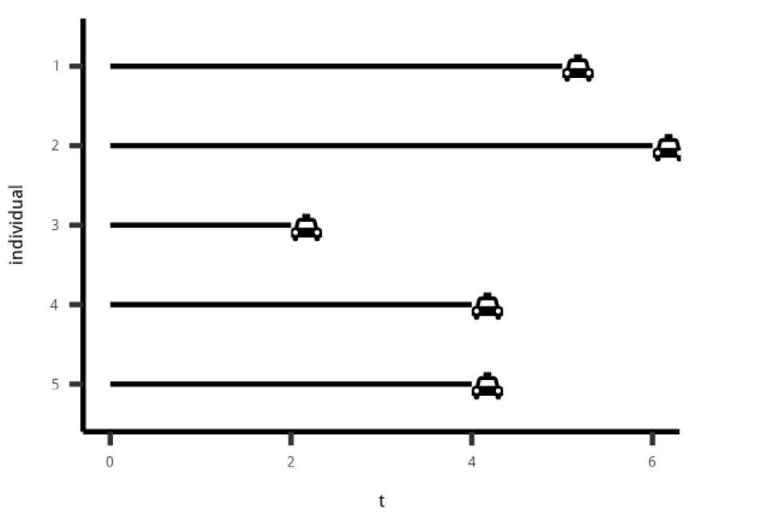
```


---

# Podatci


```{r}
#install.packages("TH.data")
#install.packages("Ecdat")
data(GBSG2, package = "TH.data")
data(UnempDur, package = "Ecdat")
```


---

# Zašto posebna vrsta analize?

- Periodi (vrijeme) je uvijek **pozitivno**

- Različite **mjere** nas zanimaju

- **Cenzori** predstavljaju problem

```{r, include=TRUE, fig.align="center", echo=FALSE, out.width="350px"}
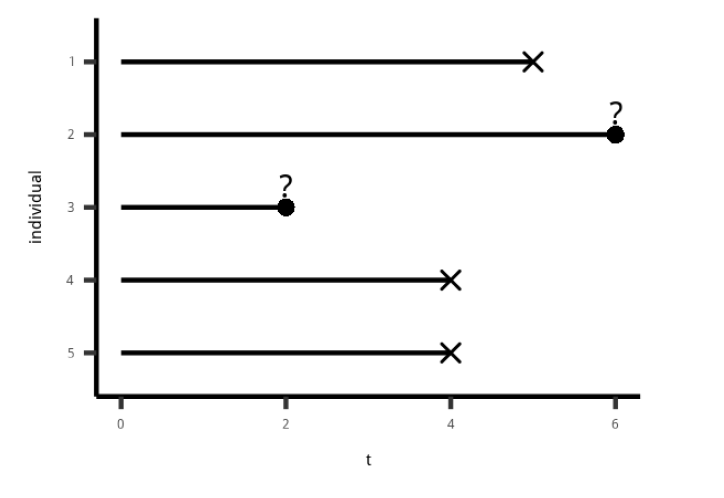
```


---

# Napravi **Surv** objekt


```{r, include=TRUE, fig.align="center", echo=FALSE, out.width="400px"}
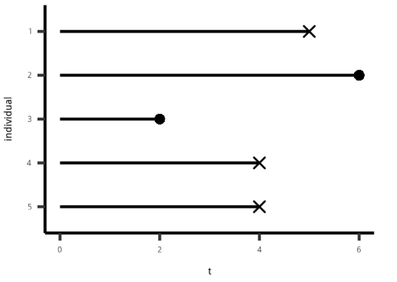
```


```{r, message=FALSE,warning=FALSE}
time <- c(5, 6, 2, 4, 4)
event <- c(1, 0, 0, 1, 1)

library(survival)
Surv(time, event)
```

---

# Paketi

```{r}
# Za analizu 
#install.packages("survival")
#install.packages("survminer")
# Za vizualizacije 
#library("survminer")
```

.footnote[Postoji i CRAN Task View za Survival analizu](https://cran.r-project.org/web/views/Survival.html)]]

---

# Pitanja na koja odgovara survival analiza

- Koja je vjerojatnost da će pacijent preživjeti više od XY godina?

- Koje je tipično vrijeme čekanja taksija?

- Od 100 nezaposlenih, koji broj možemo čekivati da će ponovno naći posao nakon 2 mjeseca?

---

# Survival funkcija

```{r, include=TRUE, fig.align="center", echo=FALSE, out.width="400px"}
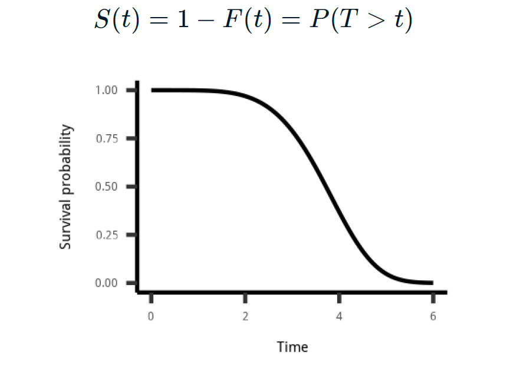
```

- Vjerojatnost da je trajanje dulje od *t*.
- npr. vjerojatnost preživljavanja nakon *t*
- npr. vjerojatnost da će taksi trebati više od *t* minuta do dolaska

---

# Survival funkcija

```{r, include=TRUE, fig.align="center", echo=FALSE, out.width="400px"}
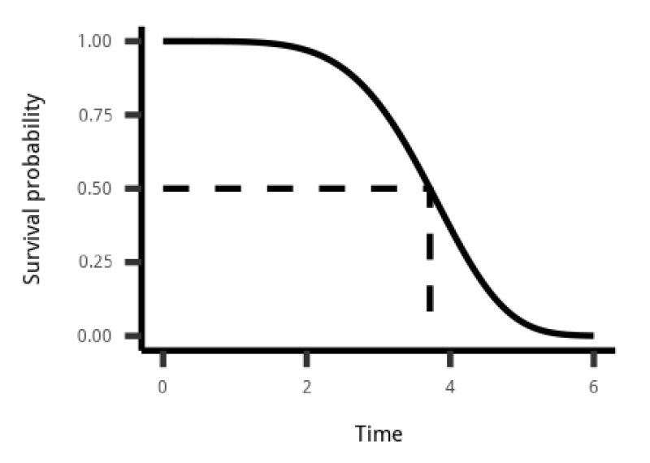
```

- Medijansko vrijeme je *t*.
- npr. medijansko vrijeme preživljavanja je 3.7 godina
- npr. medijansko vrijeme do dolaska taksija je 3.7 minuta
---

# Survival funkcija

```{r, include=TRUE, fig.align="center", echo=FALSE, out.width="400px"}
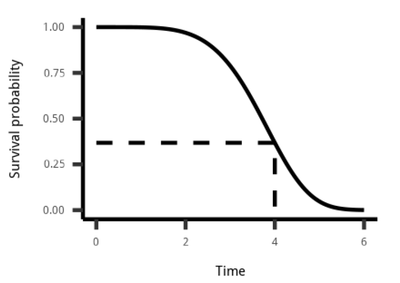
```

- 100*S(t) posto duracija je dulje od vremena t
- 37% svih pacijenata preživi dulje od 4 godine, a 63% umre unutar prve 4 godine
- 37 od 100 taksija treba više od 4 minute do dolaska


---

class: inverse, center, middle
name: proc

# PROCJENA SURVIVAL KRIVULJA

<html><div style='float:left'></div><hr color='#EB811B' size=1px width=796px></html>

(Načini procjene)

---

# Survival krivulja

```{r, include=TRUE, fig.align="center", echo=FALSE, out.width="500px"}
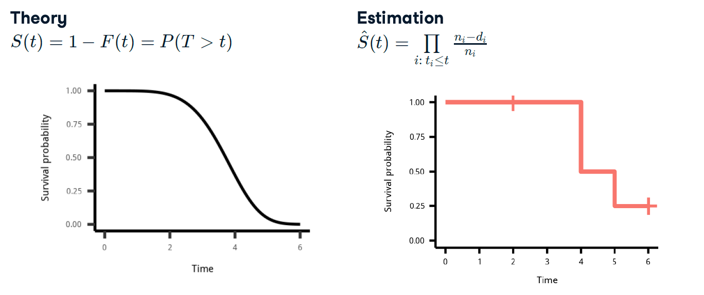
```

---

# Procjena survival krivulje

```{r, include=TRUE, fig.align="center", echo=FALSE, out.width="500px"}
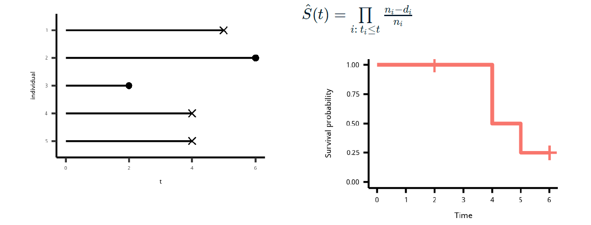
```

---

# Izračun *korak po korak*

```{r, include=TRUE, fig.align="center", echo=FALSE, out.width="500px"}
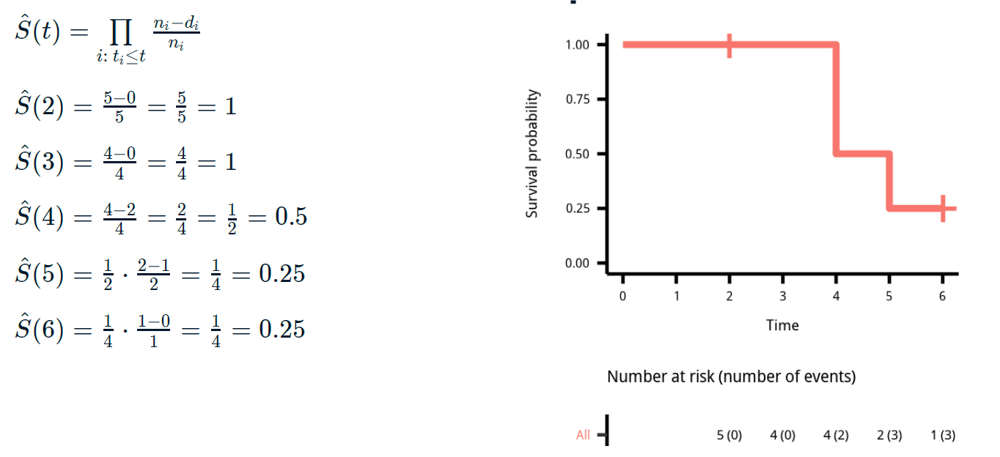
```

---

# Izračun pomoću funkcije

```{r, eval= FALSE}
# Kaplan-Meier
km <- survfit(Surv(time, event) ~ 1)
ggsurvplot(km, conf.int = FALSE,
risk.table = "nrisk_cumevents",
legend = "none")
```

---

# Vizualizacija
```{r,eval=FALSE}
ggsurvplot(
fit = km,
palette = "blue",
linetype = 1,
surv.median.line = "hv",
risk.table = TRUE,
cumevents = TRUE,
cumcensor = TRUE,
tables.height = 0.1
)
```


---

class: inverse, center, middle
name: wei

# WEIBULL MODEL

<html><div style='float:left'></div><hr color='#EB811B' size=1px width=796px></html>

---

# Zašto koristimo Weibull model

```{r, include=TRUE, fig.align="center", echo=FALSE, out.width="500px"}
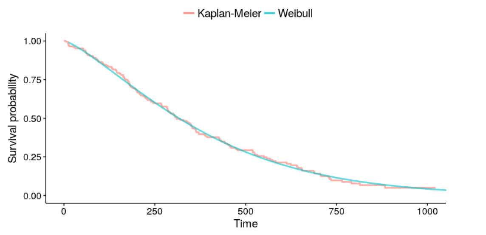
```

---

# Primjeni Weibull model u R

```{r, eval=FALSE}
# Webull model
wb <- survreg(Surv(time, event)~1,data)
# Kaplan-Meier procjena
km <- survfit(Surv(time, event)~1,data)
```

---

# Izračun

```{r}
wb <- survreg(Surv(time, cens) ~ 1, data = GBSG2)
```


```{r}
# Predviđanje
## 90% pacijenata prežive dulje od:
predict(wb, type = "quantile", p = 1 - 0.9, newdata = data.frame(1))
```
```{r}
surv <- seq(.99, .01, by = -.01)
t <- predict(wb, type = "quantile", p = 1 - surv, newdata = data.frame(1))
head(data.frame(time = t, surv = surv))
```

---

# Vizualiziraj Weibull model

```{r, eval=FALSE}
# Weibull
wb <- survreg(Surv(time, cens) ~ 1)
# Survival krivulja
surv <- seq(.99, .01, by = -.01)
t <- predict(wb, type = "quantile", p = 1 - surv, newdata = data.frame(1))
surv_wb <- data.frame(time = t, surv = surv,
upper = NA, lower = NA, std.err = NA)
# Prikaz
ggsurvplot_df(fit = surv_wb, surv.geom = geom_line)
```

---

# Vizualiziraj Weibull model

```{r, include=TRUE, fig.align="center", echo=FALSE, out.width="500px"}
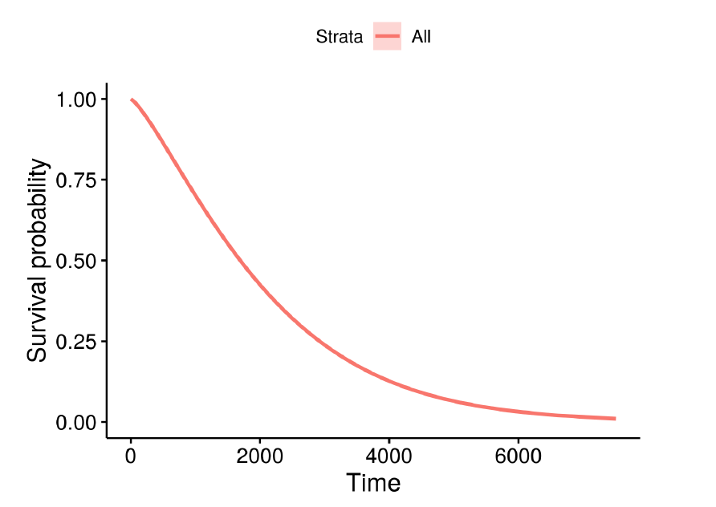
```

---

# Dodatne kontrolne varijable


```{r, include=TRUE, fig.align="center", echo=FALSE, out.width="500px"}
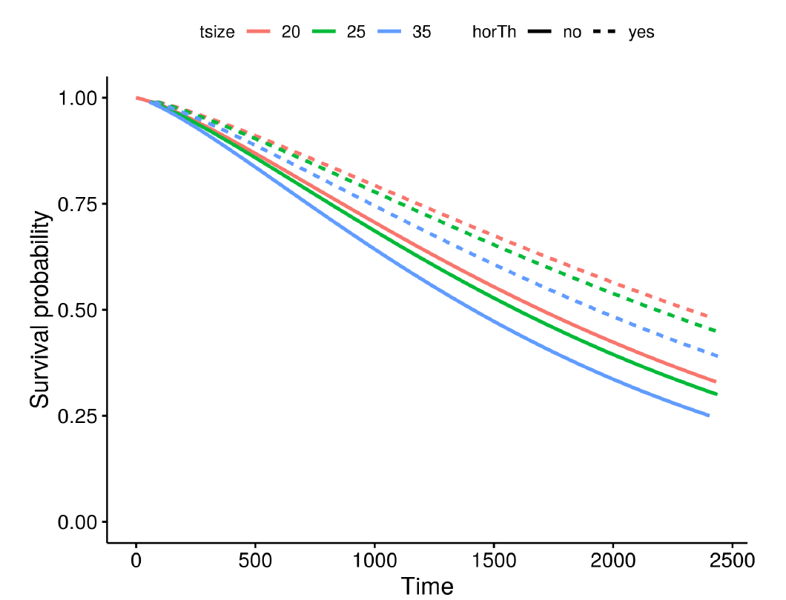
```

---

# Provedi model

```{r}
wbmod <- survreg(Surv(time, cens) ~ horTh + tsize, data = GBSG2)
coef(wbmod)
```
---

# Procedura za vizualizaciju

```{r}
# Korak 1
wbmod <- survreg(Surv(time, cens) ~ horTh + tsize, data = GBSG2) # Provedi model
## Odredi kombinacije kontrolnih varijabli
newdat <- expand.grid(
horTh = levels(GBSG2$horTh),
tsize = quantile(GBSG2$tsize, probs = c(0.25, 0.5, 0.75)) )
newdat
```

---

# Procedura za vizualizaciju

```{r}
# Korak 2
## Izračunaj survival krivulje
surv <- seq(.99, .01, by = -.01)
t <- predict(wbmod, type = "quantile", p = 1 - surv, newdata = newdat)
dim(t)
t[, 1:7]
```

---

# Procedura za vizualizaciju

```{r}
# Korak 3
## Napravi data.frame sa survival krivuljom
surv_wbmod_wide <- cbind(newdat, t)
# Promijeni oblik
library("reshape2")
surv_wbmod <- melt(surv_wbmod_wide, id.vars = c("horTh", "tsize"),
variable.name = "surv_id", value.name = "time")
surv_wbmod$surv <- surv[as.numeric(surv_wbmod$surv_id)]
surv_wbmod[, c("upper", "lower", "std.err", "strata")] <- NA
```

---

```{r}
# Korak 3
str(surv_wbmod)
```

---

```{r, fig.height=3}
# Korak 4
## Prikaži grafički
ggsurvplot_df(surv_wbmod, surv.geom = geom_line,
linetype = "horTh", color = "tsize", legend.title = NULL)
```


---

# Postoje i druge distribucije

```{r, include=TRUE, fig.align="center", echo=FALSE, out.width="500px"}
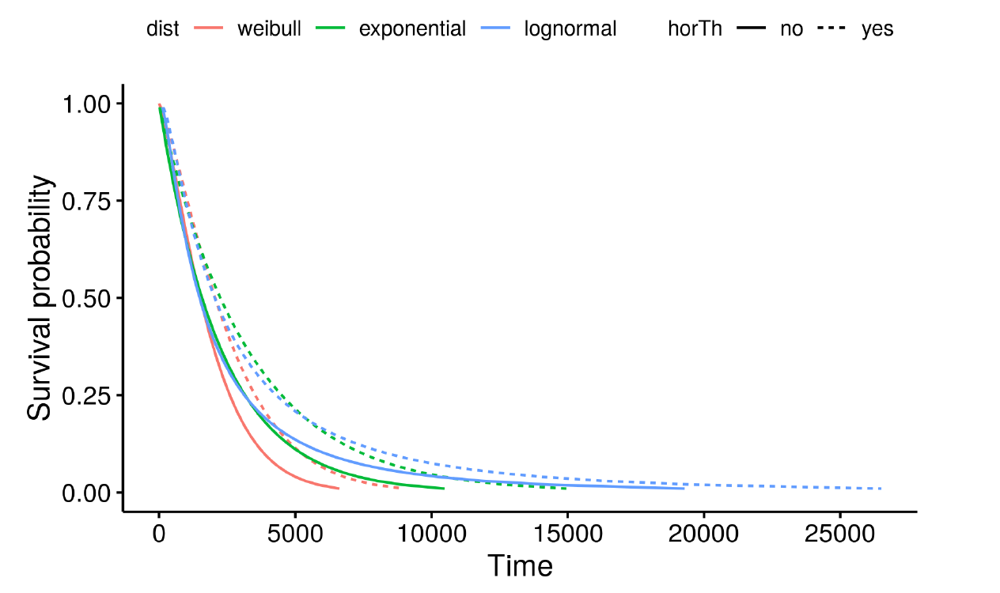
```

---

# Postoje i druge distribucije
```{r, eval=FALSE}
survreg(Surv(time, cens) ~ horTh,
data = GBSG2)
survreg(Surv(time, cens) ~ horTh,
data = GBSG2,
dist = "exponential")
survreg(Surv(time, cens) ~ horTh,
data = GBSG2,
dist = "lognormal")
```

---

class: inverse, center, middle
name: cox

# Cox MODEL

<html><div style='float:left'></div><hr color='#EB811B' size=1px width=796px></html>

(Semiprametrijski model sa manje strogim pretpostavkama)

---

# Zašto Cox model


```{r, include=TRUE, fig.align="center", echo=FALSE, out.width="500px"}
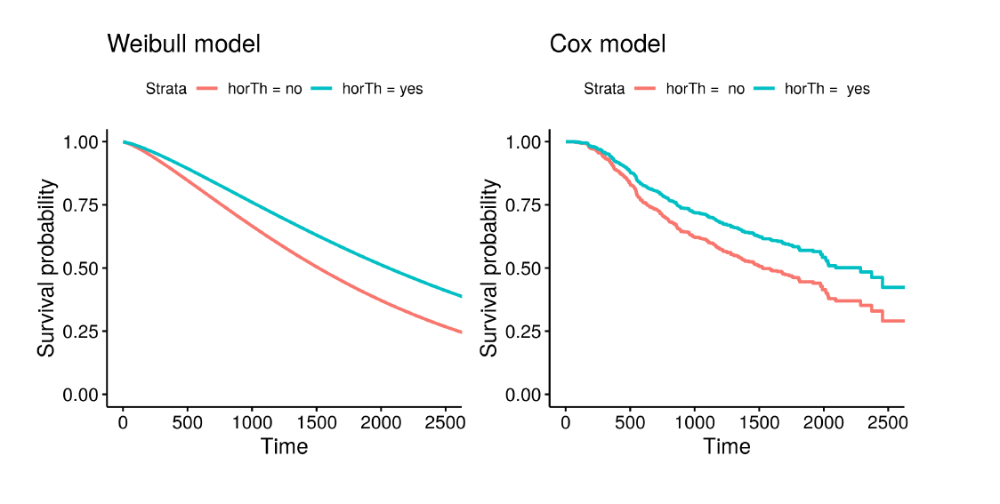
```


---

# Provedi Cox model

```{r}
# Cox model
cxmod <- coxph(Surv(time, cens) ~ horTh,
data = GBSG2)
coef(cxmod)
# Weibull model
wbmod <- survreg(Surv(time, cens) ~ horTh,
data = GBSG2)
coef(wbmod)
```


---

# Vizualizacija Cox modela

```{r}
# Korak 1
cxmod <- coxph(Surv(time, cens) ~ horTh + tsize, data = GBSG2) # Provedi model
# Odredi kombinacije regresora
newdat <- expand.grid(
horTh = levels(GBSG2$horTh),
tsize = quantile(GBSG2$tsize, probs = c(0.25, 0.5, 0.75)) )
rownames(newdat) <- letters[1:6]
newdat
```

---

# Vizualizacija Cox modela

```{r}
# Korak 2
# Izračunaj survival krivulje
cxsf <- survfit(cxmod, data = GBSG2, newdata = newdat, conf.type = "none")
str(cxsf)
```

---

# Vizualizacija Cox modela


```{r}
# Korak 3 
surv_cxmod0 <- surv_summary(cxsf)
head(surv_cxmod0)
## Napravi data.frame
surv_cxmod <- cbind(surv_cxmod0,
newdat[as.character(surv_cxmod0$strata), ])
```

---

# Vizualizacija Cox modela

```{r}
ggsurvplot_df(surv_cxmod, linetype = "horTh", color = "tsize",
legend.title = NULL, censor = FALSE)
```


---

class: inverse, center, middle

# Hvala na pažnji

<html><div style='float:left'></div><hr color='#EB811B' size=1px width=796px></html>

(Sljedeće predavanje: Network analiza)


