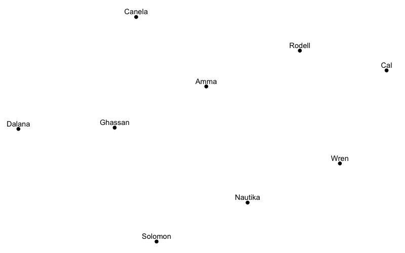
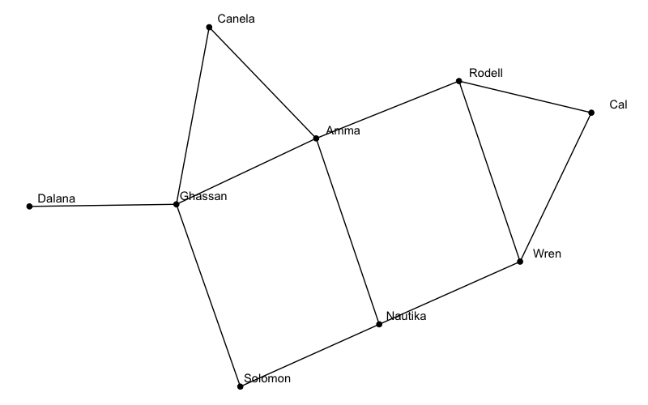
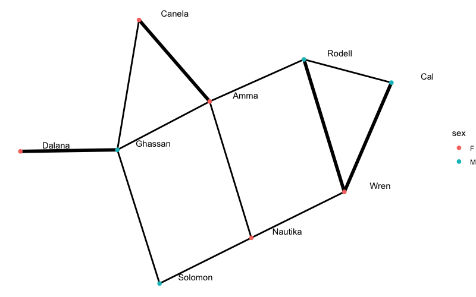
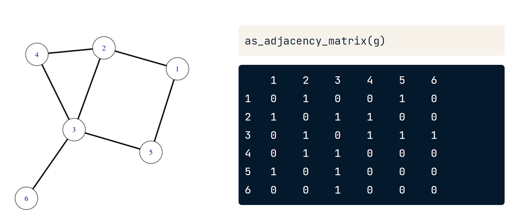
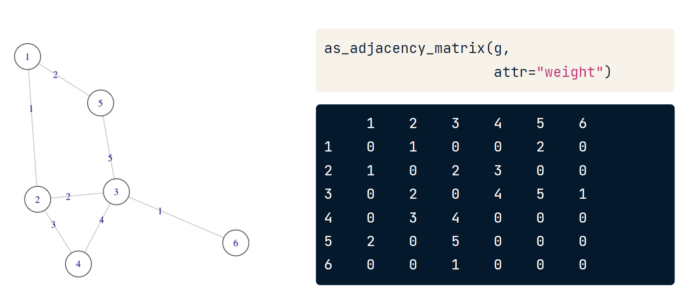
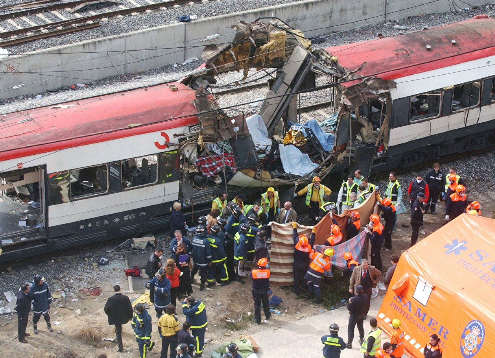
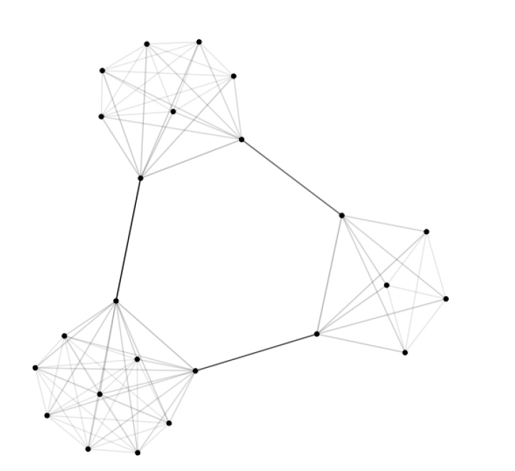
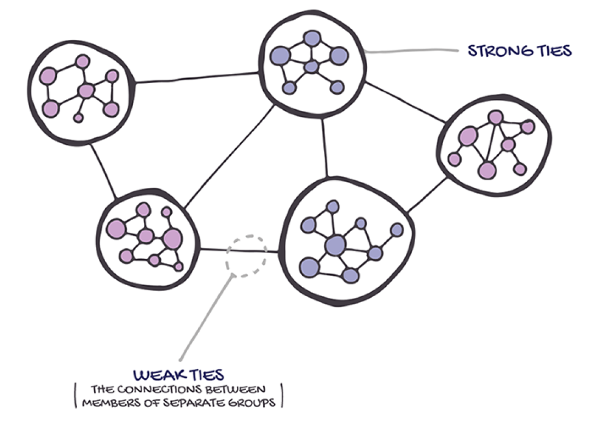

```{r setup, include=FALSE}
options(htmltools.dir.version = FALSE)
library(knitr)
opts_chunk$set(
  fig.align="center", #fig.width=6, fig.height=4.5, 
  # out.width="748px", #out.length="520.75px",
  dpi=300, #fig.path='Figs/',
  cache=T, echo=T, warning=F, message=F
  )
knitr::opts_hooks$set(fig.callout = function(options) {
  if (options$fig.callout) {
    options$echo <- FALSE
    options$out.height <- "99%"
    options$fig.width <- 16
    options$fig.height <- 8
  }
  options
})
```

```{css, echo = F, eval = T}
@media print {
  .has-continuation {
    display: block !important;
  }
}
remark-slide-content {
  font-size: 22px;
  padding: 20px 80px 20px 80px;
}
.remark-code, .remark-inline-code {
  background: #f0f0f0;
}
.remark-code {
  font-size: 16px;
}
.mid. remark-code { /*Change made here*/
  font-size: 60% !important;
}
.tiny .remark-code { /*Change made here*/
  font-size: 40% !important;
}

/* custom.css */
.left-code {
  color: #777;
  width: 38%;
  height: 92%;
  float: left;
}
.right-plot {
  width: 60%;
  float: right;
  padding-left: 1%;
}
.plot-callout {
  height: 225px;
  width: 450px;
  bottom: 5%;
  right: 5%;
  position: absolute;
  padding: 0px;
  z-index: 100;
}
.plot-callout img {
  width: 100%;
  border: 4px solid #23373B;
}
```

```{r paketi, warning=F, echo=F, message=F, eval=TRUE}

library(tidyverse)  # data manipulation and visualization
library(gridExtra)  # plot arrangement
library(ggplot2)
library(tidyverse)
library(dplyr)
library(rvest)
library(janitor)
library(readr)
library(igraph)
library(igraph)
library(dplyr)
library(ggplot2)
library(ggraph)

```

# Pregled predavanja

<br>
<br>
<br>

1. [Općenito o network analizi](#opc)

2. [Network podatci](#netdta)

3. [Network objekt](#netob)

4. [Praktični primjer (network analiza)](#stat)

---

class: inverse, center, middle
name: opc

# OPĆENITO O NETWORK ANALIZI

<html><div style='float:left'></div><hr color='#EB811B' size=1px width=796px></html>

(Osnova za korištenje)

---

# Koncept
<br>
<br>
<br>
- modeliranje kompleksnosti i međupovezanosti
<br>
- centralna metodologija za (digitalne) društvene i humanističke znanosti
<br>
- upotreba u analizi komunikacijskih kanala, modeliranju epidemije, razumijevanju društvenih interakcija
<br>
- vizualna analiza - *uvodno*
<br>
- statistička analiza - *napredno*

---

# Software podrška
<br>
<br>
<br>
- [statnet](http://statnet.org/)
<br>
- [igraph](https://igraph.org/)
<br>
- [tidygraph](https://github.com/thomasp85/tidygraph)
<br>
- [gggraph](https://www.data-imaginist.com/2017/ggraph-introduction-layouts/)

---

# Najbitniji elementi mreže
<br>
<br>
- nodes (*čvorovi*) i vertices (*poveznice*) ili edges i links
<br>
<br>
- atributi (*attributes*)
<br>
<br>
- adjecancy matrice vs. data.frame
<br>
<br>
- mreže mogu biti usmjerene (directed) i neusmjerene (unidirected)
<br>

---

# Čvorovi (*nodes*)
<br>
<br>
```{r, include=TRUE, fig.align="center", echo=FALSE, out.width="500px"}

```

---

# Stvori demo network objekt (*nodes*)
<br>
<br>

```{r}
# node-list objekt ima jednu varijablu (kolonu) i sadržava ID oznaku za pripadajući edge
node_list <- tibble(id = 1:5) 
node_list
```
---

# Poveznice (*edges*)
<br>
<br>
```{r, include=TRUE, fig.align="center", echo=FALSE, out.width="500px"}

```

---

# Stvori demo network objekt (*edges*)
<br>
```{r}
#  edge-list ima minimalno dvije kolone: kolona izvora čvorova (nodes) i kolona smjernica čvorova
#  edge-list objekt može sadržavati i dodatne atribute (varijable)
edge_list <- tibble(from = c(1, 2, 2, 3, 4), to = c(2, 3, 4, 2, 1))
edge_list
```


---

# Karakteristike (*attributes*)
<br>
<br>
```{r, include=TRUE, fig.align="center", echo=FALSE, out.width="500px"}

```


---

# Stvori demo network objekt (*attributes*)
<br>

```{r}
node_list_attr <- node_list %>% 
  mutate(Spol = c("F","F","M","F","M"))
node_list_attr
```

---

# Reprezentacija mreže
<br>
###### Standardni način: adjecancy matrica
<br>
```{r}
#>   1 2 3 4 5
#> 1 0 1 0 0 0
#> 2 0 0 1 1 0
#> 3 0 1 0 0 0
#> 4 1 0 0 0 0
#> 5 1 0 0 0 0
```
---

# *Adjecency* matrica
<br>
```{r, include=TRUE, fig.align="center", echo=FALSE, out.width="650px"}

```

---

# *Adjecency* matrica
<br>
```{r, include=TRUE, fig.align="center", echo=FALSE, out.width="650px"}

```

---

# Reprezentacija mreže
<br>
###### "Moderni" način: crna kutija (*black box*)
<br>
```{r}
g = graph_from_data_frame(edge_list, directed = FALSE, vertices = node_list)
g
```

.footnote[[*]Postoji mnoštvo različitih načina za "black box" reprezentaciju. Upoznati ćemo nekoliko načina!]

---

class: inverse, center, middle
name: netdta

# NETWORK PODATCI

<html><div style='float:left'></div><hr color='#EB811B' size=1px width=796px></html>

(Napravi mrežu iz podataka!)

---

# Preuzmi podatke 
<br>

```{r}
url <- "https://github.com/jessesadler/intro-to-r/blob/master/data/correspondence-data-1585.csv"
epistole <- read_html(url) %>%
  html_table(fill = TRUE) %>%
  as.data.frame() %>%
  select(-1) %>%
  row_to_names(1)
glimpse(epistole)
```

---

# Pregledaj podatke
<br>

```{r}
head(epistole,15)
```

---

# Stvori node listu
<br>
```{r}
sources <- epistole %>%
  distinct(source) %>%
  rename(label = source)

sources
```

---

# Stvori node listu
<br>
```{r}
destinations <- epistole %>%
  distinct(destination) %>%
  rename(label = destination)

destinations
```

---

# Stvori node listu
<br>
```{r}
# poveži u jedan objekt
nodes <- full_join(sources, destinations, by = "label")
nodes
```

---

# Stvori node listu

```{r}
# dodaj ID
nodes <- nodes %>% rowid_to_column("id")
nodes
```

---

# Napravi edge listu

```{r}
per_route <- epistole %>%  
  group_by(source, destination) %>%
  summarise(weight = n()) %>% 
  ungroup()

head(per_route,13)
```

---

# Napravi edge listu

```{r}
edges <- per_route %>% 
  left_join(nodes, by = c("source" = "label")) %>% 
  rename(from = id)
edges
```


---

# Napravi edge listu

```{r}
edges <- edges %>% 
  left_join(nodes, by = c("destination" = "label")) %>% 
  rename(to = id)
edges
```


---

class: inverse, center, middle
name: netob

# NETWORK OBJEKT

<html><div style='float:left'></div><hr color='#EB811B' size=1px width=796px></html>

(Osnova za analizu)

---

# Napravi mrežni objekt I

.tiny[
```{r}
library(network)
routes_network <- network(edges,
                          vertex.attr = nodes,
                          matrix.type = "edgelist",
                          ignore.eval = FALSE)
class(routes_network)
routes_network
```
]

---

# Vizualiziraj mrežu I

```{r, fig.height=4}
plot(routes_network, vertex.cex = 3)
```

---

# Vizualiziraj mrežu II

```{r, fig.height=4}
plot(routes_network, vertex.cex = 3, mode = "circle")
```

---

# Napravi mrežni objekt II

```{r}
detach(package:network) # ukloni paket
rm(routes_network) # Ukloni iz radnog prostora
library(igraph)
# uredi (names mora biti na prvom mjestu)
nodes %>% rename(names=label) %>% select(names,id) -> nod
# Napravi mrežni objekt
routes_igraph <- graph_from_data_frame(d = edges,
                                       vertices = nod,
                                       directed = TRUE)
routes_igraph # Pogledaj objekt
```

---

# Vizualiziraj mrežu I

```{r, fig.height=4}
plot(routes_igraph, edge.arrow.size = 0.2)
```

---

# Vizualiziraj mrežu II

```{r, fig.height=4}
plot(routes_igraph, layout = layout_with_graphopt, edge.arrow.size = 0.2)
```


---

# Napravi mrežni objekt III

```{r}
library(tidygraph)
library(ggraph)
# 1. način
routes_tidy <- tbl_graph(nodes = nodes, edges = edges, directed = TRUE)
# 2.način
routes_igraph_tidy <- as_tbl_graph(routes_igraph)
# Pregledaj objekte
class(routes_tidy)
class(routes_igraph_tidy)
class(routes_igraph)
```

---

# Pregledaj objekt
<br>
<br>
.tiny[
```{r}
routes_tidy
```
]
---

# Manipulacija sa objektom (tidyverse)
<br>
<br>
.tiny[
```{r}
routes_tidy %>% 
  activate(edges) %>% 
  arrange(desc(weight))
```
]
---

# Vizualiziraj objekt I

```{r, fig.height=4}
# Osnovna vizualizacija
ggraph(routes_tidy) + geom_edge_link() + geom_node_point() + theme_graph()
```

---

# Vizualiziraj objekt II

```{r, fig.height=3}
# Poboljšana vizualizacija
ggraph(routes_tidy, layout = "graphopt") + 
  geom_node_point() +
  geom_edge_link(aes(width = weight), alpha = 0.8) + 
  scale_edge_width(range = c(0.2, 2)) +
  geom_node_text(aes(label = label), repel = TRUE) +
  labs(edge_width = "Letters") +
  theme_graph()

```

```{r, eval=F, echo=FALSE}
# Cirkularna vizualizacija
ggraph(routes_igraph, layout = "linear") + 
  geom_edge_arc(aes(width = weight), alpha = 0.8) + 
  scale_edge_width(range = c(0.2, 2)) +
  geom_node_text(aes(label = label)) +
  labs(edge_width = "Letters") +
  theme_graph()
```

---

class: inverse, center, middle

# INTERAKTIVNE VIZUALIZACIJE

<html><div style='float:left'></div><hr color='#EB811B' size=1px width=796px></html>

---

# Interaktivne vizualizacije I

```{r, fig.height= 3}
options(htmltools.preserve.raw = FALSE) 
library(visNetwork)
visNetwork(nodes, edges)
```

---

# Interaktivne vizualizacije II

```{r, fig.height= 3}
options(htmltools.preserve.raw = FALSE) 
edges <- mutate(edges, width = weight/5 + 1)
visNetwork(nodes, edges) %>% 
  visIgraphLayout(layout = "layout_with_fr") %>% 
  visEdges(arrows = "middle")

```

---

# Interaktivne vizualizacije III

```{r, fig.height= 3}
options(htmltools.preserve.raw = FALSE) 
library(networkD3)
nodes_d3 <- mutate(nodes, id = id - 1)
edges_d3 <- mutate(edges, from = from - 1, to = to - 1)
forceNetwork(Links = edges_d3, Nodes = nodes_d3, Source = "from", Target = "to", 
             NodeID = "label", Group = "id", Value = "weight", 
             opacity = 1, fontSize = 16, zoom = TRUE)

```


---

# Interaktivne vizualizacije IV

```{r, fig.height= 2}
options(htmltools.preserve.raw = FALSE) 
sankeyNetwork(Links = edges_d3, Nodes = nodes_d3, Source = "from", Target = "to", 
              NodeID = "label", Value = "weight", fontSize = 16, unit = "Letter(s)")
```

---

class: inverse, center, middle
name: stat

# PRAKTIČNI PRIMJER (NETWORK ANALIZA)

<html><div style='float:left'></div><hr color='#EB811B' size=1px width=796px></html>

(Primjer terorističke mreže)

---

# Teroristički napad u Madridu 2004
<br>
```{r, include=TRUE, fig.align="center", echo=FALSE, out.width="500px"}

```

.footnote[ [*] Vidi rad od Jose A. Rodriguez na [poveznici](http://citeseerx.ist.psu.edu/viewdoc/download?doi=10.1.1.98.4408&rep=rep1&type=pdf)! ]

---

# Podatci
<br>
```{r}
# Učitaj podatke
terrorists <- read_csv("../Podatci/names.csv") 
# Pogledaj podatke
head(terrorists,5)
```

---

# Podatci
<br>
```{r}
# Učitaj podatke
ties <- read_csv("../Podatci/edges.csv")
# Pogledaj podatke
head(ties,5)
```

---

# Podatci

```{r}
# Prilagodi podatke
terrorists = mutate(terrorists, id = 1:nrow(terrorists)) %>% select(id, everything())
# Napravi mrežu
g = graph_from_data_frame(ties, directed = FALSE, vertices = tibble(1:nrow(terrorists)))
g # Pregled mreže
```

---

# Podatci
<br>
<br>
```{r}
# Pregledaj čvorove
V(g)
vcount(g) # Broj čvorova
```
---

# Podatci

```{r}
# Pregledaj poveznice
E(g)
ecount(g) # Broj poveznica
```

---

# Podatci

```{r}
# Doddaj naziv
g$name <- "Madrid network"
g$name
g
```

---

# Podatci
<br>
<br>
```{r}
E(g)$weight # Pogledaj težinu čvorova
```

---

# Vizualiziraj mrežu

```{r, fig.height=3}
ggraph(g, layout = "with_kk") +
geom_edge_link(aes(alpha = weight)) +
geom_node_point()
```

---

# Mjere centraliteta
<br>
<br>
- Koji su najvažniji čvorovi u mreži?

- npr. najbitnije web stranice o odrđenoj temi

- npr. utjecajni akademski članci ili knjige

- npr. internetski čvorovi i povezanost

---

# Izračunaj stupanj čvorova
<br>
<br>
```{r}
degree(g)
```


---

# Izračunaj snagu čvorova
<br>
<br>
```{r}
strength(g)
```

---

# Međusobnost (betweenness)

```{r, include=TRUE, fig.align="center", echo=FALSE, out.width="500px"}

```

---

# Vizualizacija međusobnosti

```{r, fig.height=3}
dist_weight = 1 / E(g)$weight
g$betweenness <- edge_betweenness(g, weights = dist_weight)

 ggraph(g, layout = "with_kk") +
  geom_edge_link(aes(alpha = g$betweenness)) +
  geom_node_point()

```

---

# Najpovezaniji teroristi I

```{r}
terrorists  <- terrorists %>%
  mutate(degree = degree(g),
           strength = strength(g))

arrange(terrorists, desc(degree))
```

---

# Najpovezaniji teroristi II

```{r}
arrange(terrorists, desc(strength))
```

---

# Izolirani teroristi

```{r}
filter(terrorists,degree == 0)
```

---

# Slični parovi terorista

```{r, fig.height=3}
ties <- ties %>% rename(from = x, to = y) # prilagodi nazive
ggplot(ties, aes(x = from, y = to, color = as.factor(weight))) +
  geom_point() +
  labs(color = "weigth")
```

---


# Slični parovi terorista

```{r, fig.height=3}
# Dodaj recipročne veze
ties2 = mutate(ties, temp = to, to = from, from = temp) %>% select(-temp)
ties2 = rbind(ties, ties2)
ggplot(ties2, aes(x = from, y = to, color = as.factor(weight))) +
  geom_point() +
  labs(color = "weigth")

```

---


# Slični parovi terorista

```{r}
##Pripremi podatke##
# Ukloni izolirane teroriste
isolated = filter(terrorists, degree == 0)$id
g = delete_vertices(g, isolated)
# Napravi adjecany matricu
A = as_adjacency_matrix(g, attr = "weight", sparse = FALSE)
# Sličnost kao Pearsonova korelacija
S = cor(A)
# Ukloni sličnost sa samim sobom
S = S + diag(-1, nrow(A))
# Deskriptiva
summary(c(S))
```

---

# Slični parovi terorista


```{r}
# Napravi adjecancy matricu
h <- graph_from_adjacency_matrix(S, mode = "undirected", weighted = TRUE)
# Pretvori u data.frame(tibble)
sim = as.tibble(as_data_frame(h, what = "edges")) %>% 
   mutate(from = as.integer(from), to = as.integer(to)) %>%
   arrange(desc(weight))
# join sa podatkovnim skupom terrorists
sim_joint <- sim %>% 
 left_join(terrorists, c("from" = "id")) %>% 
  left_join(terrorists, c("to" = "id")) %>%
  filter(degree.x >= 10, degree.y >= 10) %>%
  select(-strength.x, -strength.y)
```

---

# Najsličniji parovi
<br>
```{r}
head(sim_joint)
```

---

# Najmanje slični parovi
<br>
```{r}
tail(sim_joint)
```

---

# Vizualiziraj sličnost

```{r, fig.height=3, warning=FALSE,message=FALSE}
h2 <- graph_from_data_frame(filter(sim_joint, weight >= 0.60), directed = FALSE, vertices = terrorists)
h2 <- delete_vertices(h2, which(degree(h2) == 0))

ggraph(h2) + 
  geom_edge_link(aes(alpha = weight)) + 
  geom_node_point() + 
  theme_graph()
```

---

# Vizualiziraj sličnost

```{r, fig.height=3, warning=FALSE,message=FALSE}
# Dodaj snagu čvorova
ggraph(h2) + 
  geom_edge_link(aes(alpha = weight)) + 
  geom_node_point(aes(size = strength)) +
  theme_graph()
```
---


# Vizualiziraj sličnost

```{r, fig.height=3, warning=FALSE,message=FALSE}
# Dodaj nazive čvorova
ggraph(h2) + 
  geom_edge_link(aes(alpha = weight)) + 
  geom_node_point() +
  geom_node_text(aes(label = name), repel=T) +
  theme_graph()
```


---

# Vizualiziraj sličnost


```{r, fig.height=3, warning=FALSE,message=FALSE}
V(h2)$betw = betweenness(h2) # dodaj međusobnost u mrežu

ggraph(h2) + 
  geom_edge_link(aes(alpha = weight)) + 
  geom_node_point(aes(size = betw)) +
  theme_graph()
```


```{r, fig.height=3, warning=FALSE,message=FALSE,eval=FALSE, include=FALSE, echo=FALSE}

# Provedi klastering

# Napravi matricu udaljenosti
D = 1-S
# Pretvori u objekt
d = as.dist(D)
# Provedi klastering (average-linkage)
cc = hclust(d, method = "average")
# Prikaži dendogramom
plot(cc)
clusters.list = rect.hclust(cc, k = 4, border="blue") # Prilagodi grafikon
```

---
  
# Snaga slabih veza
<br>
<br>

```{r, include=TRUE, fig.align="center", echo=FALSE, out.width="500px"}

```

.footnote[[*] Rad M.S. Granovetter-a na [poveznici](http://snap.stanford.edu/class/cs224w-readings/granovetter73weakties.pdf).]

---
  
# Slabe veze
<br>
<br>
```{r, include=TRUE, fig.align="center", echo=FALSE, out.width="500px"}

```

---
  
# Snažne veze
<br>
<br>  
```{r, include=TRUE, fig.align="center", echo=FALSE, out.width="500px"}

```

---

class: inverse, center, middle

# Hvala na pažnji

<html><div style='float:left'></div><hr color='#EB811B' size=1px width=796px></html>

(Zadnje predavanje!)


