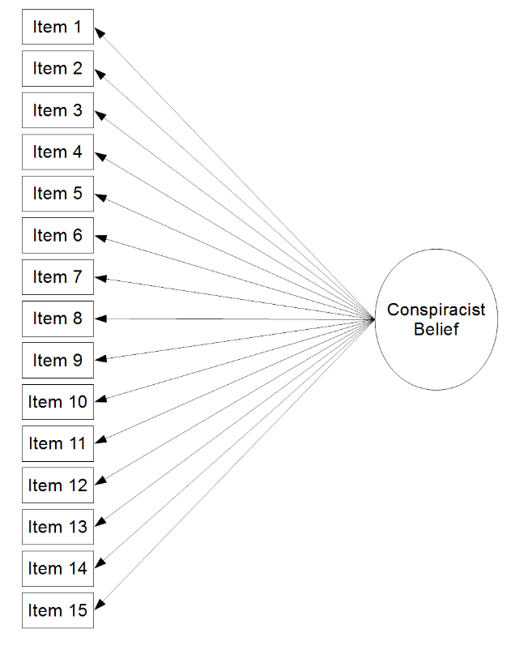
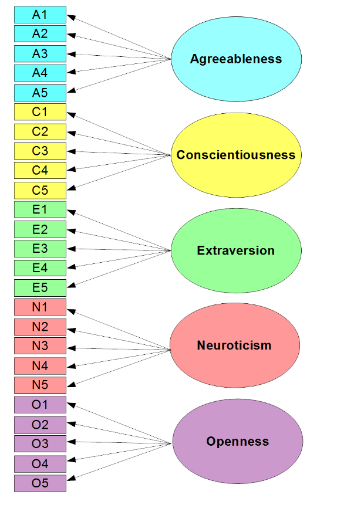

```{r setup, include=FALSE}
options(htmltools.dir.version = FALSE)
library(knitr)
opts_chunk$set(
  fig.align="center", #fig.width=6, fig.height=4.5, 
  # out.width="748px", #out.length="520.75px",
  dpi=300, #fig.path='Figs/',
  cache=F#, echo=F, warning=F, message=F
  )
```

```{css, echo = F, eval = T}
@media print {
  .has-continuation {
    display: block !important;
  }
}
remark-slide-content {
  font-size: 22px;
  padding: 20px 80px 20px 80px;
}
.remark-code, .remark-inline-code {
  background: #f0f0f0;
}
.remark-code {
  font-size: 16px;
}
.mid. remark-code { /*Change made here*/
  font-size: 60% !important;
}
.tiny .remark-code { /*Change made here*/
  font-size: 40% !important;
}
```

```{r paketi, warning=F, echo=F, message=F, eval=FALSE}

library(FactoMineR)
library(factoextra)
library(FactoMineR)
library(tidyverse)  # data manipulation and visualization
library(gridExtra)  # plot arrangement
library(patchwork)
library(ggplot2)
library(lavaan)
library(sem)
library(semPlot)
library(tidyverse)
library(dplyr)

```

# Pregled predavanja

<br>
<br>
<br>


1. [Jednodimenzionalna faktorska analiza (FA)](#uni)

2. [Multidimenzionalna FA](#multi)

3. [Konfirmatorna FA](#conf)


---
class: inverse, center, middle
name: uni

# FAKTORSKA ANALIZA

<html><div style='float:left'></div><hr color='#EB811B' size=1px width=796px></html>

(Općenito)

---

# Karakteristike FA

- Charles Spearman (1904) zaslužan za uvođenje FA
- FA ima mnogo sičnosti sa PCA
- Cilj FA je reducirati veliki broj (koreliranih) varijabli na mali broj indeksa (faktora)
- FA je statistički model (za razliku od PCA koja je statistička metoda)
- Ekstenzija (C)FA je modeliranje strukturnih jednadžbi SEM 
<br>
<br>

---

# Vrste FA
<br>
<br>

.pull-left[
##### EKSPLORATIVNA

- koristi se u fazi razvoja modela
- pregled faktorske strukture
- opća slika o varijablama
]

.pull-right[
##### KONFIRMATORNA

- procijeni kosntrukt
- koristi se nakon razvoja mjere

]


---
class: inverse, center, middle

# PODATCI I PODRŠKA

<html><div style='float:left'></div><hr color='#EB811B' size=1px width=796px></html>

(Pretpostavke za analizu)

---

# Paket

- koristimo `psych` paket

- za detalje o paketu pogledajte [Personality project](http://personality-project.org/r/psych/)

```{r}
library(psych)
```

---

# Podatci

- koristimo `gcbs` podatkovni skup (Generic Conspiracist Beliefs Survey)
- provjerite da li **i** vas prisluškuju na [Open psychometrics](https://openpsychometrics.org/tests/GCBS/) :-)


```{r}
gcbs <- readRDS("../Podatci/GCBS_data.rds")
str(gcbs)
```


---

# Konstrukti
<br>
<br>
- Zavjera vlade (GM)
<br>
- Prikrivanje vanzemaljaca (ET)
<br>
- Zle i zavjereničke globalne organizacije (MG)
<br>
- Osobna dobrobit (PW)
<br>
- Kontrola informacija (CI)

Za detalje o varijablama pogledajte [Measuring belief in conspiracy theories](https://www.frontiersin.org/articles/10.3389/fpsyg.2013.00279/full).

---

# Varijable i konstrukti

```{r, include=TRUE, fig.align="center", echo=FALSE, out.width="400px"}

knitr::include_graphics("../Foto/konstrukti_FA.png")
```

---

# Jednodimenzionalni konstrukt

```{r, include=TRUE, fig.align="center", echo=FALSE, out.width="400px"}


```

---

# Jednodimenzionalni konstrukt

.tiny[
.pull-left[
```{r}
EFA_model <- fa(gcbs)
EFA_model$loadings
```
]
]
.pull-right[
```{r}
fa.diagram(EFA_model)
```

]


---
class: inverse, center, middle

# RAZVOJ KONSTRUKTA

<html><div style='float:left'></div><hr color='#EB811B' size=1px width=796px></html>

(Prije analize...)

---

# Procedura razvoja konstrukta
<br>
<br>
<br>
- Odredi elemente konstrukta
<br>
<br>
- Prikupi podatke 
<br>
<br>
- Upoznaj se sa podatcima
<br>
<br>
- Odluka što koristiti EFA, CFA ili obje analize
<br>
<br>
- Podijeli uzorak u dva (slučajna; *random*) dijela (za obje)
<br>
<br>
- Usporedi uzorke


---

# Podatci

```{r}
psych::describe(gcbs)
```


---

# Podijeli podatke
<br>
<br>
<br>
```{r}
N <- nrow(gcbs)
indices <- seq(1,N)
indices_EFA <- sample(indices,floor((0.5 * N)))
indices_CFA <- indices[!(indices %in% indices_EFA)]
gcbs_EFA <- gcbs[indices_EFA, ]
gcbs_CFA <- gcbs[indices_CFA, ]
```

---

# Usporedi polovice
<br>
<br>
<br>
```{r}
group_var <- vector("numeric", nrow(gcbs))
group_var[indices_EFA] <- 1
group_var[indices_CFA] <- 2
head(group_var,450)
```

---

# Usporedi polovice

.tiny[
```{r}
gcbs_grouped <- cbind(gcbs, group_var)
describeBy(gcbs_grouped, group = group_var)
```
]
---

# Usporedi polovice
.tiny[
```{r}
statsBy(gcbs_grouped, group = "group_var")
```
]
---

# Korelacije varijabli

```{r}
lowerCor(gcbs)
```

---

# Signifikantnost korelacija
.tiny[
```{r}
corr.test(gcbs, use = "pairwise.complete.obs")$p
```
]

---

# Intervali pouzdanosti
.tiny[
```{r}
corr.test(gcbs, use = "pairwise.complete.obs")$ci
```
]

---

# Alfa koeficijent

.tiny[
```{r}
alpha(gcbs)
```
]

---

# Pouzdanost podjele

```{r}
splitHalf(gcbs)
```

---
class: inverse, center, middle
name: uni

# MULTIDIMENZIONALNA FA

<html><div style='float:left'></div><hr color='#EB811B' size=1px width=796px></html>

(U praksi uvijek ima više od jedne dimenzije)

---

# Podatci

- koristimo podatke Synthetic Aperture Personality Assessment (SAPA)
- 2.800 osoba
- 25 pitanja
.tiny[
```{r}
data(bfi)
str(bfi)
```
]

---

# Podatci

```{r}
head(bfi)
```

---

# Podatci
<br>
<br>
```{r}
names(bfi)
```

---

# Konstrukt


```{r, include=TRUE, fig.align="center", echo=FALSE, out.width="300px"}

```

---

# Konstrukt

- konstrukt se ne može direktno mjeriti
- primjeri: samoodređenost, sposobnost razmišljanja, politička pripadnost, ekstrovertiranost 
<br>
<br>
```{r, include=TRUE, fig.align="center", echo=FALSE, out.width="450px"}
knitr::include_graphics("../Foto/konstrukt_FA.png")
```

---

# Podijeli podatke
<br>
<br>

```{r}
N <- nrow(bfi)
indices <- seq(1, N)
indices_EFA <- sample(indices, floor((.5*N)))
indices_CFA <- indices[!(indices %in% indices_EFA)]
bfi_EFA <- bfi[indices_EFA, ]
bfi_CFA <- bfi[indices_CFA, ]
```

---

# Podijeli podatke

```{r}
head(bfi_EFA, 2)
head(bfi_CFA, 2)
```

---

# ...bez teorije


```{r, include=TRUE, fig.align="center", echo=FALSE, out.width="550px"}
knitr::include_graphics("../Foto/noTheory_FA.png")
```

---

# Korelacijska matrica

.tiny[
```{r}
bfi_EFA_cor <- cor(bfi_EFA, use = "pairwise.complete.obs")
head(bfi_EFA_cor,4) 
```
]

---

# Svojsvene vrijednosti


```{r, fig.height=4}
scree(bfi_EFA_cor, factors = FALSE)
```


---

# Eksplorativna vs. konfirmatorna FA


```{r, include=TRUE, fig.align="center", echo=FALSE, out.width="350px"}
knitr::include_graphics("../Foto/konf_FA.png")
```


```{r, include=TRUE, fig.align="center", echo=FALSE, out.width="350px"}
knitr::include_graphics("../Foto/eksp_FA.png")
```


---

# Provedi FA

.tiny[
```{r, warning=FALSE, message=FALSE}
EFA_model <- fa(bfi_EFA, nfactors = 6)
EFA_model
```
]

---

# Faktorska opterećenja

.tiny[
```{r}
EFA_model$loadings
```
]


---

# Faktorski koeficijenti
<br>
<br>

```{r}
head(EFA_model$scores)
```

---

# Procjena kvalitete modela (fit)
<br>
<br>
##### Apsolutne mjere

- Chi-square test: nesignifikanstnost
- Tucker-Lewis Index (TLI) : > 0.90
- Root Mean Square Error of Approximation (RMSEA): < 0.05

##### Relativne mjere

- Bayesian Information Criterion (BIC)

---

# Procjena kvalitete modela (relativna)

```{r, eval = FALSE}
EFA_model <- fa(bfi_EFA, nfactors = 6)
EFA_model
```

```{r}
bfi_theory <- fa(bfi_EFA, nfactors = 5)
bfi_eigen <- fa(bfi_EFA, nfactors = 6)

bfi_theory$BIC
bfi_eigen$BIC
bfi_theory$BIC
bfi_eigen$BIC
```


---
class: inverse, center, middle
name: conf

# KONFIRMATORNA FA (CFA)

<html><div style='float:left'></div><hr color='#EB811B' size=1px width=796px></html>

(Kada postoji teorija!)

---

# Razlozi za korištenje
<br>
<br>
<br>
- Eksplicitno specificiran odnos među varijablama
<br>
<br>
- Testiranje teorije koja je unaprijed poznata
<br>
<br>
- Pristup koji se koristi kod razvoja nove mjere


---


# Skica I (*jedan konstrukt*)
<br>
<br>
```{r,echo=FALSE, warning=FALSE, message=FALSE}
library(DiagrammeR)
library(DiagrammeRsvg)

knit_gv <- function(code, filename=NULL, width=NULL, height=800){

  assetpath <- "assets"
  dir.create(assetpath, showWarnings = F)

  if (!is.character(knitr::current_input())){
    format <- "png"
  } else {
    if (stringr::str_detect(
      knitr::opts_knit$get("rmarkdown.pandoc.to"), "beamer|latex|pdf")) {
      format <- "pdf"
    } else {
      format <- "png"
    }
  }
  if (!is.character(filename)){
    filename <- file.path(assetpath, paste0(sample(1e6:1e7, 1), ".", format))
  } else {
    filename = paste0(filename, ".", format)
  }

  library('rsvg')
  outfun <- get(paste0("rsvg_", format))
  capture.output({
    g <- grViz(paste("digraph{", code, "}"))
    DiagrammeRsvg::export_svg(g) %>% charToRaw %>% outfun(filename, width=width, height=height)
  },  file='NUL')

  knitr::include_graphics(filename)

}
```

```{r, echo=FALSE, warning=FALSE, message=FALSE, fig.height=5}
knit_gv('
Factor -> a
Factor -> b
Factor -> c
Factor -> d
a[shape=rectangle]
b[shape=rectangle]
c[shape=rectangle]
d[shape=rectangle]
')
```

---

# Skica II (*više konstrukta*)
<br>
<br>
```{r, echo=FALSE, fig.height=6}
knit_gv('
        Affective -> a
Affective -> b
Affective -> c
Cognitive -> d
Cognitive -> e
Cognitive -> f
Affective -> Cognitive:nw [dir=both]

a [shape=box]
b [shape=box]
c [shape=box]
d [shape=box]
e [shape=box]
f [shape=box]

')
```


---

# Podatci


```{r}
hz <- lavaan::HolzingerSwineford1939
hz %>% dplyr::glimpse()
```

---

# Definiraj model

<br>
<br>
<br>

```{r}
hz.model <- '
visual =~ x1 + x2 + x3
writing =~ x4 + x5 + x6
maths =~ x7 + x8 + x9
'
```


.footnote[ [*]Za detalje o lavaan projektu pogledajte [stranicu](https://lavaan.ugent.be/tutorial/syntax1.html)].
---

# Provedi model


```{r}
hz.fit <- lavaan::cfa(hz.model, data=hz)
summary(hz.fit, standardized=TRUE)
```


---

# Prikaži grafički


```{r, fig.height=4}
semPlot::semPaths(hz.fit)
```


---

# Prikaži grafički 


```{r, fig.height=4}
semPlot::semPaths(hz.fit, "std")
```


---

# Kvaliteta procjene (Fit)

<br>
<br>
```{r}
lavaan::fitmeasures(hz.fit, c('cfi', 'rmsea', 'rmsea.ci.upper', 'bic'))
```


---

class: inverse, center, middle

# Hvala na pažnji

<html><div style='float:left'></div><hr color='#EB811B' size=1px width=796px></html>

(Nastavak: Diskriminantna analiza)


