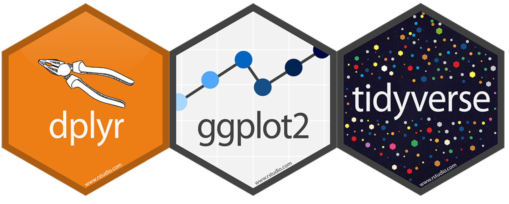
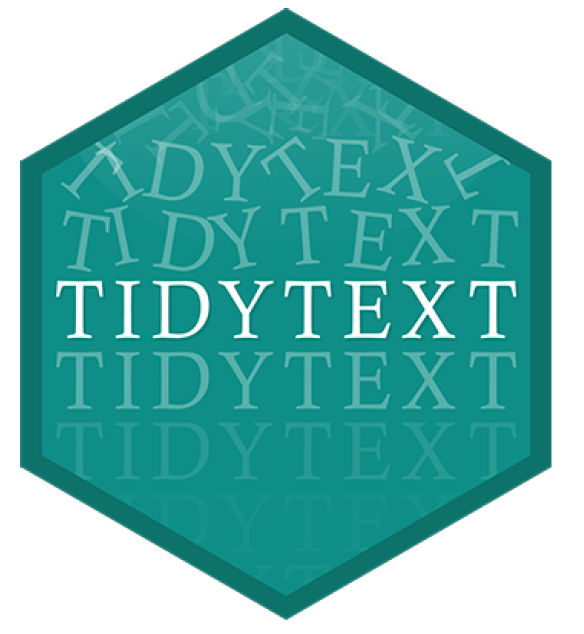
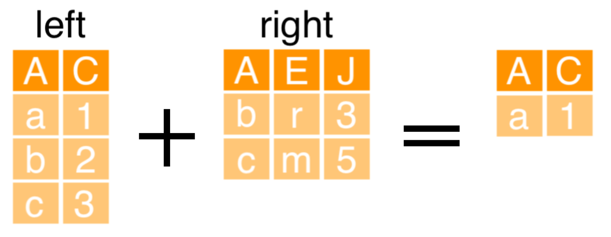

```{r setup, include=FALSE}
options(htmltools.dir.version = FALSE)
library(knitr)
opts_chunk$set(
  fig.align="center", #fig.width=6, fig.height=4.5, 
  # out.width="748px", #out.length="520.75px",
  dpi=300, #fig.path='Figs/',
  cache=T, echo=T, warning=F, message=F
  )
knitr::opts_hooks$set(fig.callout = function(options) {
  if (options$fig.callout) {
    options$echo <- FALSE
    options$out.height <- "99%"
    options$fig.width <- 16
    options$fig.height <- 8
  }
  options
})
```

```{css, echo = F, eval = T}
@media print {
  .has-continuation {
    display: block !important;
  }
}
remark-slide-content {
  font-size: 22px;
  padding: 20px 80px 20px 80px;
}
.remark-code, .remark-inline-code {
  background: #f0f0f0;
}
.remark-code {
  font-size: 16px;
}
.mid. remark-code { /*Change made here*/
  font-size: 60% !important;
}
.tiny .remark-code { /*Change made here*/
  font-size: 40% !important;
}

/* custom.css */
.left-code {
  color: #777;
  width: 38%;
  height: 92%;
  float: left;
}
.right-plot {
  width: 60%;
  float: right;
  padding-left: 1%;
}
.plot-callout {
  height: 225px;
  width: 450px;
  bottom: 5%;
  right: 5%;
  position: absolute;
  padding: 0px;
  z-index: 100;
}
.plot-callout img {
  width: 100%;
  border: 4px solid #23373B;
}
```

```{r paketi, warning=F, echo=F, message=F, eval=TRUE}

library(tidyverse)  # data manipulation and visualization
library(gridExtra)  # plot arrangement
library(ggplot2)
library(tidyverse)
library(dplyr)
library(tidyr)
library(readr)
```

# Pregled predavanja

<br>
<br>
<br>


1. [Manipulacija tekstualnih podataka](#mani)

2. [Vizualizacija teksta](#viz)

3. [Analiza sentimenta](#sent)

4. [Tematska analiza](#topi)


---

class: inverse, center, middle
name: mani

# MANIPULACIJA TEKSTUALNIH PODATAKA

<html><div style='float:left'></div><hr color='#EB811B' size=1px width=796px></html>

(*Podrška* za analizu sadržaja)

---


# Software podrška (paketi)
<br>
<br>
```{r, include=TRUE, fig.align="center", echo=FALSE, out.width="500px"}

```


---

# Podatci

```{r, eval=FALSE, echo=FALSE}
library(rvest)
link <-paste0("https://github.com/marcdotson/tidy-text-analysis/blob/master/Roomba%20650%20Amazon%20Reviews.csv")
webpage <- read_html(link)
data <- html_nodes(webpage,".js-csv-data")
recenzije_Dta<- html_table(data[[1]],header = TRUE)[,-1]
head(recenzije_Dta,8)
```

```{r}
recenzije_Dta <- read_csv("../Podatci/Roomba Reviews.csv")
head(recenzije_Dta,10)
```

---

# Pregled podataka

```{r}
# filter() + summarize()
recenzije_Dta %>%
filter(Product == "iRobot Roomba 650 for Pets") %>%
summarize(stars_mean = mean(Stars))
```

```{r}
# group_by() + summarize()
recenzije_Dta %>%
group_by(Product) %>%
summarize(stars_mean = mean(Stars))
```

```{r}
# nestrukturirani podatci
recenzije_Dta %>%
group_by(Product) %>%
summarize(review_mean = mean(Review))
```

---

# Pregled podataka

```{r}
glimpse(recenzije_Dta)
```

```{r}
recenzije_Dta %>%
summarize(number_rows = n())
```

---

# Pregled podataka 

```{r}
# summarize() + n()
recenzije_Dta %>%
  group_by(Product) %>%
  summarize(number_rows = n())
```
```{r}
# count()
recenzije_Dta %>%
count(Product)
```

```{r}
recenzije_Dta %>%
  count(Product) %>%
  arrange(desc(n))
```

---

# tidytext paket
<br>
<br>
```{r, include=TRUE, fig.align="center", echo=FALSE, out.width="500px"}

```

---

# Tokenizacija teksta
<br>
<br>
- Bag of words: riječi u dokumentu su nezavisne
<br>
- svaki element tesksta je dokument
<br>
- svaka jedinstvena riječ je element (*term*)
<br>
- svaka pojava elementa je token
<br>
- stvaranje *bag of words* je tokenizacija

---

# Tokenizacija teksta

```{r}
# unnest_tokens() funkcija
library(tidytext)
tidy_review <- recenzije_Dta %>%
unnest_tokens(word, Review)
head(tidy_review,8)
```
---

# Pobroji riječi

```{r}
tidy_review %>%
count(word) %>%
arrange(desc(n))
```

---

# anti_join()
<br>
<br>
```{r, include=TRUE, fig.align="center", echo=FALSE, out.width="500px"}

```

---

# anti_join()
<br>
<br>

```{r}
tidy_review2 <- recenzije_Dta %>%
  unnest_tokens(word, Review) %>%
  anti_join(stop_words)
tidy_review2
```

---

# Stop riječi

```{r}
head(stop_words,12)
```


---

# Pobroji riječi (drugi put)

```{r}
tidy_review2 %>%
count(word) %>%
arrange(desc(n))
```


