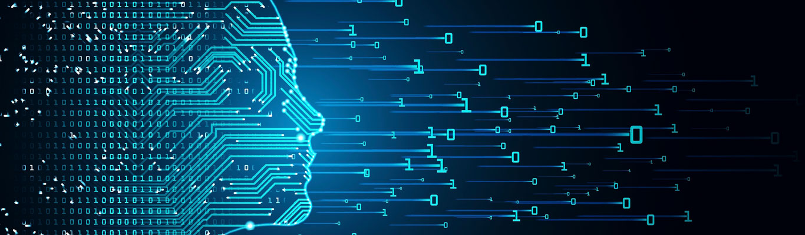

 
 
 

# **Multivarijatne metode**

 
 
 

  

 
 

Dobrodošli na stranice kolegija <b>Multivarijatne metode</b> koji u ljetnom semestru, 2020/21 izvodi Luka Šikić na Fakultetu hrvatskih studija Sveučilišta u Zagrebu. Kolegij je prvenstveno namijenjen studentima sociologije na diplomskoj razini, a može koristiti svim studentima društvenih, humanističkih i interdisciplinarnih smjerova koji su upoznati s osnovama statistike.

 
 
 
 

[Luka Šikić](https://www.lukasikic.info/) 
Fakultet hrvatskih studija, Odsjek za sociologiju 
<b>Konzultacije</b>&nbsp;&nbsp;&nbsp;Utorkom,&nbsp;od 11h do 12h 
mail: lsikic@hrstud.hr 
mob:  + 385 98 162 30 52 

